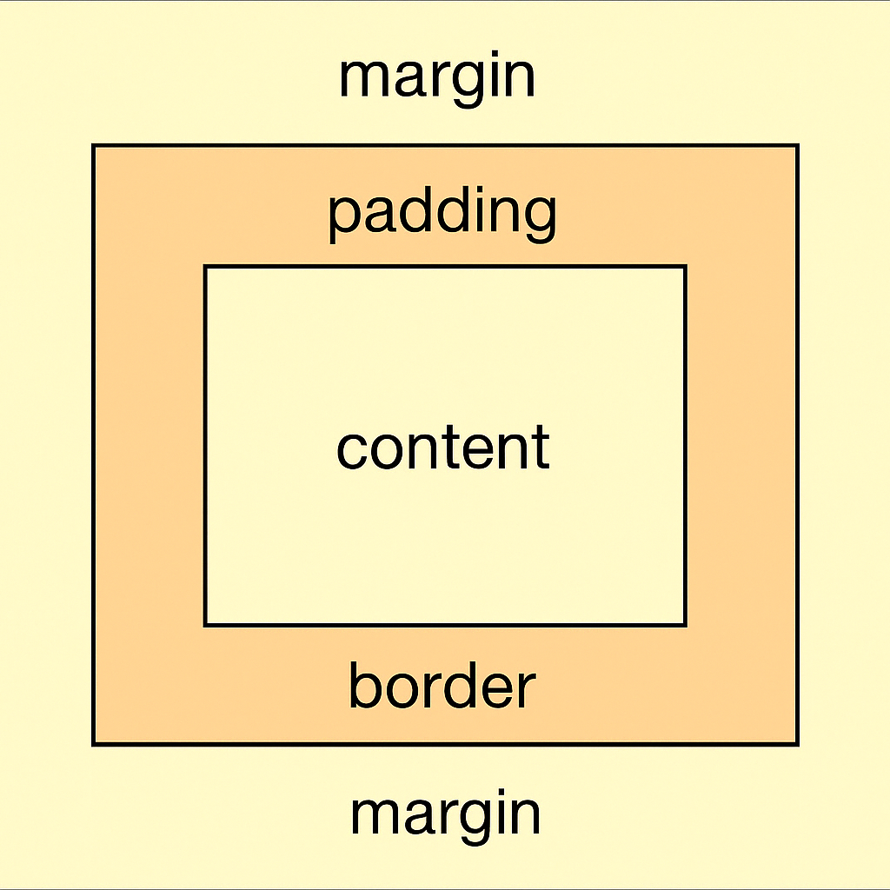
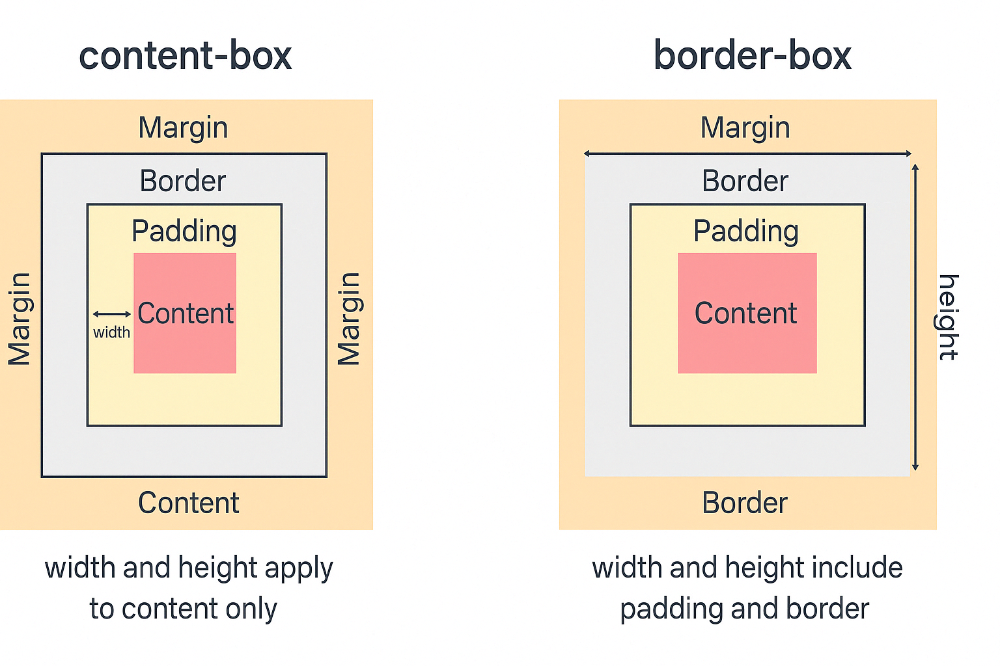

# CSS

# 1. Box 模型的组成与计算方式

## 背景说明

Box 模型是 CSS 中最基本的概念，每一个 HTML 元素都被看作一个矩形盒子。该盒子由四个部分构成：`content`、`padding`、`border` 和 `margin`。理解这些区域的关系是进行布局设计的基础。

## 各组成部分详解

| 组成部分  | 中文含义 | 作用 |
|-----------|----------|------|
| `content` | 内容区   | 元素内部实际内容区域，文本、图片等 |
| `padding` | 内边距   | 内容与边框之间的透明空间，影响元素的大小 |
| `border`  | 边框     | 包裹内容和内边距的边线，可以设置宽度、样式和颜色 |
| `margin`  | 外边距   | 元素外部与其他元素之间的空间，不影响元素自身大小，但影响布局 |

### `box-sizing` 的影响

- **默认值：`content-box`**  
  计算宽度和高度时，不包含 padding 和 border。  

  ```text
  元素最终宽度 = width + padding + border
  ```

- **推荐使用：`border-box`**  
  计算宽度和高度时，包含 padding 和 border。

  ```text
  元素最终宽度 = width（已包含 padding 和 border）
  ```

## 示例代码：对比 `content-box` 和 `border-box`

```html
<style>
  .box1, .box2 {
    width: 200px;
    height: 100px;
    padding: 20px;
    border: 10px solid #f66;
    margin: 20px;
    background: #f5f5f5;
  }

  .box1 {
    box-sizing: content-box;
  }

  .box2 {
    box-sizing: border-box;
  }
</style>

<div class="box1">content-box</div>
<div class="box2">border-box</div>
```

## 关键总结

- **Box 模型的四个部分**：`content`、`padding`、`border` 和 `margin`，它们共同影响元素的最终尺寸和布局。
- **`box-sizing: border-box` 更加常用**，能够避免计算元素宽度时出现问题。
- `margin` 会影响元素在页面中的位置，但不会改变元素的实际尺寸。

## 配图示意

以下是 Box 模型的可视化结构图：



---

# 2. 使用 padding 后盒子宽高如何变化？如何控制？

## 知识点讲解

在默认情况下，CSS 中元素的 `width` 和 `height` 只包含 `content` 区域的尺寸。添加 `padding` 会使盒子向外扩展，从而**增加实际渲染的宽高**。

### 默认行为（box-sizing: content-box）

```text
实际宽度 = width + padding-left + padding-right
实际高度 = height + padding-top + padding-bottom
```

### 推荐做法（box-sizing: border-box）

将 `padding` 和 `border` 包含在 `width` 和 `height` 内：

```css
box-sizing: border-box;
```

```text
实际宽度 = width
实际高度 = height
```

## 示例代码

```html
<style>
  .content-box {
    box-sizing: content-box;
    width: 200px;
    padding: 20px;
    background: #ffdcdc;
    margin-bottom: 20px;
  }

  .border-box {
    box-sizing: border-box;
    width: 200px;
    padding: 20px;
    background: #dcf5ff;
  }
</style>

<div class="content-box">content-box</div>
<div class="border-box">border-box</div>
```

## 关键总结

- `padding` 会在 `content-box` 模式下撑大盒子；
- `border-box` 模式更利于精准布局控制；
- 推荐统一使用：`* { box-sizing: border-box; }`

---

# 3. `box-sizing` 的不同取值及其影响

## 知识点讲解

`box-sizing` 用于定义浏览器如何计算元素的总宽度和高度。

### content-box（默认值）

- `width` 和 `height` 只包含内容区域；
- `padding` 和 `border` 会撑大盒子实际尺寸；
- 需要手动加减计算盒子总大小。

### border-box（推荐使用）

- `width` 和 `height` 包含 `padding` 和 `border`；
- 设置宽度后无需额外计算，布局更可控；
- 实际开发中推荐全局设置：

```css
* {
  box-sizing: border-box;
}
```

### inherit

- 继承父元素的 `box-sizing` 属性值。

## 示例代码

```html
<style>
  .box {
    width: 200px;
    height: 100px;
    padding: 20px;
    border: 10px solid #333;
    margin-bottom: 20px;
  }

  .content-box {
    box-sizing: content-box;
    background: #ffdede;
  }

  .border-box {
    box-sizing: border-box;
    background: #def3ff;
  }
</style>

<div class="box content-box">content-box</div>
<div class="box border-box">border-box</div>
```

## 可视化结构图



> 上图展示了 `content-box` 与 `border-box` 在视觉结构上的差异。

## 关键总结

- `content-box` 容易造成布局超出预期；
- `border-box` 更适合组件式开发；
- `box-sizing` 是控制布局精准度的重要工具。

---

# 4. margin、padding 和 border 的区别与应用

## 知识点讲解

### margin（外边距）

- **作用**：用于控制元素与其他元素之间的间距。
- **影响**：不会影响元素自身的宽度和高度，只是改变元素的位置。
- **特点**：可以为元素设置负值，产生重叠效果。
- **常见用法**：设置外部间距、居中对齐等。

### padding（内边距）

- **作用**：用于控制元素内容与边框之间的间距。
- **影响**：会增加元素的实际宽度和高度。
- **特点**：设置内边距时，背景色会填充整个内边距区域。
- **常见用法**：调整内容与边框的空间，增加按钮或容器的点击区域等。

### border（边框）

- **作用**：为元素添加边框。
- **影响**：会增加元素的实际宽度和高度，边框的宽度、样式、颜色可以自定义。
- **特点**：边框不会影响内容的大小，但会影响布局。
- **常见用法**：用于元素的分隔、突出显示等。

## 示例代码

```html
<style>
  .box {
    width: 200px;
    height: 100px;
    padding: 20px;
    margin: 20px;
    border: 5px solid #333;
    background: #e2f0f7;
  }
</style>

<div class="box">This is a box with padding, margin, and border.</div>
```

## 关键总结

- **margin** 控制元素与其他元素的间距，不影响元素自身尺寸；
- **padding** 调整内容与边框之间的间距，会影响元素实际尺寸；
- **border** 为元素添加边框，会增加元素尺寸，且影响布局。
- 合理使用这三者可以提升布局的灵活性与精确度。

---

# 5. BFC 与 margin 重叠问题的解决

## 知识点讲解

### 什么是 BFC？（Block Formatting Context）

BFC 是块级格式化上下文，是网页布局中的一种独立渲染区域，具有以下特性：

- BFC 内部的元素不会影响外部布局；
- 同一个 BFC 中的两个相邻块元素的垂直 `margin` 会发生重叠；
- 不同 BFC 间的 `margin` 不会重叠。

### 如何触发 BFC？

常用方式有：

```css
overflow: hidden;
display: flow-root;
display: inline-block;
float: left/right;
position: absolute/fixed;
```

### 应用场景：解决 margin 重叠问题

当两个垂直方向相邻的元素使用 `margin-top` 和 `margin-bottom` 时，如果它们属于同一个 BFC，margin 会发生合并（重叠）。

通过创建新的 BFC，可以避免这种重叠。

## 示例代码

### 未触发 BFC（发生 margin 重叠）

```html
<style>
  p {
    margin: 50px;
    background: #fdd;
  }
</style>
<p>第一段</p>
<p>第二段</p>
```

### 触发 BFC（解决 margin 重叠）

```html
<style>
  .wrapper {
    overflow: hidden; /* 触发 BFC */
  }
  p {
    margin: 50px;
    background: #fdd;
  }
</style>
<div class="wrapper">
  <p>第一段</p>
</div>
<div class="wrapper">
  <p>第二段</p>
</div>
```

## 关键总结

- BFC 是控制元素布局的重要机制，能够有效避免垂直方向 `margin` 的重叠问题；
- 在容器外部包裹一个触发 BFC 的元素是常见的解决方式；
- 常用于清除浮动、分隔结构、增强模块独立性。

---

# 6. 浮动引起的高度塌陷与解决方法

## 问题背景

当容器中的子元素使用 `float` 浮动后，**父元素不会自动根据浮动子元素计算高度**，会导致高度塌陷，从而影响后续布局。

## 触发示例

```html
<style>
  .container {
    background: #f0f0f0;
    border: 1px solid #ccc;
  }
  .float-box {
    float: left;
    width: 100px;
    height: 100px;
    background: #8cf;
  }
</style>

<div class="container">
  <div class="float-box"></div>
</div>
```

> 结果：`.container` 的高度为 0，没有包裹 `.float-box`，会影响整体结构。

## 常用解决方法

### 方法一：使用额外清除元素（clearfix）

```css
.clearfix::after {
  content: "";
  display: block;
  clear: both;
}
```

```html
<div class="container clearfix">
  <div class="float-box"></div>
</div>
```

### 方法二：父元素触发 BFC

```css
.container {
  overflow: hidden;
}
```

或者使用：
```css
display: flow-root;
```

### 方法三：使用 `flex` 代替浮动布局

```css
.container {
  display: flex;
}
```

## 关键总结

- 浮动布局会使父元素高度坍塌，影响结构完整性；
- 推荐使用 `clearfix` 或触发 BFC 来清除浮动；
- 在现代开发中，更推荐使用 `flex` 或 `grid` 等替代传统浮动。

---

# 7. 经典左右两栏布局的多种实现方式（float、flex、grid 等）

## 目标说明

经典的左右两栏布局通常指左侧固定宽度，右侧自适应宽度的结构，常用于后台、文章正文页等。以下是多种实现方式。

---

## 方式一：float 浮动布局（+ margin 解决塌陷）

```html
<style>
  .float-container {
    overflow: hidden;
  }
  .left {
    float: left;
    width: 200px;
    background: #aee;
    height: 100px;
  }
  .right {
    margin-left: 210px;
    background: #def;
    height: 100px;
  }
</style>
<div class="float-container">
  <div class="left">左侧</div>
  <div class="right">右侧</div>
</div>
```

---

## 方式二：flex 弹性布局（推荐）

```html
<style>
  .flex-container {
    display: flex;
  }
  .left {
    width: 200px;
    background: #aee;
    height: 100px;
  }
  .right {
    flex: 1;
    background: #def;
    height: 100px;
  }
</style>
<div class="flex-container">
  <div class="left">左侧</div>
  <div class="right">右侧</div>
</div>
```

---

## 方式三：grid 栅格布局

```html
<style>
  .grid-container {
    display: grid;
    grid-template-columns: 200px 1fr;
  }
  .left {
    background: #aee;
    height: 100px;
  }
  .right {
    background: #def;
    height: 100px;
  }
</style>
<div class="grid-container">
  <div class="left">左侧</div>
  <div class="right">右侧</div>
</div>
```

---

## 关键总结

- `float` 实现历史悠久，但需要清除浮动、计算 margin；
- `flex` 更现代，语义清晰，布局灵活，**推荐使用**；
- `grid` 更强大，适合复杂多区域布局，结构更可控；
- 选择方案需根据实际布局需求和兼容性要求决定。

---

# 8. 移动端适配方案：meta viewport 的使用

## 知识点讲解

在移动端网页开发中，为了适配不同屏幕尺寸，需要借助 `<meta name="viewport">` 标签来控制页面的缩放行为和布局宽度。

### 常见写法：

```html
<meta name="viewport" content="width=device-width, initial-scale=1, maximum-scale=1, user-scalable=no">
```

### 属性说明：

| 属性名            | 说明                                       |
|------------------|--------------------------------------------|
| width            | 视口宽度，通常设为 `device-width` 表示设备实际宽度 |
| initial-scale    | 初始缩放比例，`1` 表示默认不缩放              |
| maximum-scale    | 最大缩放比例，防止用户放大页面                 |
| user-scalable    | 是否允许用户手动缩放，`no` 为禁止               |

### 为什么需要 viewport？

- 默认情况下，移动浏览器会将页面缩放到 **980px** 的布局宽度；
- 会导致页面在手机上显示得非常小，不利于阅读和交互；
- 设置 viewport 可以让页面宽度等于设备宽度，适配各种屏幕。

## 示例代码

```html
<!DOCTYPE html>
<html>
  <head>
    <meta charset="UTF-8">
    <meta name="viewport" content="width=device-width, initial-scale=1">
    <title>移动端页面</title>
    <style>
      body {
        font-size: 16px;
        padding: 20px;
      }
    </style>
  </head>
  <body>
    <p>这是一个适配了移动端的网页。</p>
  </body>
</html>
```

## 关键总结

- 设置 `<meta name="viewport">` 是移动端适配的核心入口；
- 使用 `width=device-width` 能确保页面宽度与设备屏幕一致；
- 通常配合 rem、媒体查询等技术形成完整的响应式布局方案。

---

# 9. 媒体查询（media query）的使用与响应式断点示例

## 知识点讲解

媒体查询（Media Query）是 CSS 实现响应式设计的核心方式，可以根据设备宽度、高度、分辨率等条件应用不同样式。

### 常见断点示例

```css
/* 手机（小于 600px） */
@media screen and (max-width: 600px) {
  body {
    font-size: 14px;
  }
}

/* 平板（600px 到 1024px） */
@media screen and (min-width: 601px) and (max-width: 1024px) {
  body {
    font-size: 16px;
  }
}

/* 桌面设备 */
@media screen and (min-width: 1025px) {
  body {
    font-size: 18px;
  }
}
```

### 条件语法

- `min-width`：最小宽度触发样式；
- `max-width`：最大宽度触发样式；
- 多个条件可使用 `and` 连接。

### 使用建议

- 根据设计稿设置断点，优先考虑主流设备宽度；
- 结合弹性单位（如 rem、vw）效果更佳。

---

# 10. rem/vw/vh/em 等单位的区别与使用策略

## 单位对比

| 单位 | 含义                       | 相对参考值               |
|------|----------------------------|--------------------------|
| px   | 像素，绝对单位             | 固定值，不随屏幕缩放变化 |
| rem  | root em，相对于根元素 html | 通常 `1rem = 16px`        |
| em   | 相对于父元素字体大小       | 可继承叠加                |
| vw   | 视口宽度的 1%              | `100vw` = 屏幕宽度        |
| vh   | 视口高度的 1%              | `100vh` = 屏幕高度        |

## 推荐使用策略

- `rem`：用于大多数字体、间距，搭配 `html { font-size }` 做适配；
- `vw/vh`：适合全屏组件（如横幅、封面图）、流式排版；
- `em`：适用于局部继承，如按钮或组件内部字体；
- 避免混用多个相对单位，保持一致性。

## 动态设置 html 字号（适配方案）

```js
function init() {
  var width = document.documentElement.clientWidth;
  document.documentElement.style.fontSize = (width / 10) + 'px';
}

init();
window.addEventListener('resize', init);
```

## 关键总结

- 媒体查询配合 rem 等相对单位，可实现高质量响应式布局；
- 根据项目选择合适单位，推荐以 rem + 媒体断点为核心方案；
- 适配移动端时，推荐搭配 viewport 与动态 html 字号设置使用。

---

# 11. CSS 实现元素水平垂直居中的多种方式（margin、flex、transform 等）

## 1. 使用 `margin: auto`（固定宽高元素）

```css
.parent {
  width: 400px;
  height: 400px;
  position: relative;
}
.child {
  width: 100px;
  height: 100px;
  margin: auto;
}
```

> 只可实现**水平居中**，垂直方向需结合其他方式，如 `position + top: 0; bottom: 0;` 等。

---

## 2. 使用 `flex` 居中（推荐）

```css
.parent {
  display: flex;
  justify-content: center; /* 水平居中 */
  align-items: center;     /* 垂直居中 */
  height: 100vh;
}
.child {
  width: 100px;
  height: 100px;
  background: lightblue;
}
```

> 简洁可靠，**推荐使用**，适用于大多数居中场景。

---

## 3. 使用 `position + transform`

```css
.parent {
  position: relative;
  height: 100vh;
}
.child {
  position: absolute;
  top: 50%;
  left: 50%;
  transform: translate(-50%, -50%);
  width: 100px;
  height: 100px;
  background: pink;
}
```

> 精准对齐，适合大小不定元素。

---

## 4. 使用 `grid` + `place-items`

```css
.parent {
  display: grid;
  place-items: center;
  height: 100vh;
}
.child {
  width: 100px;
  height: 100px;
  background: lightgreen;
}
```

> `place-items: center` 是 `justify-items` 与 `align-items` 的简写。

---

## 关键总结

| 方法         | 是否支持未知宽高 | 推荐程度 | 特点与适用场景            |
|--------------|------------------|----------|-----------------------------|
| margin       | 否               | ★★       | 结构简单，需定高             |
| flex         | 是               | ★★★★★   | 最通用推荐方式               |
| transform    | 是               | ★★★★☆   | 精准控制，适合组件类弹窗     |
| grid         | 是               | ★★★★☆   | 适合整体区域统一居中排布     |

---

# 12. `visibility`、`display`、`opacity` 的区别与应用场景

## 对比说明

| 属性       | 是否占位 | 是否可见 | 是否响应事件 | 典型用途             |
|------------|----------|----------|----------------|----------------------|
| `display`  | 否       | 否       | 否             | 完全从页面中移除元素 |
| `visibility` | 是       | 否       | 否             | 保留布局但隐藏元素   |
| `opacity`  | 是       | 否（透明）| 是             | 渐隐动画、视觉效果   |

## 应用场景示例

```html
<!-- display: none -->
<div style="display: none;">不可见，不占位</div>

<!-- visibility: hidden -->
<div style="visibility: hidden;">不可见，占位</div>

<!-- opacity: 0 -->
<div style="opacity: 0;">透明但仍可点击</div>
```

## 总结

- `display` 最强，**直接移除布局**；
- `visibility` 用于保留空间但不展示内容；
- `opacity` 适合动画效果，但仍响应事件。

---

# 13. 文本溢出省略号的多种实现

## 单行文本省略号

```css
.ellipsis-single {
  width: 200px;
  overflow: hidden;
  white-space: nowrap;
  text-overflow: ellipsis;
}
```

## 多行文本省略号（Webkit）

```css
.ellipsis-multiline {
  display: -webkit-box;
  -webkit-line-clamp: 3; /* 限制行数 */
  -webkit-box-orient: vertical;
  overflow: hidden;
}
```

## 多行兼容性解决方案（伪元素渐变遮罩）

```css
.mask-multiline {
  position: relative;
  line-height: 1.5;
  height: 4.5em; /* 3 行 */
  overflow: hidden;
}

.mask-multiline::after {
  content: "";
  position: absolute;
  bottom: 0;
  right: 0;
  width: 100%;
  height: 1.5em;
  background: linear-gradient(to right, transparent, #fff);
}
```

## 总结

- 单行用 `text-overflow`；多行推荐 `-webkit-line-clamp`；
- 更强控制可结合 JS 或伪元素遮罩处理。

---

# 14. 使用纯 CSS 实现三角形（border 技巧）

## 实现原理

- 通过设置元素 `width` 和 `height` 为 0；
- 利用 `border` 创建方向性的三角形。

## 示例代码

```css
.triangle-up {
  width: 0;
  height: 0;
  border-left: 50px solid transparent;
  border-right: 50px solid transparent;
  border-bottom: 50px solid #f66;
}

.triangle-right {
  width: 0;
  height: 0;
  border-top: 25px solid transparent;
  border-bottom: 25px solid transparent;
  border-left: 50px solid #f66;
}
```

## 常见方向

- 上：`border-bottom` 有色，其余透明
- 下：`border-top` 有色，其余透明
- 左：`border-right` 有色，其余透明
- 右：`border-left` 有色，其余透明

## 总结

- 三角形是由四个 `border` 组成的对角结构；
- 宽高为 0，透明边 + 有色边即可实现方向性三角；
- 可用于菜单箭头、气泡提示、UI装饰等。

---

# 15. `background-attachment: fixed` 实现视差滚动背景图

## 知识点讲解

视差滚动（Parallax Scrolling）效果通常指背景与前景在滚动时的不同速度。`background-attachment: fixed` 是实现这种效果的经典方式之一。

### 示例代码

```css
body {
  margin: 0;
  padding: 0;
  height: 200vh; /* 增加页面高度，滚动时才能看到效果 */
  background: url('background.jpg') no-repeat center center fixed;
  background-size: cover;
}
```

- **背景图片固定**：`background-attachment: fixed` 会使背景图片相对于视口固定，而不随页面内容滚动。
- 适合用于全屏背景、动画效果、首页滚动展示等场景。

## 关键总结

- 使用 `background-attachment: fixed` 可以轻松实现视差滚动效果。
- 需要确保页面内容足够长，才能看到明显的滚动效果。

---

# 16. CSS3 中的 3D 效果与 `transform`、`perspective` 的配合使用

## 知识点讲解

CSS3 提供了 `transform` 和 `perspective` 属性来创建 3D 效果。

- **`transform`**：用于元素的二维和三维转换。
- **`perspective`**：定义观察者的视距，用于创建 3D 效果。

### 示例代码

```css
.parent {
  perspective: 1000px; /* 设置视距 */
  width: 100%;
  height: 100vh;
}
.child {
  width: 200px;
  height: 200px;
  background: lightblue;
  transform: rotateY(45deg); /* 3D 旋转效果 */
  transition: transform 0.5s;
}
.child:hover {
  transform: rotateY(0deg); /* 鼠标悬停效果 */
}
```

### 3D 效果的实现步骤

1. **父元素添加 `perspective`**，确定视距。
2. **子元素应用 `transform`**，创建旋转、倾斜等 3D 效果。
3. 使用 `transition` 添加动画过渡效果。

## 关键总结

- `perspective` 定义观察视距；
- `transform` 操作 3D 变换；
- 适合用于动态交互、3D 滑动效果等场景。

---

# 17. `transition` 与 `animation` 的区别、使用场景及代码示例

## 知识点讲解

### `transition` 与 `animation` 的区别

| 属性         | `transition`                                    | `animation`                                    |
|--------------|------------------------------------------------|------------------------------------------------|
| 触发方式     | 依赖于状态变化（例如：`hover`）               | 通过关键帧实现更复杂的动画                    |
| 动画控制     | 自动播放，过渡一个状态到另一个状态           | 控制多个关键帧动画，自动或者手动触发          |
| 用途         | 用于简短的状态转换（如按钮悬停、颜色变化等）  | 用于复杂的动画（如弹跳、旋转、循环动画等）    |

### 示例代码

#### 使用 `transition`

```css
.button {
  background-color: #4CAF50;
  transition: background-color 0.5s ease;
}
.button:hover {
  background-color: #45a049;
}
```

#### 使用 `animation`

```css
@keyframes bounce {
  0% { transform: translateY(0); }
  50% { transform: translateY(-30px); }
  100% { transform: translateY(0); }
}

.bounce {
  animation: bounce 1s infinite;
}
```

## 关键总结

- `transition` 用于简单的状态变化，适合交互反馈；
- `animation` 更灵活、强大，适合创建复杂的、持续的动画效果。
- 选择使用 `transition` 还是 `animation` 取决于动画的复杂度和需求。

---

# 18. `grid` 布局基础与常用属性（`grid-template`、`gap`、`area` 等）

## 知识点讲解

`grid` 布局是 CSS3 新增的一种强大的布局模型，能够让我们轻松创建二维布局。通过定义行和列来放置元素，具有较高的灵活性和控制性。

### 常用属性

#### 1. `grid-template-columns` 和 `grid-template-rows`

用于定义网格的列和行。

```css
.container {
  display: grid;
  grid-template-columns: repeat(3, 1fr); /* 三列等宽 */
  grid-template-rows: auto; /* 行的高度自适应 */
}
```

#### 2. `gap`

用于定义网格之间的间距。

```css
.container {
  display: grid;
  grid-template-columns: repeat(3, 1fr);
  gap: 10px; /* 设定列和行之间的间距 */
}
```

#### 3. `grid-area`

用于将元素放置到指定的区域。

```css
.container {
  display: grid;
  grid-template-columns: 1fr 1fr 1fr;
  grid-template-rows: 100px 100px;
  grid-template-areas: "header header header" "main aside aside";
}

.item {
  grid-area: main;
}
```

## 示例代码

```html
<div class="container">
  <div class="header">Header</div>
  <div class="main">Main content</div>
  <div class="aside">Sidebar</div>
</div>
```

### 总结

- `grid` 布局非常适合处理复杂的二维布局，具有较高的可控性。
- 使用 `grid-template` 定义列和行，`gap` 控制间距，`grid-area` 可以灵活地布局区域。

---

# 19. `flex` 布局基础与常用属性（`grow`、`shrink`、`basis`、`align` 等）

## 知识点讲解

`flex` 布局是 CSS3 提供的强大工具，常用于一维布局。通过弹性容器和弹性项，可以非常轻松地实现水平和垂直居中、分配空间等操作。

### 常用属性

#### 1. `flex-grow`

控制弹性项的扩展比例。

```css
.item {
  flex-grow: 1; /* 项目会分配剩余空间 */
}
```

#### 2. `flex-shrink`

控制弹性项的缩小比例。

```css
.item {
  flex-shrink: 1; /* 当空间不足时，元素会缩小 */
}
```

#### 3. `flex-basis`

定义弹性项的初始大小。

```css
.item {
  flex-basis: 100px; /* 初始大小为 100px */
}
```

#### 4. `align-items` 和 `justify-content`

控制项目在交叉轴（垂直）和主轴（水平）上的对齐。

```css
.container {
  display: flex;
  align-items: center; /* 垂直居中 */
  justify-content: space-between; /* 水平分布 */
}
```

## 示例代码

```html
<div class="container">
  <div class="item">Item 1</div>
  <div class="item">Item 2</div>
  <div class="item">Item 3</div>
</div>
```

### 总结

- `flex` 布局非常适合一维布局，常用于水平方向或垂直方向上的分布。
- `flex-grow`、`flex-shrink` 和 `flex-basis` 三个属性可帮助实现灵活、可伸缩的布局。
- `align-items` 和 `justify-content` 用于实现子项对齐，简单高效。

---

# 20. CSS 预处理器（Sass、Less、Stylus）的语法特性和实际使用区别

## 概述

CSS 预处理器是一种让 CSS 更具编程能力的工具。它们提供变量、嵌套、函数、逻辑等功能，增强了样式代码的可维护性和复用性。

常见的预处理器：**Sass、Less、Stylus**

---

## 基本语法对比

### 1. 变量

| 预处理器 | 变量声明方式         |
|----------|----------------------|
| Sass     | `$primary: #f66;`     |
| Less     | `@primary: #f66;`     |
| Stylus   | `primary = #f66`      |

### 2. 嵌套规则

```scss
/* Sass */
.nav {
  ul {
    li {
      color: red;
    }
  }
}
```

```less
/* Less */
.nav {
  ul {
    li {
      color: red;
    }
  }
}
```

```stylus
/* Stylus */
.nav
  ul
    li
      color red
```

### 3. 混入（Mixin）

```scss
@mixin center {
  display: flex;
  justify-content: center;
  align-items: center;
}
.box {
  @include center;
}
```

```less
.center() {
  display: flex;
  justify-content: center;
  align-items: center;
}
.box {
  .center();
}
```

```stylus
center()
  display flex
  justify-content center
  align-items center

.box
  center()
```

---

## 特性对比总结

| 特性            | Sass                | Less                | Stylus              |
|-----------------|---------------------|---------------------|---------------------|
| 变量语法        | `$`                 | `@`                 | 无前缀              |
| 兼容性          | 高（社区成熟）      | 与 JS 关系更强      | 自由度高但语法随意 |
| 学习曲线        | 适中                | 较低                | 稍高                |
| 语法风格        | 严谨、接近 CSS      | 接近 CSS            | 缩进式、最灵活      |
| 编译方式        | Dart Sass           | lessc               | stylus              |

---

## 实际使用建议

- **Sass**：推荐主流项目使用，生态完善，兼容性强；
- **Less**：适合与 Ant Design 等生态结合使用；
- **Stylus**：适用于追求极致灵活和简洁语法的开发者。

---

## 关键总结

- 三者核心能力相近，选择依据为团队规范、项目需求与生态支持；
- 推荐初学者优先选择 Sass；
- Stylus 在 Vue 项目中使用也较为常见，但需要统一规范。