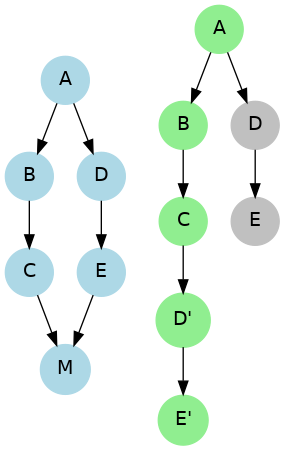

## Git 基础概念与工具对比

> ### Q1. 版本管理的理解与常用工具

**关键词:** 版本控制, 本地版本控制, 集中式版本控制, 分布式版本控制  
**命令示例:** *无*（概念性问题，无特定命令）  
**简要解析:** 版本控制（Version Control）是一种追踪和管理文件更改的系统，能够记录项目历史以便将来恢复到任意状态。常见版本控制工具包括集中式的 SVN、CVS，以及分布式的 Git、Mercurial 等。按照类别，版本控制系统分为：**本地版本控制**（变更记录保存在本地，如最早的RCS工具，只能个人使用）；**集中式版本控制**（如 SVN、CVS，有中央服务器，所有人从中央仓库获取和提交代码）；**分布式版本控制**（如 Git、Mercurial，每人都有完整仓库副本，本地提交后再同步远程）。常用工具还有 TFS、Perforce 等，其中 Git 是当前最流行的分布式版本控制工具。

---  

> ### Q2. 集中式 vs 分布式版本控制系统区别

**关键词:** 集中式版本控制, 分布式版本控制, 服务器, 离线工作  
**命令示例:** *无*  
**简要解析:** 集中式版本控制（CVCS）和分布式版本控制（DVCS）的主要区别如下表所示：  

| **集中式版本控制** | **分布式版本控制** |
| ---------------- | ---------------- |
| 依赖中央服务器，提交和更新需要网络连接 | 每个用户有完整仓库，可离线提交 |
| 中央仓库含完整历史，客户端只检出某版本 | **每个节点都保存完整历史**，无单点故障风险 |
| 协作时每次操作都直接作用于中央仓库 | 协作通过**先本地提交**，再推送/拉取与他人同步 |
| 如服务器崩溃可能导致数据丢失（需备份） | 任意节点可恢复仓库，数据更安全 |
| 代表工具：SVN、CVS | 代表工具：Git、Mercurial 等 |

集中式适合简单协作且易于管理权限，但分布式更灵活高效，支持离线工作和**分支**操作，当前软件开发更倾向使用分布式系统。

---  

> ### Q3. SVN 是什么？有何特点？

**关键词:** SVN, 集中式, 版本库, 原子提交  
**命令示例:** `svn checkout <url>` （检出仓库）, `svn commit -m "message"`（提交更改）  
**简要解析:** SVN（Subversion）是常见的**集中式版本控制**系统。SVN 用中央服务器存储版本库，开发者通过网络进行**检出（checkout）**和**提交（commit）**。SVN 相比更早的 CVS 提供了**原子性提交**（一次提交的一组文件改动要么全部成功要么全部失败），提高了可靠性。SVN 版本号是全局递增的整数，每次提交整个仓库版本号加1。SVN 支持分支和标签但开销较大（分支实际上复制目录）。特点：上手简单，工具成熟（如 TortoiseSVN 图形界面），但需联网才能提交，无法像 Git 那样本地提交和离线操作。

---  

> ### Q4. CVS 是什么？与 SVN 有何不同？
> 
**关键词:** CVS, 集中式, 文件级版本控制, 原子性  
**命令示例:** `cvs checkout <module>`，`cvs commit -m "msg"`  
**简要解析:** CVS（Concurrent Versions System）是较早的集中式版本控制工具。CVS 以**文件为单位**跟踪版本，没有 SVN 的全局版本号概念，并且历史记录保存在服务器的单个文件中。它不支持原子提交（一次提交可能部分成功），这在多人协作时容易导致不一致。相比 SVN，CVS 的分支和合并操作更不便，可能需要手工处理冲突。SVN 可以看作 CVS 的改进版：引入了**原子提交**和统一的版本号，增强了分支管理和性能。因此 SVN 几乎完全取代了 CVS，CVS 现在很少使用。

---  

> ### Q5. Git 和 Mercurial (HG) 的对比 
> 
**关键词:** Git, Mercurial, 分布式, 性能, 差异  
**命令示例:** Git:`git clone`, `git commit`; Mercurial:`hg clone`, `hg commit`  
**简要解析:** Git 和 Mercurial 都是分布式版本控制系统，主要区别在于实现细节和使用体验：Git 由 C 语言编写，性能极高，灵活且功能丰富，但命令相对复杂；Mercurial（命令行简称 hg）由 Python 编写，注重**简单易用**和直观，命令友好。两者在基本概念上相似（都有本地仓库、分支、变更集），但 Mercurial 不像 Git 那样提供暂存区（Git 的 index）和交互式 rebase 等高级功能。Mercurial 每个提交有全局递增的序号，Git 则使用 SHA-1 哈希作为标识。Git 社区更大，生态丰富（如 GitHub、GitLab），而 Mercurial 因简单稳健在某些项目中使用（如早期的 Mozilla），但总体流行度不及 Git。

---  

> ### Q6. Git 的诞生背景  
> 
**关键词:** Linus Torvalds, Linux 内核, BitKeeper, 2005年  
**命令示例:** *无*  
**简要解析:** Git 由 Linus Torvalds 在 2005 年创建。背景是当时 Linux 内核社区曾使用商用的 BitKeeper 版本控制工具，但后来授权纠纷导致终止免费使用。Linus 为了Linux开发的需要，决定编写一款全新的分布式版本控制系统，这就是 Git。Git 名称源自英国俚语（意为"怪胎"），据说是 Linus 对自己的自嘲。Git 诞生后因其**高速、高效处理分支合并**和分布式协作能力，很快取代了其他工具成为开源领域主流的版本控制系统。总之，Git 的诞生是为了解决大规模协作开发（如 Linux 内核）对分布式版本控制的迫切需求。

---  

> ### Q7. Git 和 GitHub 有何区别？ 
> 
**关键词:** Git, GitHub, 本地工具, 托管平台  
**命令示例:** *无*  
**简要解析:** **Git** 是一个版本控制软件，本地安装后用于跟踪管理代码历史；而 **GitHub** 是基于 Git的远程代码托管平台。本质区别在于：Git是工具，GitHub是服务。开发者在本地使用 Git 进行提交、分支管理等操作，然后可以将仓库**推送（push）**到 GitHub，方便与他人协作。GitHub 提供了 Web 界面和协作功能（如 Pull Request 代码审查、Issue 跟踪）但其后台仍然使用 Git 来存储版本库。此外还有类似的平台如 GitLab、Bitbucket 等。简单来说，Git 管理**本地仓库**，GitHub 托管**远程仓库**并提供社交编程功能。

---  

## Git 命令实战与工作流程

> ### Q8. 初始化仓库 (git init) vs 克隆仓库 (git clone)

**关键词:** git init, git clone, 本地仓库, 远程仓库  
**命令示例:** 
```bash
git init            # 在当前目录新建本地Git仓库
git clone <URL>     # 从远程仓库克隆项目
```  
**简要解析:** `git init` 和 `git clone` 都可创建 Git 仓库，但用途不同。`git init`是在当前目录下新建一个空的Git本地仓库，生成一个 `.git` 子目录（包含版本库的所有元数据）。它用于从零开始跟踪现有项目。`git clone`则是从已有的远程仓库复制一份代码仓库到本地，除了初始化本地仓库外，还会自动拉取所有历史记录和文件。简单来说，`git init`适合本地新项目，`git clone`适合获取远程已有项目的副本。克隆后本地仓库会自动关联远程仓库(origin)，而 init 初始化的仓库需要手动配置远程地址后才能推送代码。

---  

> ### Q9. 工作区、暂存区和版本库的工作流程

**关键词:** 工作区, 暂存区 (Index/Stage), 版本库 (Repository)  
**命令示例:** 
```bash
git status                 # 查看工作区和暂存区状态
git add <file>             # 将修改添加到暂存区
git commit -m "说明"       # 提交暂存区内容到版本库
```  
**简要解析:** Git 的基本工作流程涉及三个区域：**工作区**、**暂存区（Index/Staging Area）**和**版本库（Repository）**。开发者在工作区中编辑文件，修改完成后使用`git add`将更改放入暂存区；暂存区临时保存将被提交的快照，可以一次`add`多个文件组合成一次提交。执行`git commit`后，暂存区的内容被写入版本库成为一次新的提交（commit）。`git status`可查看哪些修改在暂存区，哪些仍在工作区未跟踪。通过这种机制，Git 实现了**先暂存后提交**的流程，使得一次提交可以精确包含需要的改动。这样在提交前可以自由整理批次，确保每个提交的逻辑独立清晰。

---  

> ### Q10. Git 配置及用户身份设置

**关键词:** git config, 用户名, 邮箱, 配置级别  
**命令示例:** 
```bash
git config --global user.name "Your Name"       # 配置全局用户名
git config --global user.email "you@example.com" # 配置全局邮箱
git config --list --show-origin                # 查看所有配置及来源
```  
**简要解析:** Git 通过`git config`命令设置各种配置选项。最重要的是用户身份（name和email），每次提交都会记录这两个信息。使用`--global`参数可在用户主目录的配置文件 (`~/.gitconfig`) 中设置全局用户名、邮箱。也可以在单个仓库中（不加`--global`，作用于项目的`.git/config`）或系统范围（`--system`）设置配置。配置层级优先级：**本地项目配置** > **全局配置** > **系统配置**。除了用户身份外，常见配置还有文本编辑器、换行符处理方式、别名等。正确配置后，新建提交会自动使用指定的用户名和邮箱。

---  

> ### Q11. 提交 (commit) 和 推送 (push) 的区别

**关键词:** commit, push, 本地提交, 远程仓库, 同步  
**命令示例:** 
```bash
git commit -m "Add feature X"   # 提交更改到本地仓库
git push origin master         # 推送本地主分支提交到远程origin仓库
```  
**简要解析:** **git commit** 和 **git push** 是Git中两个不同阶段的操作。`git commit`在本地仓库中创建一个新的提交对象，只影响本地的版本历史；而`git push`将本地的提交上传到远程仓库（如GitHub上的origin）。简单来说，commit是在**本地**保存改动，push是将改动**同步到远程**。因此在没有执行push之前，团队其他成员看不到你的提交。反之，从远程拉取（`git pull`或`git fetch`）是获取他人已推送的提交。需要注意，每次push通常需要指定远程名和分支，且本地分支应与远程分支建立跟踪关系。总结：commit记录历史，push分享历史。

---  

> ### Q12. git reset 和 git revert 有何区别？

**关键词:** reset, revert, 撤销提交, 历史可见性  
**命令示例:** *无*  
**简要解析:** **git reset** 和 **git revert** 都能撤销提交但原理不同。`git reset`通过移动分支指针来丢弃某些提交，使这些提交看似从历史中移除；而`git revert`会产生一个新的反向提交，来抵消指定的历史提交。简单来说，reset是**重置历史**（改变分支指向），revert是**增加一次"撤销操作"的提交**。另外，reset分为软/混合/硬三种模式，可控制是否保留工作区改动。而revert始终不会改变已有历史，只是在当前分支追加更改。对于已经推送到远程的提交，一般**不要用reset回退**（会导致他人分支历史不一致），而应使用revert，以确保所有贡献都在历史记录中可见，只是被反向更改了而已。

---  

> ### Q13. 已推送远程的错误提交如何撤销?

**关键词:** 回滚远程, 已发布历史, 安全撤销  
**命令示例:** 
```bash
git revert <commit-id>    # 生成一个新提交，撤销指定的提交
git push origin <branch>  # 将撤销提交推送到远程
```  
**简要解析:** 如果错误的提交已经推送到远程仓库，**不要使用`git reset`强行回退**，因为这样会重写公共历史，其他克隆者pull时会产生冲突。正确方法是使用`git revert`来撤销。`git revert <commit>`将针对指定的提交创建一个内容相反的新提交，适用于撤销已经公布的修改。完成后将该新的"撤销提交"push到远程。这相当于用一次额外提交来更正错误，而不会移除原有提交记录。例如，先前错误删除了文件并push，现在执行revert会新增一次提交把文件恢复回来。这样远程仓库的历史是可追溯且一致的。总之，**已推送**的历史若需回滚，采用revert是安全做法，而reset只能用于尚未分享的本地历史修改。

---  

> ### Q14. 什么是 HEAD？HEAD 与分支的关系

**关键词:** HEAD 指针, 当前分支, 引用  
**命令示例:** 
```bash
git branch           # 列出本地分支，当前分支前会有*
cat .git/HEAD        # 查看HEAD指针内容
```  
**简要解析:** 在 Git 中，**HEAD** 是一个重要的概念，表示当前检出的快照。通常HEAD是指向当前**分支的引用**。例如在主分支(master)上工作时，`.git/HEAD` 文件内容是 `ref: refs/heads/master`，表示 HEAD 指向本地分支 master。当切换到其他分支（`git checkout <branch>`）时，HEAD 随之更新指向新的分支。可以将 HEAD 看作"当前分支的游标"。提交(commit)时，其实是将新的 commit 赋给 HEAD 所指向的分支。如果 HEAD 脱离了任何分支（即"分离头指针"，detached HEAD），HEAD 直接指向某个具体提交的哈希。总之，HEAD 决定了工作目录所对应的分支和提交位置，是 Git 移动分支引用的机制。

---  

> ### Q15. 什么是分离头指针 (detached HEAD)?

**关键词:** 分离 HEAD, detached HEAD, 指针状态  
**命令示例:** 
```bash
git checkout <commit-hash>    # 检出特定提交，产生分离HEAD状态
git switch -c new-branch      # 从当前提交创建新分支以恢复正常状态
```  
**简要解析:** **分离头指针**是指 Git 中 HEAD 不指向任何本地分支，而是指向某个特定提交（快照）的状态。当使用`git checkout`检出某个历史提交哈希值时，就会进入detached HEAD状态。此时如果直接`git commit`，提交会在该提交之后生成，但由于不在分支上，这些新提交将没有分支引用，后续可能难以找到。分离HEAD常用于查看历史版本或临时构建。要退出分离状态，可以切换回某分支（HEAD重新附着到分支），或者将当前HEAD所指提交建立一个新分支（如`git switch -c <branch>`）。**建议:** 不要在分离HEAD状态下长时间工作，若产生了有用的提交，及时创建分支保存它们。

---  

> ### Q16. Git 分支引用与 .git 目录

**关键词:** 分支引用, 引用文件, .git/refs  
**命令示例:** 
```bash
cat .git/refs/heads/<branch>   # 查看某本地分支所指向的提交哈希
git show-ref                  # 列出所有引用（本地分支、远端分支、标签）
```  
**简要解析:** Git 将分支实现为对提交对象的简单引用。每个本地分支名对应 `.git/refs/heads/` 目录下的一个文件，内部存储了最新提交的 SHA-1 哈希值。例如，本地 master 分支引用文件包含 commit id `7406a10e...`，表示 master 当前指向该提交。HEAD 通常指向这些分支引用（如 `refs/heads/master`）。每次在当前分支上 `git commit`，Git 会自动更新对应的引用文件为新的 commit 哈希，从而移动分支头。远程跟踪分支则存储在 `.git/refs/remotes/<remote>/<branch>` 下。通过这种纯文本引用机制，Git 的分支创建、删除都非常轻量（只是读写引用）。理解引用文件有助于理解 Git 的一些行为，例如重置（reset）分支实际上就是修改这些引用指向不同的提交。

---  

> ### Q17. 简述 push、pull、stash、rebase、merge、patch

**关键词:** 概念速览, push/pull, stash, rebase, patch  
**命令示例:** *无*  
**简要解析:** 这是对 Git 中几种操作的快速解释：  
- **push：**将本地分支提交上传到远程仓库，与他人共享更新。  
- **pull：**从远程获取最新提交并合并到本地当前分支，相当于fetch+merge的组合。  
- **stash：**将当前未提交的修改暂存到栈中，恢复工作区干净，以便稍后再应用。常用于切换分支或拉取更新前保存现场。  
- **rebase：**变基操作，改变分支基础，将一系列提交在新基底重新播放，生成新的提交历史（常用于整理历史或线性化提交）。  
- **merge：**合并操作，把另一个分支的更改并入当前分支，产生一个合并提交（除非快进合并）。保留分支分叉的历史结构。  
- **patch：**补丁，一种以文本diff形式分享更改的方法。使用`git format-patch`可导出提交为".patch"文件，通过邮件等方式发送，再用`git am`应用。Patch 在没有直接推送权限的协作中曾经广泛使用（在GitHub兴起前邮件链开发常用）。如今Pull Request更常见，但patch仍用于提交代码到邮件列表等场景。

---  

> ### Q18. Git 分支合并的基本流程

**关键词:** 合并分支, merge, 快进合并, 三方合并  
**命令示例:** 
```bash
git checkout master             # 切换到主分支
git merge feature1             # 将 feature1 分支合并到当前分支
```  
**简要解析:** 在Git中，**合并（merge）**是将一个分支的更改引入当前分支的过程。基本流程：首先切换到目标分支（通常是主分支），然后执行`git merge <源分支>`。Git 会找到两个分支最近的共同祖先（基地commit），将源分支相对于该祖先的改动应用到当前分支。如果当前分支自祖先以来没有新的独有提交，可以直接**快进合并**（Fast-forward）——当前分支HEAD直接移动到源分支的最新提交，没有额外的合并提交。否则Git将执行一次**三方合并**，创建一个新的合并提交，将两个分支的最后提交作为父节点。合并提交记录了合并发生的点。当合并过程中遇到文件修改冲突，Git 会停止并让用户手动解决冲突后再提交。

---  

> ### Q19. 合并冲突及状态检查

**关键词:** 冲突, git status, unmerged files  
**命令示例:** 
```bash
git status             # 查看冲突文件（标记为"unmerged"）
```  
**简要解析:** 当两条分支在相同文件的同一位置都有修改时，合并可能产生**冲突**。Git 无法自动决定保留哪一方的改动，这时合并过程暂停。使用`git status`可以查看哪些文件存在冲突（标记为 *Unmerged*）。冲突的文件内容中会插入特殊标记`<<<<<<`, `======`, `>>>>>>`来分隔两分支的修改区域。开发者需要打开这些文件，手动编辑以解决冲突——保留需要的代码，删除冲突标记。完成后，运行`git add <冲突文件>`标记冲突已解决，然后使用`git commit`提交合并。未解决冲突前提交不会完成。值得注意，发生冲突并不意味着不好，只需按照提示修复即可。合并提交完成后，用`git log`能够看到一次新的合并提交，表示成功将两个源流融合。

---  

> ### Q20. 如何解决合并冲突并完成提交

**关键词:** 冲突解决, 编辑冲突, 合并提交  
**命令示例:** 
```bash
# 打开冲突文件，手动选择保留内容并删除冲突标记
git add <冲突已解决的文件>     
git commit -m "Merge feature1 into master"   # 完成合并提交
```  
**简要解析:** **解决合并冲突**需按以下步骤进行：首先根据`git status`找到所有冲突文件，打开每个文件，会看到Git插入的冲突标记。例如：  

```diff
<<<<< HEAD
当前分支的代码改动
=======
待合并分支feature1的代码改动
>>>>>> feature1
```  

编辑该文件，保留正确的代码（可以是两者的结合或择一），删除`<<<<<<`到`>>>>>>`之间的标记行。保存后，运行`git add <文件>`将解决后的版本标记为已解决。重复处理所有冲突文件后，再次`git commit`即可创建合并提交。这个合并提交将把两分支的历史连接起来。完成后，用`git log --graph`可以清晰地看到分支合并的结构。如果在解决过程中想中止合并，可以用`git merge --abort`放弃此次合并操作，恢复到合并前的状态。

---  

> ### Q21. 什么是 Fork？Fork 和 Clone 的区别

**关键词:** Fork, 克隆, 协作, GitHub  
**命令示例:** *无*（Fork 在GitHub等平台界面上操作）  
**简要解析:** **Fork** 本意是"叉枝"，在开发中指从他人的远程仓库拷贝出一个独立副本。Fork 通常发生在托管平台（如 GitHub）上，点按 Fork 按钮即可在自己的账户下生成一份目标仓库的拷贝。Fork 与直接 Clone 的区别在于：Fork是在服务器端复制仓库，目的是在他人项目基础上进行开发，并最终可以向原仓库提交 Pull Request；而 **Clone** 只是把远程仓库复制到本地工作。简单来说，Fork是为**协作贡献**准备的，你没有原仓库的直接推送权限，通过Fork->修改->提交PR的方式参与。Clone 则更泛指获取代码的方法，对自己有权限的仓库直接clone即可开展工作。Fork后的仓库依然可以被clone到本地进行修改，修改完成后推送到自己的Fork，再由原仓库接受合并。

---  

> ### Q22. Fork 后如何同步原仓库更新?

**关键词:** 上游仓库, 同步更新, fetch upstream  
**命令示例:**
```bash
git remote add upstream <原仓库URL>   # 添加原仓库为上游远程
git fetch upstream                  # 获取上游仓库更新
git merge upstream/master           # 将上游主分支合并到当前分支
```  
**简要解析:** 当我们 Fork 了一个仓库后，原项目（上游）可能继续有更新。为了同步这些更改，需要将原仓库添加为一个远程，例如命名为"upstream"。之后可以使用`git fetch upstream`拉取上游仓库的提交，再将其合并或重播到自己的分支上。常见流程是在本地的主分支上执行：`git fetch upstream && git merge upstream/master`，这样Fork仓库的master就与原仓库master同步了。如果不想产生额外的合并提交，也可以用`git pull upstream master --rebase`进行变基更新。总之，Fork 后的同步需要手动 fetch+merge，上游的改动不会自动出现在自己Fork中，需定期更新以避免与原项目主线产生巨大差异。

---  

> ### Q23. 如何新建分支并切换过去?

**关键词:** 创建分支, git branch, git checkout  
**命令示例:** 
```bash
git branch featureX        # 新建名为 featureX 的分支（留在当前分支）
git checkout featureX      # 切换到 featureX 分支
# 或合并为一步：
git checkout -b featureX   # 新建并切换到 featureX 分支
```  
**简要解析:** 新建分支的方法有两种：先用`git branch <分支名>`创建分支，然后`git checkout <分支名>`切换；或者直接一条命令`git checkout -b <分支名>`完成创建+切换。新分支初始时从当前HEAD所指提交分出，即当前提交成为新分支的起点。切换后`git branch`会显示新的当前分支（带 * 标记）。创建分支通常用于开发新功能(feature)、修复bug等，使不同工作隔离在不同分支。完成后可将分支合并回主干。需要注意，切换分支会修改工作区文件为该分支的最新提交版本，Git 会自动保存并切换文件内容，所以在切换之前确保当前修改已提交或暂存，以免未提交更改干扰分支切换。

---  

> ### Q24. 如何将 GitHub 上的开源项目变成自己的并提交改动?

**关键词:** GitHub 协作流程, Fork, Clone, 提交PR  
**命令示例:** 参考流程：Fork -> Clone -> 修改 -> Push -> Pull Request  
**简要解析:** 对开源项目贡献代码的一般流程是：首先在GitHub上**Fork**项目到自己的仓库，然后**Clone**这份Fork到本地进行开发。开发中建议在本地创建新分支（避免直接在master上改动）。完成修改并本地**commit**后，**push**到自己Fork的对应分支。接着，在GitHub页面向原仓库提交一个**Pull Request(PR)**。PR 会显示差异变化和讨论区域，仓库维护者可以审查并合并你的改动。一旦PR被合并，你的贡献就会出现在原仓库中。需要注意保持Fork与原仓库的同步（参考上题），以减少PR冲突。如果没有写权限，Fork -> PR 是提交改动的标准流程，直接在原仓库 clone 是无法push的。

---  

> ### Q25. 推送代码和 Pull Request 的步骤

**关键词:** push, Pull Request, 远程分支, 协作  
**命令示例:** 
```bash
git add .                              # 阶段改动
git commit -m "Fix issue"              # 本地提交
git push origin featureX              # 将featureX分支推送到远程origin
# 然后在托管平台创建 Pull Request 请求合并
```  
**简要解析:** 在协作开发中，本地完成修改并提交后，需要**推送（push）**到远程仓库供他人查看。在首次推送某分支时，可能需要用`git push -u origin 分支名`建立跟踪关系。Push 后，在托管平台（如GitHub）的该分支页面可以发起**Pull Request** (PR)，请求将你的分支合并到目标分支（通常是主分支）。Pull Request 提交后，维护者可以在平台上查看你的代码改动(diff)，进行评审和讨论。如果通过，他们会点击合并，将你的提交并入主仓库。Pull Request 流程实现了分叉协作模型：开发者不直接向主仓库push，而是通过PR由维护者审核合并。注意，Push只是上传代码，Pull Request才是正式提出代码合并的请求，两者缺一不可。

---  

> ### Q26. 如何查看远程仓库的所有分支?

**关键词:** 远程分支列表, git branch -a, 跟踪分支  
**命令示例:** 
```bash
git branch -a            # 列出本地和远程所有分支
git branch -r            # 仅列出远程分支列表
```  
**简要解析:** 当我们 clone 一个仓库后，本地默认只创建与远程默认分支（如master）的跟踪分支。本地并不会自动创建其他远程分支对应的本地分支，但可以通过`git branch -a`查看**所有本地和远端分支**列表。输出中，`remotes/origin/XXX` 列举了远程的分支名称。要在本地检出某个远程分支，可以使用`git checkout -b 本地分支名 origin/远程分支名`，Git 会从对应提交创建新本地分支并建立跟踪。如果只是想更新远程分支信息，执行`git fetch`后再`git branch -r`查看。由此可见，克隆仓库后实际拿到所有分支的提交历史，但只有检出时才在本地工作区表现出来，必须显式创建本地分支才能修改该远程分支上的内容。

---  

> ### Q27. git fetch 和 git pull 有何区别？

**关键词:** fetch, pull, 同步, 差别  
**命令示例:** 
```bash
git fetch origin              # 从远程获取新提交，但不自动合并
git pull origin master       # 获取远程提交并合并到当前分支
```  
**简要解析:** `git fetch`和`git pull`都用于同步远程仓库更新，但作用不同。`git fetch`仅从远程获取最新的提交和更新远程跟踪分支（如 origin/master），**不会修改本地工作分支**；而`git pull`相当于`git fetch`加一次**自动合并**（merge）——它在抓取更新后立即将指定远程分支的更新合并到当前分支。换句话说，fetch只是**下载数据**，pull则是下载后试图**集成**这些更新。很多开发者建议使用fetch然后手动merge，这样可以先检视变更再决定如何合并，从而保持对合并过程的控制。直接pull虽然快捷，但可能在不经意间引入合并提交，或遇到冲突时让人措手不及。因此理解两者区别有助于更细粒度地控制同步过程。

---  

> ### Q28. 如何手动执行 git pull 的步骤?

**关键词:** pull 等价操作, fetch+merge, 合并步骤  
**命令示例:** 
```bash
git fetch origin master        # 1.获取远程master最新提交
git merge origin/master       # 2.将远程master分支合并到当前分支
```  
**简要解析:** `git pull`其实就是先fetch再merge。手动执行等价步骤可以更清晰地观察过程：首先执行`git fetch <远程> <分支>`获取远程分支的更新，这会将更新存储在本地对应的远程跟踪分支（如 `origin/master`）。接着在当前分支上运行`git merge <远程>/<分支>`，将刚fetch下来的更新合并进来。这样完成后效果与`git pull`相同，但分成两步便于在合并前查看变化。例如，fetch之后可以用`git log -p HEAD..origin/master`查看将要合并的提交和差异，再决定merge还是其他处理（如`rebase`）。所以当希望更好地控制自动合并行为时，可以用fetch+merge替代pull。

---  

> ### Q29. 如何在不同分支名称之间进行抓取和合并?

**关键词:** 定向抓取, 指定分支, 重命名抓取  
**命令示例:** 
```bash
git fetch origin master:temp   # 将远程origin的master抓取到本地新分支temp
git merge temp                # 将temp分支合并到当前分支
```  
**简要解析:** 默认的`git fetch`会更新对应同名的远程跟踪分支，但有时我们希望将远程的某分支代码提取到本地不同名称下。Git 支持在fetch时使用`远程分支:本地分支`的语法。例如上面的命令将远程origin的master分支下载后直接创建/更新一个本地分支名为temp。这样做的好处是不必切换当前分支也能获取远程数据到指定分支进行检查或合并。完成fetch后，就可以把temp合并到当前分支（或其他分支）。此外，`git pull`也支持类似语法：`git pull origin master:branchtest`，即抓取origin/master并直接合并到本地新建的branchtest分支。这种定向抓取在需要从远程临时拉取代码做实验而不干扰现有分支时很有用。

---  

> ### Q30. 如何在一次命令中抓取远程新分支到本地?

**关键词:** pull定向, 本地新分支, 一步到位  
**命令示例:** 
```bash
git pull origin master:branchtest   # 抓取远程master并在本地创建branchtest分支
```  
**简要解析:** 通常，如果远程有一个本地不存在的分支，我们可以先fetch再checkout。也可以用一条`git pull`命令完成：格式为 `git pull <远程> <远程分支>:<本地分支>`。Git 将在pull时新建本地分支并跟踪远程分支，然后把远程提交合并过来。例如命令`git pull origin master:newfeature`会新建本地分支 newfeature，并把 origin/master 的更新合并入 newfeature。需要注意，这只在本地分支不存在时有效（已有本地分支则pull会尝试把远程master合并到已有分支）。这种用法相对少见，但在某些脚本化场景下可以一步到位地将远程分支取到本地。

---  

## 合并与冲突处理

> ### Q31. 合并 (merge) 和 变基 (rebase) 的区别

**关键词:** merge vs rebase, 合并提交, 历史整理  
**图示:** 左侧蓝色表示 **Merge** 模式产生额外的合并节点 M；右侧绿色表示 **Rebase** 后线性历史，D、E 提交被重新应用为 D'、E' 

**命令示例:** *无*（概念对比题）  
**简要解析:** **merge** 和 **rebase** 是整合分支改动的两种方式。**Merge**通过创建一个合并提交将两个分支的历史汇集在一起，保留分支分叉结构；合并后的历史是非线性的，有分支点和合并点。**Rebase**则是将一条分支上的提交在另一条分支最新位置之上**重放**，相当于将分支从基底A改到基底B。Rebase 后历史变为**直线**，看起来所有改动依次串联，没有分叉。区别在于：merge保留原始分支关系，能看出分支点，但历史可能较复杂；rebase 会 **重写提交**（产生新的提交ID，如D' E'替代原来的D E），使历史更整洁，但需谨慎在共享分支使用（避免改写已推送的历史）。一般来说，在本地私有分支可以用rebase整理提交，在公共仓库整合分支则多采用merge以避免冲突和混乱。

---  

> ### Q32. 变基操作流程及冲突处理

**关键词:** rebase 步骤, 冲突, git rebase --continue  
**命令示例:** 
```bash
git checkout feature1                   # 切换到需变基的分支
git rebase master                      # 将 feature1 分支在 master 最新提交上重新播放
# 若途中出现冲突:
# 1. 按提示修复冲突，git add <文件>
git rebase --continue                 # 2. 继续剩余的变基过程
```  
**简要解析:** 执行`git rebase <base>`会将当前分支从新的基底开始重放提交。Git 按时间顺序逐个应用当前分支的每个commit到目标基底。当发生冲突时，rebase会暂停并提示解决冲突 。解决步骤与合并冲突类似：编辑文件解决冲突后，用`git add`标记解决，然后运行`git rebase --continue`继续变基剩下的提交。如果不想继续了，可以用`git rebase --abort`来取消整个变基，分支会回到变基开始前的状态。需要注意，rebase 完成后原分支的提交会产生新ID，需要使用强制推送（`git push -f`）更新远程分支（若该分支已分享）。变基的好处是可以**整理提交历史**，将分支改动放到最新基底上，使得项目历史看起来线性。但在多人协作中，对已推送的分支rebase可能造成他人仓库冲突，需谨慎使用。

---  

> ### Q33. 交互式变基 (interactive rebase) 的用途

**关键词:** git rebase -i, 压缩提交, 调整顺序  
**命令示例:** 
```bash
git rebase -i HEAD~3    # 交互式变基最近3次提交
# 在打开的编辑器中按需修改指令，如 squash 压缩提交等
```  
**简要解析:** **交互式变基**是 `git rebase -i` 命令提供的强大功能，用于在变基过程中**编辑提交历史**。执行时会打开一个文本列表，列出选定范围内的每个提交和可选操作（pick、squash、reword等）。常见用途包括：**压缩提交(squash)**，将多次零散提交合并成一次；**编辑提交信息(reword)**，修改历史提交的说明；**调整提交顺序**，通过重新排列行顺序改变应用顺序。交互式变基允许开发者在提交正式合并主干前美化历史，使之逻辑清晰、整洁。例如，将"修正bug"类的后续提交 squash 到最初功能提交中。完成保存并退出编辑器后，Git 会按照新顺序和指令重新应用提交。如果过程中产生冲突，处理方式同普通rebase。交互式变基应仅对尚未推送的本地历史使用，以免影响他人仓库。

---  

> ### Q34. 何时使用 Merge vs Rebase

**关键词:** 合并策略, 历史可读性, 团队协作规范  
**命令示例:** *无*  
**简要解析:** Merge 和 Rebase 各有适用场景，在团队协作中通常有约定：  
- **使用 Merge：**当需要保留完整的开发历史和分支结构时。例如在将长期存在的功能分支合并回主分支时，用merge能清晰看到分支点和合并点，方便追溯来源。尤其在公共仓库中，多人共同开发的分支推荐merge，这样不会改动已有提交历史。  
- **使用 Rebase：**在个人开发分支上，为保持提交历史整洁，可以对未公开的提交使用rebase整理。例如在提交PR前将零散的修复commit rebase合并，使代码审查更清晰。rebase适合**本地历史整理**和**线性历史需求**的场景。  
总的来说，如果关注**项目历史完整性**且他人已基于你的提交展开工作，用merge较安全；如果关注**历史简洁**且确定改写不会影响他人，则可选择rebase。团队通常会制定何时采用哪种策略，以兼顾协作和历史可读性。

---  

## 提交管理与回滚机制

> ### Q35. git reset 的三种模式

**关键词:** reset --soft, --mixed, --hard, 暂存区, 工作区  
**命令示例:** 
```bash
git reset --soft HEAD~1   # 重置HEAD到上一个提交，保留变更于暂存区
git reset HEAD~1         # 默认为 --mixed，保留变更于工作区
git reset --hard HEAD~1   # 丢弃最后一次提交的所有改动
```  
**简要解析:** `git reset`可按需选择不同模式来回退提交：  
- **--soft：**仅移动 HEAD 指针到指定位置，后续的改动仍保留在**暂存区**。例如`reset --soft HEAD~1`会撤销上一次提交，但把改动当作已暂存状态，可直接重新commit。  
- **--mixed（默认）：**移动 HEAD，同时重置暂存区索引为指定提交状态，但**保留工作区改动**。即提交被撤销，改动变为未暂存状态。这是常用模式，相当于"撤销提交但保留改动供调整"。  
- **--hard：**彻底重置，HEAD 移动且暂存区和工作目录都同步到目标提交状态，**丢弃**指定提交后的所有本地改动。慎用，该模式会使未提交的修改无法恢复。  
总结：从soft到hard，保留的改动范围依次减少。一般在想修改最近一次提交时用soft或mixed，而在放弃本地改动时用hard。

---  

> ### Q36. 利用 reset 回退提交的示例

**关键词:** 本地回退, HEAD^, 前一个提交  
**命令示例:** 
```bash
git log --oneline            # 查看提交历史简要ID
git reset HEAD^             # 将当前分支回退到上一个提交
```  
**简要解析:** 假设当前分支的最新历史如下（最新在上）：  
```
a770008 (HEAD -> master) second commit  
e311186 (origin/master, master) first commit  
```  
要撤销"second commit"这个提交，可以执行`git reset HEAD^`（HEAD^表示当前提交的父提交，即e311186）。运行后，master 分支会指向`first commit`，即 e311186。此时`git log`可见最新提交变成了"first commit"，而原先"second commit"的修改仍在工作目录中未保存。如果此时希望彻底放弃这些修改，可以进一步`git reset --hard HEAD`（危险操作，清除尚未添加的改动）。反之，如果只是想合并修改到上一次提交，可以修改后重新commit。通过上述过程，我们实现了本地回退提交并（可选）修改的效果。但要谨记，这种操作 rewriting history，只适用于尚未推送的本地提交。

---  

> ### Q37. HEAD^ 和 HEAD~1 表示什么？

**关键词:** 提交引用, 父提交, 祖先提交  
**命令示例:** 
```bash
git show HEAD^      # 查看当前提交的第一个父提交内容
git reset HEAD~2   # 重置HEAD到当前提交的第二个祖先提交
```  
**简要解析:** 在Git中，`HEAD^`表示当前提交的**父提交**（第一个父节点），等同于`HEAD~1`。`HEAD~n`表示当前提交往上追溯n次，也即第 n 代祖先提交。例如`HEAD~2`是当前commit的爷爷辈提交。对于合并提交，可能有多个父，`HEAD^`默认第一个父（通常主分支），`HEAD^2`表示第二个父。一些操作中，经常使用HEAD的相对引用：例如`git reset HEAD^`意为回退一个提交，`git diff HEAD~3..HEAD`对比三次提交前的状态与当前差异。通过HEAD的“^”和“\~"符号，能够方便地引用相对位置的提交。在脚本或复杂Git命令中，这种引用非常常见。理解它可以更快捷地执行如回退多个提交（`git reset HEAD~3`回退最近3个提交）等操作。不过要注意合并提交的多父情况，`HEAD~1`顺着第一个父链前进，而`HEAD^2`可用于访问其他父分支的提交。

---  

> ### Q38. 如何撤销指定的旧提交 (git revert)

**关键词:** 还原提交, 反向提交, 不可fast-forward  
**命令示例:** 
```bash
git revert <commitID>             # 生成一个新提交来撤销指定commit
git revert HEAD~2                # 撤销倒数第二个提交的更改
```  
**简要解析:** 当需要撤销某一历史提交的影响但又要保留历史记录时，用`git revert`最为安全。它会根据目标提交的内容变化创建一个**反向变更**的新提交。比如，commit X 删除了一个文件，执行`git revert X`将产生一个新提交Y，恢复被删文件。这样做不会修改已有提交X，只是追加了提交Y以抵销X的效果。多个提交也可一次revert，例如`git revert A..B`可以生成一系列反向提交撤销从A(不含)到B(含)范围的所有提交。需要注意，`git revert`本身可能也会遇到冲突（如果要撤销的改动与之后的提交有冲突），这时需像合并冲突一样手工解决然后`git revert --continue`。完成后用`git log`可以看到新的撤销提交。通过revert，我们可以在不破坏历史的情况下撤回错误，更适合已发布的版本回滚或多人协作仓库。

---  

> ### Q39. reset vs revert 对比总结

**关键词:** 历史重写, 工作流程, 差异总结  
**命令示例:** *无*  
**简要解析:** 下表总结了 **git reset** 和 **git revert** 的差异：  

| 属性                     | **git reset** | **git revert** |
| ------------------------ | ------------ | ------------- |
| **原理**                | 移动分支HEAD指针，抹去后续提交记录 | 创建新的反向提交，保留原提交历史 |
| **影响范围**            | 仅本地（已push需强制推送，会影响他人） | 可安全用于远程仓库的公开历史 |
| **用途场景**            | 修改/撤销未推送的本地提交，整理历史 | 撤销已生效的提交，引入对应反操作 |
| **操作结果**            | 可选择保留或删除工作区改动（软/硬） | 提交一个"还原commit"，不更改工作区 |
| **优点**                | 灵活，可合并撤销多个提交成一次新提交 | 安全，不破坏历史，团队协作友好 |
| **注意事项**            | 谨慎用`--hard`以免丢失改动；禁止用于公共分支历史回退 | 可能产生冲突需手工解决；大量revert会使历史增多提交 |

总的来说，**reset**适合本地改错（改写历史），**revert**适合远程改错（保留历史）。在团队合作中，应优先选择revert回滚错误，而reset应限制在本地未分享的修正上。

---  

## 暂存、重置、stash 等高级操作

> ### Q40. 什么是 git stash？

**关键词:** git stash, 工作现场, 暂存栈  
**命令示例:** 
```bash
git stash save "WIP: add feature"   # 将当前修改存入stash，并附加说明
git stash list                    # 列出所有暂存的stash条目
```  
**简要解析:** **git stash** 命令用于将当前工作目录和暂存区的改动**临时保存**起来，以便切换分支或暂时离开当前工作。它会把未提交的修改（可以包括已暂存和未暂存的部分）打包成一个储藏（stash）记录压入栈。之后工作区会恢复到最近一次提交的干净状态，方便执行其他操作。稍后可以通过`git stash pop`或`git stash apply`将保存的改动重新应用。多个stash条目以栈形式管理，使用`git stash list`可以查看，如`stash@{0}`是最近一次保存。常见用法是在开发一半需要切走或拉取更新时，先stash保存**开发到一半的代码**，完成其他任务后再恢复。Stash 不会包含未被跟踪的新文件，除非使用`git stash -u`（包含未跟踪文件）或`-a`（包括忽略文件）选项保存。

---  

> ### Q41. 恢复和应用 stash（pop vs apply）

**关键词:** git stash pop, git stash apply, 多个储藏  
**命令示例:** 
```bash
git stash apply          # 应用最近一次stash的改动，保留stash记录
git stash pop            # 应用最近一次stash并将其从栈中删除
git stash show -p stash@{1}   # 查看第2个stash的差异内容
```  
**简要解析:** 要取回之前`git stash`保存的改动，有两种主要方式：`git stash apply`和`git stash pop`。二者都将指定的stash内容应用到当前工作目录，但区别在于：**apply**仅应用，不删除stash记录；**pop**应用的同时**删除**该stash条目，相当于"弹出"。如果想应用非最新的条目，可以在命令后加引用名，如`git stash apply stash@{2}`。在应用前，可用`git stash list`查看索引顺序。应用stash时也可能出现冲突（如果当前代码与stash中的改动存在冲突），需要手动解决后再次`git stash apply`或`--continue`。另外，`git stash show`可查看某个stash包含的改动概览，加`-p`显示具体diff。一般来说，若确定不再需要重复使用某个stash，用pop更便捷；若想保留stash以备多次套用，则用apply。使用结束后，可以用`git stash drop stash@{n}`手动移除指定条目，或`git stash clear`清空所有stash。

---  

> ### Q42. 删除 stash 条目 (drop 和 clear)

**关键词:** 删除暂存, git stash drop, 清空stash  
**命令示例:** 
```bash
git stash drop stash@{0}   # 删除最近的一个stash条目（也可指定索引）
git stash clear           # 清空所有stash记录
```  
**简要解析:** 当某些 stash 条目不再需要时，可以将其移除以保持列表整洁：  
- 使用`git stash drop [<stash>]`删除指定的单条储藏。如果不加参数默认删除最新的`stash@{0}`。删除并不会影响工作区，因为stash内容仅存于栈中。  
- 使用`git stash clear`可以**一次性清空**所有储藏的内容。清空操作不可恢复，需谨慎执行。  
通常在确认某些暂存修改已无用了，可以手动drop它们。另一方面，`git stash pop`在成功应用后已经隐式drop了该项，无需再次drop。保留过多stash会导致混乱，因此养成良好习惯：应用完毕就pop删掉，或定期清理陈旧的stash记录，有助于仓库整洁。需要注意，stash内容也占用磁盘（记录在.git目录下的对象数据库），大量未清理的stash可能稍微增大仓库大小，但影响不大。

---  

> ### Q43. Git stash 的应用场景示例

**关键词:** 工作中断, 临时切换, 场景案例  
**命令示例:** 
```bash
git stash                  # 保存当前工作进度
git pull origin master    # 拉取远程更新以解决其他问题
git stash pop             # 恢复之前的开发进度
```  
**简要解析:** **应用场景：**假设你正在开发一个新功能，代码编写了一半且未完成提交。这时突然接到任务需要切换到其他分支修复紧急问题，或者需要从远程获取最新更新。如果直接切换/拉取，未提交的更改会导致冲突或混乱。此时可以：  
1. 在当前分支运行`git stash`将**开发到一半的代码**暂存起来（例如保存为"WIP: 功能开发"）；  
2. 切换到目标分支，执行修复并提交 `git commit -m "修改问题"`，然后推送或拉取远程代码完成紧急任务；  
3. 返回最初的功能分支，运行`git stash pop`将之前保存的工作代码**追加到最新的提交之后**，继续之前的开发。  

通过上述流程，stash充当了"临时书签"和"栈"角色，让开发者可以随时搁置当前工作而不丢失进度，再无缝恢复。从这个场景可以看出，git stash 在多任务切换、同步远程更新前保存当前修改等情况下非常实用。