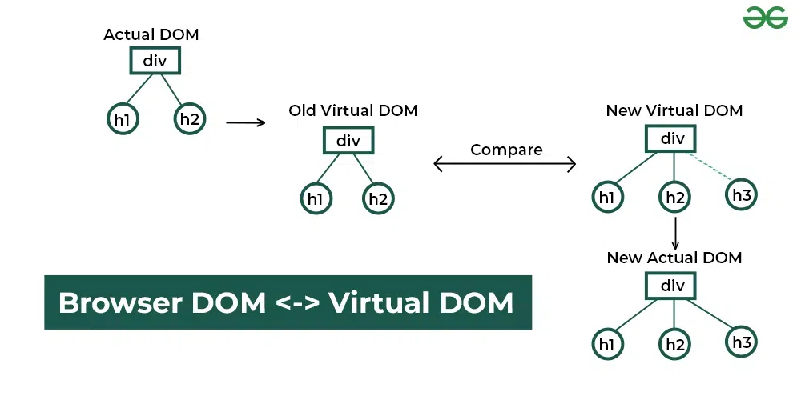
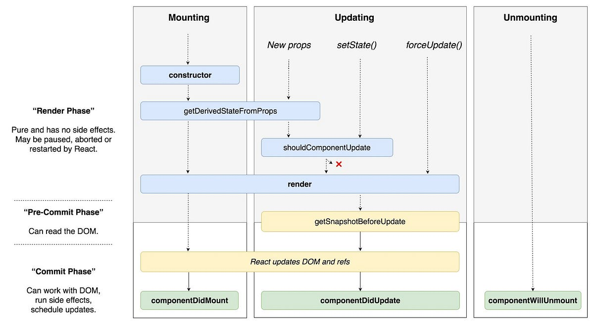
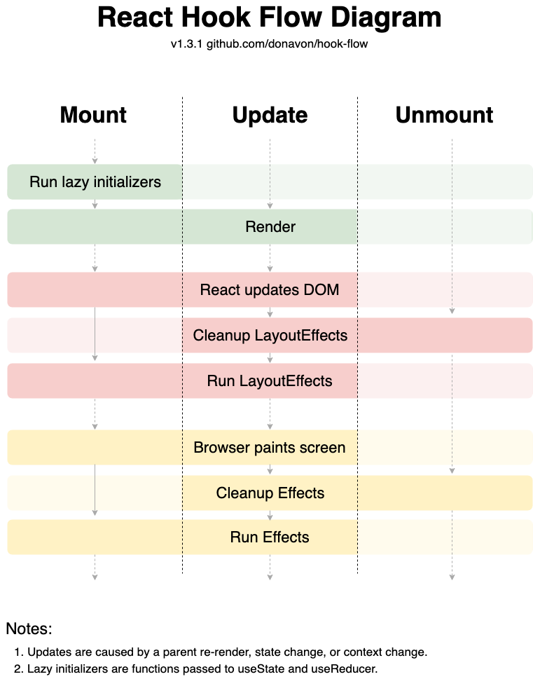

## React 核心概念

### 虚拟 DOM 与 Diff 算法

React 的**虚拟 DOM**（Virtual DOM）是对浏览器真实 DOM 的一种抽象表示，它以 JavaScript 对象树的形式保存 UI 结构。每当组件状态改变时，React 并不会立刻直接操作真实 DOM，而是先生成一个新的虚拟 DOM 树，然后将其与之前的旧虚拟 DOM 树进行比较，找出发生变化的部分，最后只将必要的差异更新到真实 DOM。这种通过**Diff 算法**计算最小更新的策略大大提高了性能：避免了大量不必要的 DOM 操作和重绘。虚拟 DOM 的 Diff 算法遵循以下原则：

- **同层比较：**React 只比较同一层级的节点，不会跨层级地比较节点位置。因此如果在组件树中移动某个节点（改变层级），React 会将其视为节点删除再新增，无法识别为同一节点移动。
- **类型判断：**如果新旧虚拟 DOM 节点类型不同（如 div 变为 p，或组件类型不同），React 直接销毁旧节点及其子树，并创建新节点（包括子节点），而不再深度比较内部结构。这意味着即使结构相似，只要元素或组件类型不同也无法复用。
- **Key 唯一标识：**对于同一列表中的子节点，React 依赖`key`属性来识别节点对应关系，从而高效地对列表进行插入、删除、重排操作。如果不指定稳定的 key（如使用数组索引作为 key），可能导致 Diff 算法错误地重新创建或移除本可复用的DOM元素，产生性能浪费或UI状态错误。

 
 
 *图：React 虚拟 DOM 工作原理示意。React 根据状态变化先生成新的虚拟DOM树（New Virtual DOM），将其与旧的虚拟DOM进行比较（Compare），找出差异后再更新实际的真实DOM（New Actual DOM）。通过这种差量更新，提高渲染效率。*

总之，虚拟 DOM 提供了一层抽象，使得开发者可以用声明式的方式更新UI，而底层由 React 高效地计算必要的最小DOM更新，保证性能。在实际开发中，遵循 React 官方关于性能的最佳实践（如避免不必要的状态变化、合理使用`shouldComponentUpdate`或`React.memo`、为列表元素提供稳定的`key`等）可以充分发挥虚拟 DOM Diff 算法的优势。

### JSX 与 React 元素

**JSX** 是 React 提供的一种语法糖，它允许在 JavaScript 中直接书写类似 HTML 的标签结构。JSX 本质上会被转译为对 `React.createElement` 函数的调用，生成一个描述 UI 的**React 元素**对象。React 元素是构成虚拟 DOM 的最小单元。

使用 JSX 可以使代码更直观，可读性更强。例如：

```jsx
// 使用JSX创建元素：
const element = <h1 className="greeting">Hello, React!</h1>;

// JSX 会被编译成如下的 JavaScript：
const element = React.createElement(
  'h1',
  { className: 'greeting' },
  'Hello, React!'
);
```

上面代码中，JSX `<h1 className="greeting">Hello, React!</h1>` 会被 Babel 编译为对 `React.createElement` 的调用，返回一个普通的 JavaScript 对象（即虚拟 DOM 节点）。这个对象包含了元素的类型（这里是 `'h1'`）、属性（`className: "greeting"`）和子节点（文本 `"Hello, React!"`）。需要注意的是，JSX 语法需要在代码构建时经过编译才能运行，例如通过 Babel 配置 React 的 JSX 转换插件。

JSX **并不是必须的**，我们也可以直接调用 `React.createElement` 来构建元素，但使用 JSX 能让代码风格更加接近 HTML，描述 UI 结构更加直观。因此，在绝大多数 React 项目中都会使用 JSX。需要注意，JSX 语法中可以嵌入表达式（用花括号 `{}` 包裹），但不能直接放语句或对象。并且 JSX 标签最终会编译为函数调用，因此在 JSX 中不要使用保留字（例如 `class` 要写成 `className`）。总之，JSX 是 React 推荐的描述 UI 的语法，它本质上和普通 JavaScript 并无二致，只是编译阶段的一个语法扩展。

## 组件与状态管理

### 类组件 vs 函数组件

在 React 中，**组件**主要有两种定义方式：**类组件**（Class Component）和**函数组件**（Function Component）。两者在编写方式和特性上有一些区别：

- **类组件：** 使用ES6的 class 语法定义，继承自 `React.Component` 或 `React.PureComponent`。类组件必须实现一个 `render()` 方法来返回 JSX。可以在类组件内部使用本地状态（`this.state`）和生命周期方法（如 `componentDidMount` 等）。由于使用 `this` 上下文，类组件在编写时常需要注意绑定方法的 `this` 指向（例如在构造函数中绑定，或使用箭头函数避免独立的 `this`）。
- **函数组件：** 定义为一个普通的 JavaScript 函数（或箭头函数），接收 `props` 参数并返回 JSX。函数组件没有 `this`，也没有传统生命周期方法。以往函数组件被称为“无状态组件”（因为早期无法维护内部状态），但自从 React 16.8 引入 **Hooks** 之后，函数组件也可以使用状态和其他React特性。因此现在函数组件已成为开发中**首选**的组件形式。

两者主要区别在于**使用方式和复杂度**：函数组件相对更简洁，没有 `this`，每次渲染就是一次函数调用，并借助 Hooks 实现状态管理和副作用处理；类组件相对冗长，需要编写类结构，并且在构造函数、生命周期等处处理逻辑。随着 Hooks 的出现，几乎所有以前只能用类组件实现的功能都可以用函数组件+Hooks 达成，并且代码更简洁。因此React官方文档和社区趋势都推荐使用函数组件替代类组件。只有在极少数需要优化的场景下（例如需要继承 `PureComponent` 实现 `shouldComponentUpdate` 的浅比较优化），才可能考虑使用类组件，但这些优化在函数组件中也可以通过 `React.memo` 等实现。

### State 和 Props 的区别

在组件内部管理数据时，**state（状态）**和**props（属性）**是最核心的两个概念，它们在作用和使用上有明显区别：

- **Props：**组件的**属性**。由父组件传入，用于配置子组件。对于一个组件而言，props 是**只读**的，它不可以也不应该在子组件内部被修改。props 体现了组件的**输入**，由父级控制，常用于组件间的数据传递。例如父组件可以通过 `<Child title="Welcome" />` 传给子组件一个 `title` prop。在子组件内部可以通过 `this.props.title`（类组件）或函数参数直接获取 props。因为 props 由父级管理，子组件无权改变，所以 React 组件间的数据流是单向的（自上而下）。
- **State：**组件的**内部状态**。State 由组件自身维护，可以通过 `this.setState`（类组件）或 Hook（函数组件中的 `useState` 等）来更新。state 通常用于存放组件在交互过程中会变化的数据，例如用户输入、请求返回的数据等。state 的改变是**异步**的并且会触发组件重新渲染。与 props 不同，state 不由外部直接提供，而是在组件内部初始化，且只能在组件自身中被修改（当然父组件可以通过传入 props 间接影响子组件的状态逻辑）。

简单来说：**props 是外部传入的数据，state 是组件自身管理的数据**。Props 通常用来配置和呈现（它就像函数的参数），而 state 用来追踪交互后的变化（它类似于函数内部的变量）。例如，一个计数器组件 `<Counter initialCount={0} />`，initialCount 就是传入的 prop，而当前计数值则保存在组件 state 中，当用户点击按钮修改计数时，组件会使用 `setState` 更新 state 并重新渲染 UI。

需要注意的是，尽管子组件不能修改 props，但如果需要响应父组件传入的新 props（例如 prop 改变时重置内部 state），可以利用组件的生命周期方法（如 `componentDidUpdate` 或 `getDerivedStateFromProps`）进行同步。此外，在函数组件中可以使用 `useEffect` 监测 props 变化做出相应处理。

总之，props 和 state 各司其职：props 保持组件的纯粹和可复用，而 state 让组件具有交互和动态变化的能力。清晰地区分两者并合理使用，是React开发的基本要求。

### 控制组件和非控制组件

在表单类组件（如 `<input>`、`<select>` 等）中，React 提供了两种管理方式：**受控组件**（Controlled Component）和**非受控组件**（Uncontrolled Component）。区别在于组件的表单数据是否由 React 状态管理。

- **受控组件：**表单元素的值由组件的状态（state）完全控制。每当用户输入时，会触发事件处理函数，进而使用 `setState` 更新组件状态，组件重新渲染后通过 props 将新的值赋给表单元素的 `value` 属性。整个过程中，输入框显示的值始终来自于 React 组件的 state。因为React状态是唯一数据源，这种模式被称为“单一数据源”或“受控”。例如，一个受控的文本输入：

  ```jsx
  function NameInput() {
    const [name, setName] = React.useState("");
    return (
      <div>
        <input 
          value={name} 
          onChange={e => setName(e.target.value)} 
        />
        <p>当前输入：{name}</p>
      </div>
    );
  }
  ```

  在上述代码中，输入框的值 `value` 始终等于组件状态变量 `name`，每当触发 `onChange` 事件就更新状态，从而实现输入框UI的同步更新。受控组件的优点是**可控性强**，组件对表单的数据有完全控制，可以方便地执行验证、根据输入动态变化UI等。

- **非受控组件：**表单元素的值不受组件状态控制，而是利用DOM自身的机制来管理。例如可以为 `<input>` 设置 `defaultValue` 初始值，后续用户输入的值并不存储在 React 状态中，而是在需要时通过 ref 或事件处理去读取DOM节点的当前值。非受控组件更类似于传统操作 DOM 的方式。例如，使用非受控组件读取表单值：

  ```jsx
  class FileInput extends React.Component {
    constructor(props) {
      super(props);
      this.fileInputRef = React.createRef();
    }
    handleSubmit = () => {
      const file = this.fileInputRef.current.files[0];
      alert(`选中的文件: ${file.name}`);
    };
    render() {
      return (
        <div>
          <input type="file" ref={this.fileInputRef} />
          <button onClick={this.handleSubmit}>提交</button>
        </div>
      );
    }
  }
  ```

  在这个例子中，文件输入框的值并没有保存在组件状态中，而是通过 `ref` 在提交时直接访问 DOM 节点获取文件信息。

受控组件使得表单数据可控，便于即时校验和动态提示，但实现时稍显繁琐，每个输入都要维护状态和事件。非受控组件实现简单，适用于一些对实时交互要求不高的场景（例如文件上传控件，不需要每次内容变化都去处理）。在实际开发中，大部分情况推荐使用**受控组件**，以便充分发挥 React 单向数据流和即时渲染的优势。在需要时，也可以混合两者：例如先用 defaultValue 提供初始值，然后转为受控模式。

## 组件生命周期

React 中的**组件生命周期**指的是组件从创建、更新到销毁的整个过程所经历的一系列方法调用。对于类组件，React 提供了若干生命周期方法，让我们可以在组件的不同阶段插入代码以控制行为。主要的生命周期分三个阶段：

1. **挂载阶段（Mounting）：**组件实例被创建并插入 DOM 的过程。依次调用以下方法：
   - `constructor(props)`: 构造函数，通常用于初始化 state、绑定事件处理方法等。
   - `static getDerivedStateFromProps(props, state)`: （少用）在构造函数之后、`render` 之前调用，根据传入的 props 派生出新的 state。通常用于当 props 改变时需要更新内部 state 的场景。
   - `render()`: 必需的方法，返回组件的 JSX结构。应保持纯粹，避免在此方法中调用 `setState` 或执行副作用操作。
   - **DOM 更新**：React 根据 render 返回结构构建并插入真实 DOM。
   - `componentDidMount()`: 组件挂载完毕（真实 DOM 已插入）后调用。在这里适合执行**副作用**操作，如数据获取、订阅事件或定时器等。这些操作只执行一次。

2. **更新阶段（Updating）：**组件已挂载后，由于 state 或 props 改变导致重新渲染的过程。可能重复执行多次。触发更新的原因包括父组件重新渲染传入新 props、调用 `setState`、或调用 `forceUpdate`。更新流程方法调用顺序：
   - `static getDerivedStateFromProps(props, state)`: （同上）在每次组件接收新props或state更新时（render前）调用，可返回对象来更新state（或返回null表示不更新）。
   - `shouldComponentUpdate(nextProps, nextState)`: 是否应更新组件，返回 `false` 可以跳过后续的更新（阻止组件重新render），默认返回 `true`。可用于性能优化，避免不必要的更新。对于继承自 `React.PureComponent` 的组件，React 已内置一个浅比较实现来自行决定是否更新，无需手动编写此方法。
   - `render()`: 同挂载阶段，依据新的 props/state 返回 JSX。
   - **DOM 更新**：React 比较虚拟DOM的变化，高效地更新真实 DOM。
   - `getSnapshotBeforeUpdate(prevProps, prevState)`: （少用）在更新后的DOM内容还未绘制前调用，可捕获一些更新前的信息（如滚动位置等），其返回值将作为 `componentDidUpdate` 的第三参数。
   - `componentDidUpdate(prevProps, prevState, snapshot)`: 组件更新完毕后调用。可以在此处执行副作用，如根据前后props变化发起网络请求，或者操作更新后的DOM。需要注意避免在此方法中直接调用 `setState` 导致无限循环（如需根据更新结果更新state，必须加判断）。

3. **卸载阶段（Unmounting）：**组件将要从 DOM 中移除，整个实例要销毁的过程：
   - `componentWillUnmount()`: 组件卸载前最后一次调用。应在这里执行必要的清理工作，如清除定时器、取消网络请求、注销事件监听等，防止内存泄漏。

 
 
 *图：React 16.3+ 新版生命周期示意图（“现代”生命周期）。Mounting（挂载）、Updating（更新）、Unmounting（卸载）三个阶段的重要生命周期方法及调用顺序。如图所示，更新阶段中若 `shouldComponentUpdate` 返回 false，将跳过后续的 render 和 update，而在挂载和更新完成后分别调用 `componentDidMount` 和 `componentDidUpdate`。*

以上列出了常用的生命周期钩子。在 React 16.3 版本之前，还有一些已废弃/不推荐使用的旧生命周期方法，例如 `componentWillMount`、`componentWillReceiveProps`、`componentWillUpdate` 等，它们在新版本中已不再调用或需要加 `UNSAFE_` 前缀。React 引入这些更改是为了配合底层架构（如 Fiber 协调算法）实现异步可中断渲染。

了解生命周期对于理解组件何时初始化数据、何时更新 UI、何时清理资源非常重要。例如，常见的模式是在 `componentDidMount` 中发起数据获取请求，在 `componentWillUnmount` 中清除订阅或定时器；在 `shouldComponentUpdate` 中根据情况避免不必要的渲染等。

需要强调的是，**函数组件没有上述生命周期方法**，但可以通过 Hooks 来实现类似的效果。例如，用 `useEffect` Hook 来替代 `componentDidMount`、`componentDidUpdate` 和 `componentWillUnmount`（通过传不同的依赖参数实现）。下一节将介绍 Hooks 如何让函数组件参与到生命周期管理中。

## Hooks 与函数组件

React Hooks 是 React 16.8 引入的一项特性，它为函数组件添加了状态和副作用等能力，从而**无须编写类组件**也能实现有状态逻辑和生命周期控制。Hooks 改变了组件的编程模式，是 React 发展的一个里程碑。

Hooks 的出现带来了诸多好处：首先，函数组件+Hooks 相比类组件更简洁，没有 `this` 和繁琐的生命周期方法；其次，Hooks 提供了一种**组合逻辑**的方式，可以在不改变组件结构的情况下复用状态逻辑（相比之下，类组件要实现逻辑复用通常需要高阶组件或render props等模式）。常用的内置 Hooks 包括：`useState`（状态钩子）、`useEffect`（副作用钩子）、`useContext`、`useMemo`、`useReducer`、`useCallback`、`useRef` 等等。

使用 Hooks 时需要遵循**两条规则**：①只在函数最顶层调用 Hook，不要在循环、条件或嵌套函数中调用；②只在 React 的函数组件或自定义 Hook 中调用 Hook，不要在普通的非组件函数中调用。React 会根据 Hook 调用的顺序来记录状态，一旦顺序发生变化将导致错误。这也是为何Hook调用必须保持稳定、不可在条件分支中动态调用的原因。

下面介绍几个核心 Hook 的用法：

- **`useState`：状态钩子。** 让函数组件拥有 state，并返回一个状态变量和一个更新该状态的函数。用法：`const [count, setCount] = useState(initialValue)`。调用 `setCount` 来更新状态并触发组件重新渲染。值得注意的是，如果新状态值是基于旧状态计算的，应该使用函数式更新：`setCount(prev => prev + 1)`，这样可以确保拿到正确的 prev 值。`useState` 可以多次使用，以声明多个不相关的状态变量。

- **`useEffect`：副作用钩子。** 让函数组件在渲染后执行副作用逻辑，如数据获取、订阅或手动修改 DOM 等。`useEffect` 接收一个副作用函数，该函数会在组件渲染到屏幕后执行。可以通过给 `useEffect` 传入第二个参数依赖数组来控制副作用执行时机：
  - 不传依赖数组：则每次组件更新（包括初次挂载）后都执行副作用函数，相当于类组件的每次 `componentDidUpdate`。
  - 传空数组 `[]`：则副作用只在组件初次挂载后执行一次，相当于 `componentDidMount`，且在组件卸载时执行可选的清理函数。
  - 传入特定依赖 `[dep1, dep2]`：则仅当依赖值发生变化时才执行副作用函数，相当于根据依赖判断是否需要执行更新逻辑。
  - 在副作用函数中返回一个函数作为清理函数，将在组件卸载或下一次副作用执行之前调用，常用于清除计时器、取消订阅等，相当于 `componentWillUnmount`。

  例如，下例演示一个计数器组件使用 `useEffect` 实现订阅：

  ```jsx
  function Counter() {
    const [count, setCount] = useState(0);
    useEffect(() => {
      document.title = `当前计数: ${count}`;
      return () => {
        // 可选的清理函数，在组件卸载时执行
        console.log("组件卸载，清理副作用");
      };
    }, [count]); // 仅当count变化时才执行effect
    return <button onClick={() => setCount(count + 1)}>点击{count}</button>;
  }
  ```

  上述代码中，`useEffect` 依赖了 `count`，因此每次点击按钮更新 state 后，组件重新渲染并执行副作用，将网页标题更新为当前计数。此外还定义了一个清理函数，会在组件卸载时执行（这里仅打印日志示意）。

 
 
 *图：React Hooks 的调用流程示意图。函数组件在挂载 (Mount) 和更新 (Update) 时，会按照Hooks声明的顺序依次执行：首先运行 `useState` 等 Hook 的初始化（Mount 时会执行状态的 lazy initializer 初始化，Update 时跳过），然后执行组件渲染（Render阶段，产出虚拟DOM），紧接着在提交阶段更新真实 DOM 后，依次执行 `useLayoutEffect`（若有）和浏览器绘制，然后执行 `useEffect`。在组件更新时，还会在更新前清理上一次的 Effect。卸载 (Unmount) 阶段则会清理任何遗留的 Effect 和 LayoutEffect。该流程图清晰展示了 Hooks 相对于生命周期的执行时机。*

- **其他常用 Hooks：** 除了 useState和useEffect，React 还提供了其他Hook满足不同需求。例如：
  - `useContext` 可以让我们直接获得上下文（Context）中的值，避免使用 `<Context.Consumer>` 元素。
  - `useMemo` 接收一个计算函数和依赖数组，在依赖不变的情况下缓存计算结果，避免每次渲染都执行耗时计算，起到性能优化作用。
  - `useCallback` 类似于 useMemo，但专门用于缓存函数定义，避免子组件因回调函数引用变化而不必要重新渲染。
  - `useRef` 提供一个可变的 ref 对象，其 `.current` 属性可用于保存跨渲染周期保持不变的值，或用于引用 DOM 元素。
  - `useReducer` 用于以 Redux 类似的方式管理复杂状态，通过 reducer 函数来更新状态，常用于状态逻辑复杂或包含多个子值的情况。
  - 可以自定义 Hooks，将组件间可复用的状态逻辑提取成独立的函数，以 `use` 开头，通过调用内部其他Hooks来实现一定的功能。这有助于分享逻辑而不增加组件嵌套。

通过 Hooks，函数组件几乎可以完成过去类组件的所有功能。需要注意的是，Hooks 的调用顺序在每次渲染中必须保持一致，因此 Hooks 规则尤其重要。此外，`useEffect` 等 Hooks 的执行时机可能与类生命周期略有不同，例如所有 `useEffect` 会在浏览器完成绘制后统一异步调用，这一点和类组件的 `componentDidUpdate` 行为接近但不完全相同（useEffect 调用时机稍晚）。对于需要在 DOM 更新后但在浏览器绘制前执行的逻辑，可以使用 `useLayoutEffect`。大部分情况下，Hooks 的这些细微差别并不影响开发，通过合理使用依赖数组和清理函数，可以实现和类生命周期等价的效果。

## setState 的工作原理

无论在类组件还是函数组件中，更新状态都有异步批量处理的特点。在类组件中，使用 `this.setState` 来更新组件状态，值得注意以下几点：

- **异步批量更新：**React 出于性能考虑，会将多个连续的状态更新合并批处理。例如在一个事件处理函数中调用多次 `setState`，React 并不会立即逐次执行渲染，而是可能将它们合并在一次更新中完成。这意味着在调用 `setState` 之后，`this.state` 不会立即更新，而是在稍后的批处理中统一更新。所以如果需要在调用 `setState` 之后获取更新后的状态值，应该使用 `setState` 的回调函数，或在 `componentDidUpdate` 中获取。从React 18开始，所有由事件处理产生的更新默认都是批处理的。
- **部分更新：**在类组件中，`setState` 可以传入一个对象，这个对象会与现有状态做浅合并（shallow merge）。因此我们只需提供需要改变的状态字段，未提及的字段保持不变。这不同于Redux那样需要返回完整的新状态对象。
- **函数式更新：**`setState` 还可以接收一个函数 `setState(prevState => newState)`，以保证在需要基于前一状态计算新状态时的准确性。在批量异步更新下，使用函数形式能够避免因为无法及时获取最新state导致计算错误。例如：`this.setState(prev => ({ count: prev.count + 1 }));` 多次调用可以确保每次都基于之前的正确值递增。

在函数组件中，`useState` 的更新函数（例如 `setCount`）也具有异步批量特性。尽管在实现上有所不同（函数组件的 state 更新在下一次渲染中才生效），但开发者的心智模型可以与类组件类似：调用状态更新不会马上更新变量，只有当组件重新渲染时才能获得新值。因此切忌直接依赖更新后的 state 执行后续逻辑，而应放在 `useEffect` 中或使用回调获取。

需要强调的是，React通过批量更新和异步处理提高了性能，但也需要开发者理解这一机制。例如，不要根据当前的 state 推断后续 state，而应使用函数式更新；不要假设连续的多次 `setState` 会导致多次渲染，React 可能会合并它们。有时候我们希望跳过批处理立即更新，可以使用 `flushSync` 等（React18提供的API）强制同步更新，但一般很少需要。

最后，`setState` 的调用会触发组件重新渲染，React 会重新执行渲染过程并更新虚拟DOM，通过Diff找差异并更新真实DOM。因此请避免在不需要的时候调用 `setState`，以免引起不必要的重渲染。

## Context 上下文

React 的 Context（上下文）提供了一种组件间共享数据的方式，避免了多层组件嵌套传递props（即所谓的“prop drilling”问题）。使用 Context，我们可以在祖先组件处提供一个值，然后在后代组件任意深度处直接读取该值，而不需要通过每一层的props手动传递。

典型的使用场景包括：应用主题（theme）设置、当前登录用户、偏好设置、多语言信息等需要在应用许多地方使用但不想层层传递的全局性数据。

**使用 Context 的步骤：**

1. 使用 `React.createContext(initialValue)` 创建一个 Context 对象。可以为它指定一个默认值（当没有匹配的 Provider 时会用到）。例如：`const ThemeContext = React.createContext('light');`
2. 在上层组件中，用 `<ThemeContext.Provider value={/* 一些值 */}>` 包裹下层组件树。这样 Provider 会将 `value` 属性提供的值传递给树中所有使用了该 Context 的子孙组件。
3. 在需要使用该上下文的子组件中，有两种获取方式：
   - **Context.Consumer：** 使用 `<ThemeContext.Consumer>` 包裹要访问上下文的部分，提供一个函数子元素，该函数接收 context 值作为参数并返回 JSX。
   - **useContext Hook：** 在函数组件中，可以更方便地使用 `const theme = useContext(ThemeContext)` 直接获得当前上下文值，而不需要 Consumer 包裹。
   - （对于类组件，也可以通过定义 `static contextType = ThemeContext` 来直接在 `this.context` 访问，但更常用的是 Consumer）

例如，使用 Context 共享主题的简单示例：

```jsx
// 创建 Context
const ThemeContext = React.createContext('light');

function ThemeButton() {
  const theme = React.useContext(ThemeContext);  // 获得当前上下文的值
  return <button className={"btn-" + theme}>当前主题</button>;
}

function Toolbar() {
  return (
    <div>
      <ThemeButton />
    </div>
  );
}

// 在应用中提供上下文：
function App() {
  const [theme, setTheme] = useState('dark');
  return (
    <ThemeContext.Provider value={theme}>
      <Toolbar />
      <button onClick={() => setTheme(theme === 'dark' ? 'light' : 'dark')}>
        切换主题
      </button>
    </ThemeContext.Provider>
  );
}
```

在上述代码中，`App` 使用 `ThemeContext.Provider` 将当前主题值提供给后代组件。`ThemeButton` 内部通过 `useContext(ThemeContext)` 直接获取 `theme`，并根据它渲染不同的样式。当上层调用 `setTheme` 切换主题时，Provider 提供的 value 改变，`ThemeButton` 组件会自动订阅到这一变化并重新渲染。

**Context 的注意事项：** 
- Context 应该适度使用。如果只是父子两级传递数据，完全没有必要用 Context，直接用 props 更清晰。Context 主要适用于深层嵌套的全局信息。
- 当 Context 的 Provider 的 value 发生变化时，所有使用该 Context 的后代组件都会重新渲染。为了避免不必要的渲染浪费，可以将 value 拆分成多个小的 Context 分别提供，或利用 `React.memo` 等对消费组件进行优化。
- 不要在一个应用中滥用 Context，否则会使组件与环境高度耦合，破坏组件的独立性和可重用性。理想情况下，全局状态还是考虑专门的状态管理（如 Redux 或 Zustand 等），而 Context 更适合作为实现这些库的底层机制或传递少量简单数据。

## 性能优化与其他建议

随着应用规模变大和组件数量增多，合理的性能优化变得重要。下面介绍 React 开发中几个经典的性能优化点以及常见面试关注问题：

### shouldComponentUpdate 与 PureComponent

如上文所述，类组件可以通过覆盖 `shouldComponentUpdate(nextProps, nextState)` 来决定是否需要进行重新渲染。如果返回 false，组件将跳过此次更新。这在避免大量无意义渲染时非常有用。例如父组件更新但子组件的 props 并未变化时，可以让子组件跳过更新。

React 提供了 `React.PureComponent` 来简化这个过程。PureComponent 是 React.Component 的子类，其 `shouldComponentUpdate` 已经帮我们实现了**浅比较**：即比较新旧 props 和 state 的表层值，如果都没有变化则返回 false，阻止更新。因此，我们可以让类组件继承 PureComponent 而非 Component，便可自动获得一次浅层对比的优化。但需注意浅比较只能检查对象引用是否相同，不能深度比较对象内部，可能误判不同内容的对象（引用变化才认为变了）。

对于函数组件，可以使用 Hook 或高阶组件来实现类似优化。最常用的是 **`React.memo`** 高阶组件，它可以包装一个函数组件，使其也具有类似 PureComponent 的浅比较性质。即：`export default React.memo(MyComponent)`，则 MyComponent 在接收到相同的 props 时会跳过渲染直接重用上次的结果。React.memo 也支持第二个参数提供自定义的比较函数，以替代默认的浅比较逻辑。

需要指出，使用 `shouldComponentUpdate` 或 PureComponent/React.memo 都是为了减少不必要的UI更新，但过度使用也可能使代码逻辑复杂化。应该在确认性能瓶颈时，再有针对性地优化。而且它们只避免 React 的重新渲染，但如果父组件本身频繁渲染，子组件使用 memo 虽然不渲染但还是会进行一次浅比较运算，也有一定开销。因此在优化时需要权衡利弊。

### 列表渲染中的 Key 值

前面在虚拟DOM部分提到，**key** 在列表(diff)算法中扮演重要角色。在渲染动态列表时，为每个列表项提供稳定的 `key` 可以帮助 React 正确识别哪些元素被新增、移除或重新排序，从而复用已有DOM元素，避免不必要的创建和销毁。

**常见问题：**为什么不建议使用数组的索引作为列表项的 key？因为索引会随着元素顺序改变而改变。当列表项顺序变化时，基于索引的 key 也会变化，React 会误以为元素本身都变了，导致所有项重新渲染，失去了 diff 算法应有的优化效果。此外，如果列表项内部有输入状态或其它本地状态，也可能因为 key 改变导致组件被卸载重建，造成用户输入丢失等问题。因此，key 应该使用列表元素的唯一标识（如数据库主键、唯一ID等），以在重排时保持不变。

总之：**保证 key 唯一且稳定**。当没有合适的自然唯一值时，才考虑用索引，但要清楚这样做可能带来的副作用。在面试中，这是高频考点。正确的回答应该包括：key 的作用（辅助虚拟DOM diff，提高列表渲染性能），为何需要唯一稳定，以及索引作为 key 的问题。

### 其他优化技巧

- **懒加载 (Code Splitting)：** 使用 React.lazy 和 `<Suspense>` 按需加载组件，避免一次性加载整个应用代码，提高初次加载性能。
- **避免匿名函数和多余对象创建：** 在 JSX 中避免每次 render 都创建新的匿名函数或对象属性，可能的话提取到组件外部或使用 useCallback/useMemo 缓存，否则子组件可能因为接收到新函数引用而重复渲染。
- **缓存列表项组件：** 列表渲染时，可以将列表子项提取成独立组件并使用 React.memo，这样父列表更新时只渲染改变了的子项。
- **利用浏览器优化：** 尽量减少 DOM 操作次数已经由React完成，但仍应注意避免强制同步布局（如不必要的调用元素尺寸测量）等操作。可以适当使用CSS动画取代过多的JS计算。

通过以上手段，配合 React 提供的调试工具（如 React Developer Tools 的 Profiler），我们可以识别性能瓶颈并做针对性优化。性能优化是进阶主题，面试中除了考察具体技术点（比如 shouldComponentUpdate、key 等），也会看开发者是否有整体的性能意识和调优经验。
