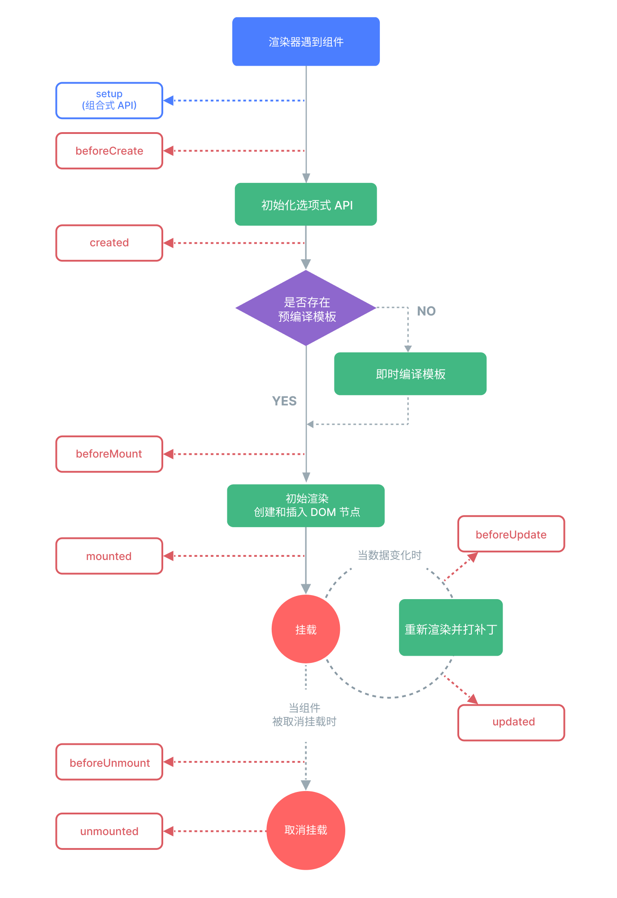

# Vue2与Vue3面试高频题系统讲解

# 1. Vue 的生命周期有哪些阶段？


 
 *（Vue 组件生命周期图示：展示组件从初始化选项式 API、创建 DOM 节点、挂载、更新到销毁的完整流程，每个阶段对应的生命周期钩子函数。）*

**背景说明：** Vue实例从创建到销毁会依次触发一系列生命周期钩子函数。理解生命周期有助于我们在正确的时机执行代码（如数据初始化、DOM 操作、清理定时器等）。Vue2 和 Vue3 的生命周期总体类似，但在命名和用法上稍有区别（Vue3 中将 `beforeDestroy/Destroyed` 更名为 `beforeUnmount/Unmounted`，并在组合式 API 中提供 `onMounted` 等对应函数）。

**知识点讲解：** Vue的生命周期大致分为**创建阶段**、**挂载阶段**、**更新阶段**和**销毁阶段**。在**创建阶段**，实例完成观测数据、初始化事件等，此时有 `beforeCreate` 和 `created` 钩子（Vue3 还会在创建前执行组合式 API 的 `setup`）。`beforeCreate` 时组件实例尚未初始化完成，数据和DOM都未生成；`created` 时数据观测完成，可以访问 `data/computed` 等属性，但尚未挂载 DOM，`$el` 仍不可用。接着进入**挂载阶段**，Vue 编译模板并创建真实 DOM，调用 `beforeMount`，随后将 DOM 插入页面触发 `mounted` 钩子。`mounted` 时组件已经出现在页面上，通常在这里进行DOM相关操作或异步数据请求。随后在运行过程中，当响应式数据变化，会进入**更新阶段**，依次触发 `beforeUpdate`（数据已更新，但DOM尚未更新）和 `updated`（DOM更新完毕）。开发者可在这两个钩子中对更新前后的状态进行处理（一般更常用 `updated` 获取更新后的DOM状态）。最后，当组件从页面移除，进入**销毁阶段**，分别触发 `beforeDestroy`（或Vue3中的`beforeUnmount`）和 `destroyed`（Vue3中`unmounted`）。此阶段可以在 `beforeDestroy` 中执行清理工作（如清除定时器、取消订阅等），`destroyed` 时实例已解除数据观测和事件绑定。需要注意，**Keep-Alive** 缓存的组件在停用时不会调用destroy，而是调用 `deactivated`，重新激活时调用 `activated`（这是 Keep-Alive 特有的两个钩子）。

**示例代码：** 下面通过简单日志展示 Vue2 生命周期钩子的触发顺序：

```javascript
<script>
export default {
  data() {
    return { msg: "Hello" };
  },
  beforeCreate() { console.log("beforeCreate"); },
  created()     { console.log("created"); },
  beforeMount() { console.log("beforeMount"); },
  mounted()     { console.log("mounted"); },
  beforeUpdate(){ console.log("beforeUpdate"); },
  updated()     { console.log("updated"); },
  beforeDestroy(){ console.log("beforeDestroy"); },
  destroyed()   { console.log("destroyed"); }
}
</script>
```

假设该组件被创建并插入页面，然后修改其 `msg` 数据，最后从页面中移除，控制台将依次打印出：`beforeCreate -> created -> beforeMount -> mounted -> beforeUpdate -> updated -> ... -> beforeDestroy -> destroyed`，体现出生命周期各个阶段的执行顺序。

**重点提示：**

- **钩子函数作用**：在不同阶段执行相应操作。例如：`created` 常用于初始化数据，`mounted` 用于操作已挂载的DOM或发送异步请求，`beforeDestroy` 用于清理计时器或解绑事件。
- **避免误用数据**：在 `beforeCreate` 和 `created` 钩子中，DOM 尚未生成，不要进行 DOM 操作；在 `mounted` 钩子之前，`$el` 等还不可用。
- **组合式 API**：Vue3 使用组合式 API 时，可用 `onMounted`、`onUpdated` 等函数注册生命周期，相当于对应的选项式钩子。在 `setup` 内调用这些函数来实现相同行为。
- **Keep-Alive 钩子**：使用 `<keep-alive>` 缓存组件时，需了解 `activated`/`deactivated` 钩子的触发时机，以正确维护组件状态（例如切换选项卡时保留组件数据）。

# 2. 什么是 MVVM？Vue 如何实现？

**背景说明：** MVVM 是 *Model-View-ViewModel* 的缩写，即模型-视图-视图模型架构。它是一种用于界面开发的设计模式，通过**双向数据绑定**将 View（视图）和 Model（数据模型）连接起来，ViewModel 负责同步两者状态。Vue 是典型的 MVVM 框架：数据模型的变化自动更新视图，用户操作视图也能反馈更新模型。理解 MVVM 对掌握 Vue 的数据绑定原理非常关键。

**知识点讲解：** 在 MVVM 模式中：
- **Model（模型）**: 指应用的领域数据和业务逻辑。例如 Vue 中 `data` 里的对象就是 Model 的部分。
- **View（视图）**: 即用户界面，由 DOM 元素构成。在 Vue 中是模板渲染出来的页面。
- **ViewModel（视图模型）**: 作为桥梁，承担双向绑定职责。Vue实例本身可以视为一个ViewModel：它将 Model 和 View 关联起来，当 Model 改变时，ViewModel 检测到变化并通知 View 更新；当 View 有用户交互（如输入），ViewModel 也会捕捉事件并更新 Model。

Vue实现MVVM的关键在于**数据劫持**和**模板编译**两部分：
- **数据劫持 (Observer)**: Vue2 初始化实例时，会遍历 `data` 对象，用 `Object.defineProperty` 将每个属性转为 getter/setter，以拦截数据变动。每个数据属性都对应一个依赖收集容器（Dep），用于追踪有哪些地方使用了该数据。这样当数据变化时，Vue能感知并通知后续处理。
- **模板编译 (Compile)**: Vue在编译模板时，会将模板指令（如 `{{}}` 插值、`v-model`、`v-on` 等）解析为更新函数（或称渲染函数）。在这个过程中，会为每个使用到数据的地方创建一个观察者（Watcher）。Watcher 订阅相应数据的变化，当数据更新时，Watcher 接收到通知并执行回调更新视图。
- **Watcher & Dep（订阅-发布）**: 可以把 Dep 理解为消息中心，数据属性的每次读取会让当前执行的 Watcher 订阅该属性；当属性值发生变化时，属性对应的 Dep 会发布通知，调用所有订阅该属性的 Watcher 更新函数。这种机制就是典型的观察者模式/发布订阅模式的应用，在Vue中实现了数据到视图的联动。

简而言之，Vue通过 **Observer (数据劫持)** + **Watcher (数据监听)** + **Dep (依赖收集)** + **Compile (模板编译)** 实现了 MVVM：
当我们调用 `new Vue({...})` 时，Vue做了以下事情：
1. **数据劫持**：对传入的 `data` 执行响应式转换 (`observe`过程)，把每个属性转成 getter/setter，以便追踪。
2. **模板编译**：解析模板指令，将模板中用到的数据和DOM进行绑定，创建 Watcher 来追踪这些数据。
3. **绑定 Watcher**：在模板编译过程中，每遇到一个数据绑定，就实例化一个 Watcher，并在其构造中访问相应的属性（触发 getter）。getter 中将当前 Watcher 添加到该属性的 Dep 中完成订阅。
4. **初始化视图**：Compile 阶段会执行一次各指令对应的初始更新函数，根据数据状态在 DOM 上渲染出内容。
5. **双向绑定**：如果用户在界面上操作（如输入框编辑），通过 `v-model` 指令已经在 input 事件监听中更新数据模型；数据修改后又走回响应式更新流程，触发 Watcher 更新视图，从而完成 “View → Model” 的更新。这就是 MVVM 中双向绑定的体现。

**示例代码：** 以下通过简化的伪代码展示 Vue2 中 MVVM 实现的核心流程：

```javascript
class Vue {
  constructor(options) {
    this.$data = options.data;
    // 1.数据劫持：将 this.$data 转为响应式
    observe(this.$data);
    // 2.代理数据：将 data 中属性直接代理到 Vue 实例上
    // 如访问 this.prop 等价于 this.$data.prop
    proxy(this, '$data');
    // 3.模板编译：编译挂载点内的模板，将数据和模板绑定
    new Compile(options.el, this);
  }
}
```

在 `observe` 函数中，对对象每个属性定义getter/setter：

```javascript
function observe(obj) {
  if (typeof obj !== 'object' || obj == null) return;
  Object.keys(obj).forEach(key => {
    defineReactive(obj, key, obj[key]);
  });
}
function defineReactive(obj, key, val) {
  // 递归处理嵌套对象
  observe(val);
  const dep = new Dep();  // 每个属性一个依赖收集器
  Object.defineProperty(obj, key, {
    get() {
      if (Dep.target) dep.addSub(Dep.target);  // 收集依赖
      return val;
    },
    set(newVal) {
      if (newVal !== val) {
        val = newVal;
        observe(newVal);      // 新值如果是对象，继续劫持
        dep.notify();         // 通知所有订阅者更新
      }
    }
  });
}
```

Compile 会解析模板，比如遇到 `{{message}}`，则创建对应 Watcher：

```javascript
class Watcher {
  constructor(vm, expOrFn, updateFn) {
    this.vm = vm;
    this.getter = parsePath(expOrFn);  // 将表达式转为取值函数
    this.updateFn = updateFn;
    this.value = this.get();  // 调用get触发依赖收集
  }
  get() {
    Dep.target = this;               // 将当前 watcher 标记为依赖目标
    let value = this.getter.call(this.vm, this.vm);
    Dep.target = null;
    return value;
  }
  update() {
    const newVal = this.getter.call(this.vm, this.vm);
    this.updateFn.call(this.vm, newVal);  // 执行实际 DOM 更新
  }
}
```

当数据变化调用 `dep.notify()` 时，会遍历 Dep 中的所有订阅者 Watcher，调用其 `update()`，从而执行对应的DOM更新函数。通过这一机制，Vue实现了数据变动→视图更新的流程。同时，`v-model` 指令在 Compile 阶段还为表单元素绑定事件监听，实现视图变化→数据更新。

**重点提示：**

- **双向绑定 vs 单向数据流**：MVVM 提供的双向绑定便捷地同步视图和数据，但在复杂场景下需小心双向数据流引发的状态不明。Vue 默认父子组件是单向数据流（props down, events up），只在特定场景使用双向绑定（如表单输入）。
- **Observer 开销**：Vue2 在初始化时要遍历数据对象的每个属性进行数据劫持，深层嵌套对象会有一定性能和内存消耗，因此应避免 data 对象过于庞大或深度层次太深。如果数据量很大，可以考虑按需懒观测或在Vue3使用 Proxy 优化。
- **MVVM 限制**：不是所有变化都能自动监听，例如 Vue2 不能检测数组通过索引直接赋值、或给对象动态增加新的属性（详见下一节响应式原理）。这源于 defineProperty 的局限，需要使用 Vue.set/删除等API绕过。Vue3 则通过 Proxy 消除了这些限制。

# 3. Vue 响应式原理对比（Vue2 vs Vue3）

**背景说明：** Vue响应式原理是框架最核心的部分。Vue2 和 Vue3 都实现了数据的自动追踪和更新，但底层机制有显著不同：Vue2 使用 `Object.defineProperty` 拦截属性读写实现响应式，而 Vue3 则重构为基于 ES6 `Proxy` 的响应系统。这两种实现各有特点和差异，理解其原理有助于编写更高效、符合响应式机制预期的代码，并能解释一些常见的框架行为和陷阱。

**知识点讲解：**

- **Vue2 响应式（基于 defineProperty）：** Vue2 在初始化组件时，会遍历 data 对象的每个属性，用 `Object.defineProperty` 将其转换为 getter/setter（正如上题代码所示的 `defineReactive`）。当组件渲染时，访问数据属性会触发 getter，把当前组件的渲染 Watcher 收集到依赖列表中；当属性赋新值时触发 setter，setter 内部通知对应的 Dep 去调用所有相关 Watcher 的 update 方法，从而让依赖该数据的视图更新。这个实现方式稳定高效，但有几个**局限**：
  1. **无法检测属性添加或删除：** defineProperty 必须在对象属性已存在时才能劫持。如果给响应式对象新增一个未定义的属性（如 `vm.obj.newProp = 123`），因为初始化时没有defineProperty这个键，Vue2无法监听到这个新增属性的变化。同理，删除属性也无法触发响应。为此，Vue2 提供了 `$set` (或全局 `Vue.set`) 和 `$delete` 方法，让开发者显式添加/删除响应式属性（其内部其实是通过重新定义defineProperty实现）。
  2. **无法检测数组索引和长度变化：** 对于数组，通过索引直接赋值如 `vm.items[3] = 'x'` 或修改长度 `vm.items.length = newLen` 也无法被监听。Vue2 针对数组采用了一些变通方法：覆盖了数组原型上会改变数组的方法（如 push/pop/splice 等），使它们在修改数组时额外触发通知。但是像通过索引赋值这种非原型方法的变化仍无自动通知，需要用 `Vue.set(vm.items, 3, 'x')` 替代。
  3. **性能问题（大量属性）：** defineProperty 需要递归遍历对象所有属性进行劫持，对于巨大复杂的对象会有初始化性能问题。而且每个属性都绑定闭包存储一个 value 和 Dep，会消耗一定内存。

- **Vue3 响应式（基于 Proxy）：** Vue3 重写了响应式系统，使用 `Proxy` 来代理整个对象。这意味着不需要遍历每个属性预定义 getter/setter，只需对对象做一次代理，就可以拦截对这个对象的所有操作。核心机制是**追踪（track）**和**触发（trigger）**：
  - 当组件渲染或计算属性求值时，访问响应式对象属性会进入 Proxy 的 get 拦截器。Vue3 在 get 拦截中调用 `track(target, key)`，将当前活跃的副作用（effect，相当于Watcher）与所访问的 target.key 建立关联（记录在全局的 “依赖地图” 中）。
  - 当响应式对象的某个属性被设置时，会进入 Proxy 的 set 拦截器。Vue3 在 set 中调用 `trigger(target, key)`，通过之前建立的依赖关系找到使用该属性的副作用列表，然后逐一触发重新运行（例如重新渲染组件或计算属性重新计算）。
  
  Vue3 响应式相比Vue2有以下**优点**：
  1. **支持新增和删除属性**：Proxy 可以拦截诸如 `has`（in 操作符）、`ownKeys`（Object.keys）等操作。因此当我们给响应式对象添加一个新属性时，也会触发 set trap，从而能够自动响应（Vue3 不再需要 Vue.set）。删除属性同理，也能被检测到。
  2. **支持数组索引和长度**：对数组的索引赋值或修改长度，同样通过 Proxy 的 set 拦截检测，从而触发响应。这弥补了Vue2的数组变异监听漏洞。
  3. **惰性创建依赖**：Vue3 不再初始化时遍历每个属性进行劫持，而是在运行时访问时才追踪需要的属性依赖。这使得冷数据（未被访问的属性）不会产生开销，**tree-shaking**更友好（未用到的模块/属性不触发依赖收集）。同时也降低了初始化成本，提升运行效率。
  4. **更易拓展**：Proxy 能拦截更全面的操作，Vue3 基于它实现了一些Vue2难以实现的新特性，如 `reactive` 可以嵌套代理，`readonly` 代理实现只读响应式对象，以及 `shallowReactive`（浅响应）等变种。整体代码也更模块化（Vue3 将响应式实现抽离为独立的 `@vue/reactivity` 包）。

- **依赖追踪变化：** Vue3 把原来的 Watcher 拆解为更通用的 “响应式副作用 effect”。`effect` 可以是渲染函数、计算属性函数或者用户自定义的 watch 回调等。Vue2 时每个 Watcher 绑定一个组件或一个表达式，而 Vue3 的 effect 是通过 `effect(fn)` 去注册一个副作用函数 fn。这个 fn 执行时如果用到了响应式数据，就会通过 track 记录依赖。日后数据变时，触发 trigger 找到对应的 effect 重新执行。这种设计更灵活、解耦，将依赖收集逻辑集中处理，也方便实现例如 `stop` 停止监听、`effectScope` 等控制效果的API。

**示例代码：** 以下演示Vue2和Vue3响应式实现上的差异：

- *Vue2模式下*（defineProperty）：我们手写一个简单的响应式转换，劫持对象属性：

  ```javascript
  // 简化的 Vue2 数据劫持
  function defineReactive(obj, key, val) {
    observe(val); // 递归子对象
    Object.defineProperty(obj, key, {
      get() {
        console.log('get', key, val);
        return val;
      },
      set(newVal) {
        if (newVal !== val) {
          console.log('set', key, newVal);
          val = newVal;
          observe(newVal);      // 新值继续劫持
          // notifyUpdate() -> 在真正实现中，这里会通知依赖该属性的 Watcher 更新
        }
      }
    });
  }
  
  function observe(obj) {
    if (typeof obj !== 'object' || obj == null) return;
    Object.keys(obj).forEach(key => defineReactive(obj, key, obj[key]));
  }
  
  // 使用
  const data = { foo: 'foo', bar: { baz: 1 } };
  observe(data);
  data.foo;         // 访问 -> 输出 "get foo foo"
  data.foo = 'new'; // 修改 -> 输出 "set foo new"
  // 注意：data.newProp = 123 无法检测，需要 Vue.set
  //       data.bar.baz = 2 可以检测，因为 bar.baz 已被劫持
  ```

- *Vue3模式下*（Proxy）：Vue3 提供 `reactive` 将对象转为响应式。我们模拟一个简单的 reactive 实现：

  ```javascript
  function reactive(target) {
    if (typeof target !== 'object' || target == null) return target;
    const handler = {
      get(target, key, receiver) {
        const result = Reflect.get(target, key, receiver);
        console.log('get', key, result);
        // Track 依赖收集（关联当前 effect 与 target.key）
        track(target, key);
        return typeof result === 'object' ? reactive(result) : result;
      },
      set(target, key, value, receiver) {
        const oldValue = target[key];
        const result = Reflect.set(target, key, value, receiver);
        if (oldValue !== value) {
          console.log('set', key, value);
          // Trigger 触发更新（通知所有依赖了 target.key 的 effect）
          trigger(target, key);
        }
        return result;
      }
    };
    return new Proxy(target, handler);
  }
  
  // 使用
  const state = reactive({ foo: 'foo', list: [1,2,3] });
  state.foo;         // 访问 -> 输出 "get foo foo"
  state.foo = 'new'; // 修改 -> 输出 "set foo new"
  state.newProp = 123; // 新增属性 -> 输出 "set newProp 123" （能监测到）
  state.list[1] = 99;  // 修改数组索引 -> 输出 "set 1 99" （能监测到）
  ```

  上述代码中，我们在 get/set trap 中打印日志，可以看到对属性的读写都被拦截到了，包括新增属性和数组索引变化。在Vue3正式实现里，`track` 会把依赖关系记录在一个全局WeakMap结构中，`trigger` 则从WeakMap取出依赖执行更新。**值得注意**的是，在 Proxy 实现里，对象的嵌套结构也能自动递归代理（如上 `reactive` 里对嵌套返回值又调用了一次 reactive），而无需像Vue2那样手动深度遍历。

**重点提示：**

- **性能与兼容性：** Vue3 的 Proxy 实现使响应式更健壮和高效，但 Proxy 无法被完全 polyfill，因而Vue3不支持IE11等老旧浏览器。Vue2由于使用defineProperty，可以支持IE9+。如果需要兼容旧环境，需要继续使用Vue2或构建降级方案。
- **调试差异：** 在Vue2中，我们可以通过浏览器控制台打印 Vue 实例的 `$data` 看到普通对象；而Vue3中 `reactive` 返回的是 Proxy，可以看到类似 `Proxy {<target>}` 的对象。在调试时需要注意这一点，不过Vue3提供的开发者工具会友好地显示响应式状态。
- **避免直接操作 Proxy 原型方法：** 虽然Vue3 Proxy 能监听大部分操作，但仍需避免一些破坏响应追踪的做法。例如不要通过 `Object.assign` 用一个普通对象直接覆盖一个响应式对象（这样会失去响应式包装，需要重新 reactive）。也不要直接操作响应式对象的原始对象（Vue3提供了 `toRaw` 可以获取原始对象，一般仅用于避开追踪，平时避免随意对原始对象进行修改）。
- **响应式 API：** Vue3 将响应式相关功能封装为API，如 `reactive`、`ref`、`computed`、`watch` 等。相比Vue2利用实例属性和选项，Vue3开发者可以直接导入使用这些API，更灵活也更利于 Tree-Shaking。例如在Vue3中你可以按需引入 `import { reactive, computed } from 'vue'`，只用到哪个就引哪个，构建时未用的不会打包进最终代码，提高性能。

# 4. 虚拟 DOM 是什么？它的工作原理如何？

**背景说明：** 虚拟 DOM（Virtual DOM）是前端框架（如 React、Vue）常用的一个概念。它指的是以 JS 对象的形式模拟 DOM 结构，从而对实际 DOM 操作进行抽象。Vue 在内部使用虚拟 DOM 技术：组件的模板会编译成渲染函数，执行后返回虚拟 DOM 树表示 UI 结构。当数据变化时，Vue通过新旧虚拟DOM进行**差异比较（diff）**，计算出最小的真实DOM更新操作，从而高效更新页面。理解虚拟DOM有助于明白Vue的渲染机制和性能优化手段。

**知识点讲解：** 
1. **什么是虚拟DOM?** 简而言之，就是用一个原生JS对象来描述DOM节点的信息。这个对象通常包含节点的标签名、属性 (props/attrs)、子节点列表等。例如，一个简单的DOM元素 `<div id="app"><span>Hello</span></div>` 可以用虚拟DOM表示为类似：
   ```js
   {
     tag: 'div',
     props: { id: 'app' },
     children: [
       { tag: 'span', props: {}, children: ['Hello'] }
     ]
   }
   ```
   这个 JS 对象就是一个虚拟节点 (VNode)。整个Vue组件渲染出来的页面，可以对应成一棵由VNode组成的树状结构（Virtual DOM Tree）。

2. **虚拟DOM的作用:** 直接操作浏览器DOM是昂贵的，因为DOM变化会触发浏览器布局、重绘等一系列渲染步骤。而通过虚拟DOM，框架可以在内存中以JS对象的方式先计算出最终需要的DOM结构，把大量变更合并，然后**批量更新**真实DOM。具体来说，当数据变化时，Vue会调用组件的渲染函数重新生成一棵新的虚拟DOM树，然后将其与旧的虚拟DOM树进行比较(diff)。Diff算法会找出两棵树之间节点的差异，进而转换成对真实DOM的最小修改操作（如添加某节点、删除某节点、更新属性等），最后由Vue高效地执行这些DOM更新。这样避免了粗暴地重新渲染整个页面，提高性能。

3. **Diff算法原理:** Vue的虚拟DOM diff 基本遵循 React 提出的策略：O(n) 的双端比较算法。主要原则包括：
   - **同层比较**：只比较同一层级的节点，不会跨层级地比较和移动节点（因为正常DOM操作中跨层移动不常见且影响大）。
   - **Key 的重要性**：在列表（如通过 `v-for` 渲染）中，Vue会根据每个节点的 `key` 属性来判断节点是否相同，从而更准确、更少开销地更新列表。`key` 相同则认为是同一节点，可复用；没有 `key` 则默认按顺序推断，可能导致错误的复用或重建，降低更新效率。
   - **算法流程**：Vue在 diff 两组子节点时，会采用双指针从头和尾同时遍历的算法，逐步找到可以复用的节点；对于需要新增或删除的节点，进行对应操作。具体步骤包括：头部指针比较、新旧尾部比较、头尾交叉比较等。当无法通过简单对比确定节点时，退化为用`key`建立索引的方式寻找可复用节点。这一算法在平均情况下性能较好（接近线性），只有在无 `key` 或节点频繁换位等最坏情况下才会接近 O(n^2)。
   - **组件 diff**：对于组件类型的虚拟节点，Vue会进一步比较其对应实例的构造函数是否相同、`key` 是否相同等决定能否复用组件实例。如果可以复用，则更新组件的props等数据并调用更新钩子，而不重新销毁/创建组件。这使得组件切换时能保持内部状态（除非 `key` 改变强制重新创建）。

4. **Vue中的渲染函数:** 在Vue2中模板最终会被编译为一个渲染函数 `render()`。这个函数执行时会调用一些虚拟DOM辅助函数，比如 `h()` 或 `_c`（createElement）去创建 VNode。Vue2的VNode实现包含诸如 `sel`（标签选择器）、`data`（属性/事件）、`children`、`text`、`elm`（对应真实DOM引用）等属性。Vue3中使用类似Snabbdom的VNode结构，但理念相同。当状态更新时，对应组件的 render 函数重新执行返回新的 VNode 树，然后进行 diff。值得一提的是，Vue3 对静态节点进行了**标记提升**和**缓存**：编译阶段就将模板中不依赖响应式数据的部分标记为静态节点，render时直接复用，不参与diff比较，从而减少不必要的虚拟DOM对比和创建。这也是Vue3相对Vue2性能提升的一环（静态提升）。

**示例代码：** 虽然一般开发中我们直接写模板，但可以用渲染函数直观演示虚拟DOM。比如一个简单组件：

```javascript
// 等价的模板：<div id="app"><span>{{ message }}</span></div>
render(h) {
  return h('div', { attrs: { id: 'app' } }, [
    h('span', this.message)
  ]);
}
```

在Vue2中，渲染函数用 `createElement(tag, data, children)` 表示一个节点。上述代码返回的实际上就是一个VNode对象，类似于：

```js
VNode(
  tag = 'div',
  data = { id: 'app' },
  children = [
    VNode(tag='span', children=[ 'Hello World' ])
  ]
)
```

当 `message` 数据改变时，这个 render 函数会再次执行，生成新的 VNode 树，比如从 `'Hello World'` 变为 `'Hello Vue'`。Vue会对比新旧两个 VNode 树：
- 找到根节点 `<div id="app">` 没变（tag相同且key相同），复用，不重建DOM。
- 比较子节点，只一个 `<span>`，tag也相同，继续比较其子文本。
- 文本从 "Hello World" 变为 "Hello Vue"，于是产生一个差异：需要更新这个文本节点。
- Vue据此生成一个真实DOM更新操作，比如 `span.textContent = 'Hello Vue'`，然后应用到页面上。

整个过程中，只有修改了变化的文本节点，其他DOM保持原样，没有进行不必要的改动。

**重点提示：**

- **无需手动操作DOM:** Vue借助虚拟DOM + diff，封装了DOM操作细节。开发者只需要操作数据，Vue内部会高效地映射到DOM更新。这极大提升了开发效率，也减少直触DOM导致的错误机会。
- **避免误用索引当Key:** 在列表渲染中，应为每项提供独一无二的 `:key`。使用数组索引作为key在元素增删时可能导致错误复用，产生意外的DOM更新（例如列表顺序改变时DOM内容错乱）。正确的key能辅助diff算法更准确地识别节点对应关系。
- **虚拟DOM不是银弹:** 虽然虚拟DOM优化了大部分场景，但在非常极端的局部更新场景下，手写DOM操作仍可能比虚拟DOM更快（因为省去了diff计算）。Vue提供了手段让开发者在必要时跳过虚拟DOM，例如使用 `v-show` (直接操作CSS)、`v-html` (直接插入HTML字符串)、或者在Vue3中利用 `Runtime DOM API` 自行操作。然而绝大多数情况下，应该相信Vue的虚拟DOM机制，它已经过调优且能应对复杂的场景。**不要过早优化**，但需要知道Vue也提供了 `v-once`、`shouldComponentUpdate( Vue3的优化策略 )` 等指令或配置来优化性能。
- **理解diff限制:** Vue的diff算法对比较树做了一些合理的限制，例如不同类型的节点（tag 不同或组件不同）直接视为不同节点，销毁重新创建，不会去比较其子树。这意味着如果你在模板中用条件渲染切换两个完全不同的元素结构，Vue不会尝试智能地保留部分DOM，而是直接整体替换。这种行为通常没问题，但要避免滥用使组件状态丢失，比如切换组件时如果想复用组件实例，需要用`key`来控制（相同组件名且相同key才会复用实例）。

# 5. 计算属性 (Computed) 与侦听器 (Watch) 有何区别？适用场景分别是什么？

**背景说明：** Vue 提供了两种基于响应式数据派生新值的方式：**计算属性** (computed property) 和 **侦听器** (watcher)。两者经常让初学者困惑：它们都能在数据变化时执行相应逻辑，但实现方式和使用场景有所不同。理解 computed vs watch 的区别有助于我们选取合适的工具解决问题，提高代码的简洁性和性能。

**知识点讲解：**

- **计算属性 (computed)：** 计算属性本质上是**基于现有响应式数据计算出新的值**。在Vue2中，computed 定义的属性会在组件初始化时为其创建对应的 Watcher（默认是lazy模式，惰性求值）。计算属性有缓存特性：只有当它的依赖数据发生变化时，下一次访问 computed 才重新计算，否则直接返回之前的缓存值。这使得计算属性在依赖数据未变化时开销极低，可以频繁在模板中使用而不必担心重复计算成本。例如：
  ```js
  data: { price: 100, quantity: 5 },
  computed: {
    totalPrice() {
      return this.price * this.quantity;
    }
  }
  ```
  当 `price` 或 `quantity` 变化时，`totalPrice` 在下一次访问时会重新计算并缓存；如果这两个数据没变，无论模板如何多次访问 `{{ totalPrice }}`，都不会重复运行函数。计算属性适合用在**同步且无副作用**的场景——根据现有 state 推导出新的 state。常见用法包括：根据某几个数据计算出综合结果（如金额、过滤后的列表等）、对数据做格式化（如日期格式化显示）等。

- **侦听器 (watch)：** Watch 允许我们在数据变化时执行任意函数，可以理解为**观察某些数据，当它们发生改变时"触发副作用"**。在定义 watch 时，Vue会创建一个 Watcher 来订阅指定数据，当数据变化时调用我们提供的回调函数。watch 最大的特点是**适合处理异步或开销较大的操作，以及对数据变化做细粒度响应**。例如监听路由参数变化去加载数据、监听某个数据变化发起请求或手动修改其他数据等：
  ```js
  watch: {
    query(newVal, oldVal) {
      // 当 this.query 变化时执行，例如发起API请求
      this.fetchResults(newVal);
    }
  }
  ```
  watch 回调默认接收新值和旧值，可以在里面执行任意逻辑。相比 computed，watch 更加通用，但**没有内置缓存**（因为通常是执行副作用操作，缓存意义不大）。此外，watch 可以设置 `immediate: true` 立即触发一次（常用于组件加载后立即根据初始数据做某事），以及 `deep: true` 深度监听对象内部变化。**侦听器适用场景**：当需要在数据变化时执行**异步操作**（如ajax请求）、**有副作用的操作**（如访问DOM、日志、状态同步）、或者**一对多的反应**（一个变化需要引起多个数据变化）时，用 watch 比 computed 更合适。

- **方法 (methods)：** 此外，有人会问：直接用 methods 调用一个函数计算值 vs 用 computed 有何区别？一个 methods 调用每次都会执行函数，不会缓存；而 computed 有缓存，且写法上更声明式，把依赖管理交给框架。一般**在模板中**如果需要显示某个基于数据计算的值，优先使用 computed 而非调用 methods。这保证了如果依赖不变，不会重复计算，效率更高。

**示例代码：** 下面通过一个简单例子对比 computed 和 watch：

```html
<template>
  <div>
    <p>商品单价：{{ price }} 元，数量：{{ quantity }} 个。</p>
    <p>总价（计算属性）：{{ totalPrice }} 元</p>
    <p>总价（方法调用）：{{ getTotalPrice() }} 元</p>
    <input v-model="quantity" type="number" />
    <button @click="simulateAsyncChange">模拟异步修改价格</button>
  </div>
</template>

<script>
export default {
  data() {
    return {
      price: 100,
      quantity: 1,
      totalPriceWatch: 0
    }
  },
  computed: {
    // 计算属性：根据 price 和 quantity 计算总价，具有缓存
    totalPrice() {
      console.log('计算 totalPrice');
      return this.price * this.quantity;
    }
  },
  methods: {
    // 方法计算：每次调用都执行
    getTotalPrice() {
      console.log('调用 getTotalPrice 方法');
      return this.price * this.quantity;
    },
    simulateAsyncChange() {
      // 模拟异步更新数据，例如价格变动后需要处理
      setTimeout(() => {
        this.price = 200;
      }, 1000);
    }
  },
  watch: {
    // 侦听器：监控 price 或 quantity 变化，同步更新 totalPriceWatch 或执行其他逻辑
    price(newVal, oldVal) {
      this.totalPriceWatch = newVal * this.quantity;
      console.log(`price 从 ${oldVal} 改为 ${newVal}，watch 更新 totalPriceWatch = ${this.totalPriceWatch}`);
    },
    quantity(newVal, oldVal) {
      this.totalPriceWatch = this.price * newVal;
      console.log(`quantity 从 ${oldVal} 改为 ${newVal}，watch 更新 totalPriceWatch = ${this.totalPriceWatch}`);
    }
  }
}
</script>
```

在上面的代码中：
- 我们有一个计算属性 `totalPrice`，其依赖 `price` 和 `quantity`。每当页面需要渲染 `totalPrice` 时，如果 `price` 或 `quantity` 自上次计算后没有变，Vue会直接使用缓存值，不会重新执行函数。控制台可以看到只有当这两个数据变更时才输出"计算 totalPrice"日志。
- 方法 `getTotalPrice` 每次在模板渲染时都会被调用，无论数据是否改变，都会输出"调用 getTotalPrice 方法"的日志，多次调用造成不必要的计算。
- watch 监听了 `price` 和 `quantity`，每当它们变化，就计算出新的总价赋给 `totalPriceWatch`。同时打印日志表明 watch 回调被触发了。不同于 computed，watch 不能直接用于模板显示值（我们这里另外绑定了一个 data `totalPriceWatch` 来演示），但 watch 可以做更多事情，比如这里可以在价格变化时执行其他逻辑（如弹出提示、重新获取相关数据等）。

**重点提示：**

- **避免滥用 watch：** 初学者有时倾向于凡是需要计算/处理数据变化都用 watch，但其实很多场景 computed 更简单高效。如果一个值完全是由其他响应式状态计算得出，而且用于展示或参与逻辑，应该用 computed。watch 主要用于"观察"而非"展现"——也就是数据变化引起的**流程控制**而非**值计算**。
- **computed 必须是无副作用的纯函数：** 计算属性应该只依赖于响应式数据，并返回一个结果，不应在里面执行副作用（如修改数据、发请求）。这样才能确保computed的可预测和缓存行为。如果需要在数据变化时执行动作，就不要用computed，用watch或直接在相应事件中处理。
- **立即执行与深度监听：** watch 默认在数据变化**之后**触发。如果需要在组件创建时立即执行一次回调，可以设置 `{ immediate: true }`。另外对于复杂类型数据，`deep: true` 可以深度侦听对象内部变化，但深度监听往往伴随性能损耗，尽量通过精确侦听具体属性来替代深度监听。
- **Vue3 的 watchEffect：** 在Vue3中，除了 watch 还提供了 `watchEffect`，可以看作一种特殊的立即执行watch：不用声明具体依赖，传入的回调函数会自动追踪其中用到的响应式数据。数据变就重跑整个函数。它适合一些不需要旧值的新值对比，只要数据变就执行的副作用逻辑。但要小心控制作用域，避免不必要的频繁执行。

# 6. Vue 组件之间如何通信？

**背景说明：** 在大型应用中，组件被划分为父子、兄弟、跨级等多种关系，组件之间经常需要交换数据或触发行为。Vue 提供了多种组件通信机制，每种适用于不同场景。常见的通信包括：**父组件传子组件**（Props）、**子组件触发父组件**（Events）、**非父子关系组件**（可通过事件总线或状态管理）、以及**跨级通信**（provide/inject）等。熟练掌握这些方式，有助于架构清晰的组件关系。

**知识点讲解：**

1. **父 -> 子：Props 传递**：父组件可以通过在子组件标签上设置属性的方式，将数据传递给子组件。这些属性在子组件中需要通过 `props` 选项声明接受。Props 是单向数据流：父级数据变更会流动给子组件，子组件自身不应直接修改父传入的 prop（否则会发出警告）。如果需要变更，应该通过触发事件告知父组件修改。示例：
   ```html
   <!-- 父组件模板 -->
   <ChildComponent :user-name="parentName" :age="parentAge" />
   ```
   ```js
   // 子组件定义
   Vue.component('ChildComponent', {
     props: {
       userName: String,
       age: Number
     },
     template: `<p>姓名: {{ userName }}, 年龄: {{ age }}</p>`
   });
   ```
   父组件的 `parentName`、`parentAge` 以 props 形式传入子组件进行展示或使用。**适用场景**：几乎所有父子静态数据传递，都用 props 实现，比如父组件将某些状态（列表、对象）下发给子组件，让子组件用于渲染。

2. **子 -> 父：事件触发**：子组件可以通过 `$emit` 自定义事件，将消息发送给父组件。父组件在使用子组件时可以用 `v-on` (`@`) 监听子组件发出的事件，从而接收通知并执行回调。这实现了子组件影响父组件状态的机制。例如：
   ```html
   <!-- 子组件内部 -->
   <button @click="$emit('confirm', data)">确认</button>
   <!-- 父组件模板 -->
   <ChildComponent @confirm="handleConfirm" />
   ```
   当子组件按钮点击时，调用 `$emit('confirm', data)`，父组件侦听到了 `confirm` 事件，于是调用自身的 `handleConfirm` 方法，可以拿到传递的 `data` 做处理。**适用场景**：子组件需要将某种用户交互或状态改变通知父组件。例如表单子组件提交结果，子列表项通知父列表刷新等。

3. **兄弟组件通信：** 没有直接的父子关系时，通信需要借助**中间媒介**。一种常见做法是在它们共同的父组件中**通过事件**传递：兄弟A $emit 一个事件由父捕获，父再更改数据或直接 $emit 给兄弟B。这样虽然可以实现，但会让父组件卷入过多逻辑。更直接的方式是使用**事件总线**（Event Bus）。在Vue2中，可以创建一个空的 Vue 实例作为事件总线：
   ```js
   // eventBus.js
   import Vue from 'vue';
   export const EventBus = new Vue();
   ```
   兄弟组件A发布事件：`EventBus.$emit('eventName', payload)`，组件B在创建时订阅：`EventBus.$on('eventName', payload => { ... })`。这样就实现了任意两个组件间的通信。但这种模式在大型应用中不易追踪，组件增多时事件管理会混乱。Vue3 中不再自带 $on/$off 方法，因此使用事件巴士需要引入第三方库（如 mitt）或使用组合API自己实现一个EventEmitter对象。**适用场景**：兄弟组件/隔代组件通信频繁但又不方便通过多层父子传递时。小型应用可用event bus快速实现，但大型应用更推荐 Vuex/Pinia 这类状态管理（见下文）。

4. **跨级通信：Provide/Inject**：Vue2.2+ 提供了 `provide` / `inject` API，可以让祖先组件提供数据，深层的后代组件直接注入使用，中间层级无需逐层传递。使用方法：
   ```js
   // 祖先组件
   provide: {
     themeColor: 'blue'
   }
   // 深层子组件
   inject: ['themeColor'],
   created() { console.log(this.themeColor); }
   ```
   这样，不论组件层级多深，所有声明 inject 的子孙都能拿到祖先的 provide 数据。Vue3 中 use setup 语法，则通过 `provide('key', value)` 和在子组件中调用 `inject('key')` 来实现。**注意**：provide/inject 不是响应式绑定（Vue3 如果传入 ref 是可以响应的，但Vue2下provide的普通值变化不会通知inject端）。它主要用于**依赖注入**场景，比如全局的主题、环境配置，或一些实例在上下文共享（如Form与FormItem之间共享表单信息）。一般不用于业务数据的大范围传递，因为非响应式的话更新需要额外处理。

5. **全局状态管理 (Vuex/Pinia)：** 当应用变得复杂，组件间通信变得多且杂时，引入统一的状态管理是更好的方案。Vuex（Vue2/Vue3都可用）或其升级版Pinia（Vue3推荐）能建立一个中央数据存储。所有组件都从这个全局 store 读取或提交数据，从而实现"**单向数据流**"：store中的状态视为单一数据源，驱动各组件；组件通过分发 action/commit mutation 来修改全局状态。这样虽然不是直接组件通信，但常见的兄弟、跨级甚至完全不相关组件要共享交互信息，都可以通过**共享的 store**进行。**适用场景**：大型单页应用，需要在不同视图间共享数据（如用户登录信息、多步骤表单的数据）或者需要集中管理（如购物车、用户偏好设置等），使用Vuex/Pinia可以避免层层传 props 或 event bus 带来的混乱，易于维护。

**示例代码：** 以下示范几种通信方式：

- **父传子 (Props)**: 父组件有一个子组件`UserCard`，通过props将用户数据传入子组件展示：

  ```html
  <!-- Parent.vue -->
  <UserCard :user="currentUser" />
  ```
  ```js
  // UserCard.vue (子组件)
  props: {
    user: { type: Object, required: true }
  },
  template: `<div>
    <h3>{{ user.name }}</h3>
    <p>邮箱: {{ user.email }}</p>
  </div>`
  ```
  父组件中 `currentUser` 对象变更时，`UserCard` 会自动更新显示，无需额外处理。

- **子传父 (事件)**: 子组件触发一个事件让父组件响应：

  ```html
  <!-- Parent.vue -->
  <Counter @change="handleCountChange" />
  <p>子组件计数：{{ childCount }}</p>
  ```
  ```js
  // Parent.vue script
  data: { childCount: 0 },
  methods: {
    handleCountChange(val) {
      this.childCount = val;
    }
  }
  ```
  ```js
  // Counter.vue (子组件)
  data: { count: 0 },
  template: `<button @click="increment">点击 {{ count }}</button>`,
  methods: {
    increment() {
      this.count++;
      this.$emit('change', this.count);
    }
  }
  ```
  子组件 `Counter` 每次点击增加自身 count，并通过 `$emit('change', 新值)` 发事件给父。父组件监听 `@change`，在 `handleCountChange` 中拿到子组件的新值并赋给自己的 `childCount`，从而父组件也感知到了这个变化。

- **兄弟通信 (EventBus)**: 设想有两个无直接关系的组件A和B，需要A操作时通知B。使用 EventBus：

  ```js
  // eventBus.js
  import Vue from 'vue';
  export const bus = new Vue();
  ```
  组件A中：
  ```js
  import { bus } from './eventBus';
  // ... 在需要时触发事件:
  bus.$emit('task-finished', { id: 123, status: 'ok' });
  ```
  组件B中：
  ```js
  import { bus } from './eventBus';
  export default {
    created() {
      bus.$on('task-finished', this.onTaskFinished);
    },
    beforeDestroy() {
      bus.$off('task-finished', this.onTaskFinished);
    },
    methods: {
      onTaskFinished(payload) {
        console.log('任务完成：', payload);
        // 可以根据 payload 更新组件B自身状态
      }
    }
  }
  ```
  这样，当组件A执行任务完毕调用 `$emit` 后，组件B的侦听器会触发 `onTaskFinished` 执行，实现通信。**注意**：为了防止内存泄漏，组件B在销毁时用 `$off` 取消监听。

- **提供/注入 (Provide/Inject)**: 例如，一个祖先组件提供当前应用主题给深层子组件使用：

  ```js
  // App.vue (根组件或某祖先)
  provide: {
    theme: 'dark'
  },
  ...
  ```
  ```js
  // DeepChild.vue (深层子组件)
  inject: ['theme'],
  template: `<div :class="theme">深层组件，使用主题: {{ theme }}</div>`
  ```
  深层组件直接拿到祖先的 theme 值，假如祖先 later 修改了 provide 里的 theme（Vue3中如果provide的是ref则可以响应，否则Vue2不响应），子组件也能跟着变化（Vue3响应式的情况）。

- **Vuex (跨组件共享状态)**: 在 store 定义状态和mutation：
  ```js
  // store.js (Vuex示例)
  export const store = new Vuex.Store({
    state: { isLoggedIn: false },
    mutations: {
      setLogin(state, status) { state.isLoggedIn = status; }
    }
  });
  ```
  在组件A中提交修改：
  ```js
  this.$store.commit('setLogin', true);
  ```
  在组件B中读取：
  ```js
  computed: {
    loggedIn() {
      return this.$store.state.isLoggedIn;
    }
  }
  ```
  由于 Vuex 的 state 本身就是响应式的，组件B会实时反映组件A触发的状态改变。这种方式解耦了组件之间的直接联系，统一由store管理数据流，更加可预测。

**重点提示：**

- **倾向于 props/events：** 父子组件通信应优先使用官方建议的单向数据流 (`props down, events up`)。这保证了数据流向清晰，组件边界明确。非父子通信能转化为父子的，尽量通过多层传递 rather than 引入全局bus（例如有时候多传几层props虽然繁琐但更清晰，必要时可封装）。
- **谨慎使用 EventBus：** 它方便但在大型应用中难以维护，因为事件来源和处理不直观，调试困难。Vue3 已经移除了实例上的 $on，显示不鼓励这种模式。如果使用，一定要管理好事件订阅的生命周期，避免组件销毁后事件没有清除导致的内存泄漏。
- **Vuex/Pinia**: 当多个非关系组件需要共享状态时，应该考虑引入全局状态管理。不要用 EventBus 在各处传递庞大的数据，这实际上是在手动实现一个不如 Vuex 完善的全局store。Vuex 提供了严格的一套流程和调试工具，Pinia 在Vue3中使用更简单但核心理念类似。使用全局状态也要注意组织模块，避免所有数据混在一个 store 里，要根据领域拆分模块、合理设计 mutations/actions。
- **组件通信的演进：** 在Vue2时代，如果通信复杂，可以借助 vuex 或 event bus。Vue3时代除了 Pinia，也可以利用组合式 API 提供更灵活的模式，比如利用自定义 hooks (组合函数)来共享逻辑状态，或使用 `provide/inject` 传递函数或对象达到类似依赖注入的效果。选择哪种，要根据数据的作用域和关系：局部状态局部处理，全局状态全局管理；父子明确关系用 props/events，跨层级又紧耦合的用 provide/inject；完全无关系又少量通信可以 event bus，复杂大量则上状态管理。

# 7. Vue 中的 $nextTick 原理是什么？为什么要使用 nextTick？

**背景说明：** `$nextTick` 是 Vue 提供的一个工具方法，用于在修改数据后等待 Vue 完成 DOM 更新再执行一段代码。在开发中经常遇到这样的场景：刚改变组件的数据，立即去操作 DOM（或取 `$refs`）会发现DOM还没更新。这是因为Vue为了性能，**批量异步更新** DOM，而不是数据一变立即同步DOM。`Vue.nextTick` 或组件实例方法 `$nextTick` 允许我们在下次DOM更新循环结束后执行回调，从而拿到更新后的DOM状态。理解 nextTick 的原理和使用场景，有助于避免开发中由于异步更新导致的逻辑错误。

**知识点讲解：**

- **Vue的异步更新机制：** 在 Vue 中，当响应式数据变化时，Vue不会立刻更新 DOM，而是开启一个队列，将需要更新的组件缓存起来（防止同一个组件多次重复更新），并在同一事件循环的"**下一个tick**"中刷新队列统一更新DOM。这个过程也称为**批量异步更新**或**微任务刷新**。之所以这样设计，是为了提高性能：如果在一个事件回调中连续多次修改数据，Vue会合并这些修改，只进行一次DOM更新，而不是每改一次就更新一次（这会导致多次重排重绘，开销大）。

- **nextTick 的作用：** 因为DOM更新是异步的，所以有时我们**需要等DOM更新完成后再基于新DOM执行操作**。`Vue.nextTick(cb)` 或 `this.$nextTick(cb)` 就是实现这个等待的方法。它接受一个回调函数，在组件DOM更新完成后调用。比如一个典型场景：在改变某个数据后，希望根据更新后的列表DOM高度滚动到底部，如果不使用 nextTick，直接修改数据后获取列表高度，拿到的仍是旧DOM高度。包裹在 nextTick 里，就能确保拿到最新值。

- **原理分析：** Vue2 中 nextTick 的实现利用了**浏览器的微任务机制**（优先Promise或MutationObserver）来调度。在修改数据后，如果该组件尚未在更新队列，则将其加入更新队列，并且**只在队列第一次加入时**注册一个刷新函数到下一个异步任务。例如Vue2代码中，大致逻辑：
  ```js
  // 简化伪码
  function queueWatcher(watcher) {
    if (!has[watcher.id]) {
      has[watcher.id] = true;
      queue.push(watcher);
      if (!waiting) {
        waiting = true;
        nextTick(flushSchedulerQueue);
      }
    }
  }
  ```
  `flushSchedulerQueue` 会遍历队列调用每个 watcher 的 run 方法（更新DOM）。而 `nextTick` 在Vue2内部优先采用 `Promise.then` 实现：
  ```js
  let callbacks = [];
  function nextTick(cb) {
    callbacks.push(cb);
    if (!pending) {
      pending = true;
      // 使用已存在的微任务调度一次 flushCallbacks
      timerFunc();
    }
  }
  ```
  `timerFunc` 在环境支持Promise时：
  ```js
  timerFunc = () => {
    Promise.resolve().then(flushCallbacks);
    // 在iOS/UIWebView下Promise.then可能有bug，故加setTimeout noop作为兜底
    if (isIOS) setTimeout(() => {});
  }
  ```
  flushCallbacks 则把所有 callbacks（包括 flushSchedulerQueue 以及开发者注册的 nextTick 回调）逐个执行。如此保证了这些回调在本轮事件循环结束时、DOM更新完成后调用。

  Vue3 中 nextTick 则封装在 `@vue/runtime-core`，实现上也使用了类似 Promise.then 的微任务，不同的是 Vue3 的 nextTick 返回一个Promise，所以可以用 `await nextTick()` 语法。

- **使用场景：** 大多数情况下，开发者无需手动调用 nextTick，因为Vue更新DOM是自动且按预期进行的。但有些场景必须用：
  1. **在DOM更新后进行操作：** 如上例需要获取更新后的DOM状态（尺寸、存在性等）。
  2. **强制依赖更新后的子组件：** 某些情况下，父子组件都依赖同一数据更新，父想等子更新完再做事，也可在父的 nextTick 中确保子也完成了（因为Vue更新是深度优先，会先更新子再父，但如果父的 nextTick回调需要等所有都更新）。
  3. **结合动画/插件：** 一些UI操作要等DOM变更后触发浏览器reflow或第三方插件计算，比如等元素显示出来后再初始化第三方UI组件，否则可能计算尺寸错误。
  
  值得注意的是，不要滥用 nextTick。大量使用 nextTick 可能意味着在试图命令式操作DOM，应该尽量用数据驱动的方式替代。不过当确实需要时，它是解决异步更新问题的唯一手段。

**示例代码：** 演示 nextTick 的用法和效果：

```html
<template>
  <div>
    <div ref="box" class="box">{{ content }}</div>
    <button @click="changeContent">改变内容</button>
  </div>
</template>

<script>
export default {
  data() {
    return { content: "初始文本" }
  },
  methods: {
    changeContent() {
      this.content = "更新后的文本";
      // 尝试直接读取更新后的 DOM 内容（错误示范）
      console.log("直接读取DOM文本：", this.$refs.box.textContent);
      // 正确做法：在 nextTick 回调中读取
      this.$nextTick(() => {
        console.log("nextTick后DOM文本：", this.$refs.box.textContent);
      });
    }
  }
}
</script>

<style>
.box { border: 1px solid #000; padding: 8px; }
</style>
```

假设上面组件渲染后 `.box` 中文本是 "初始文本"。点击按钮后，控制台输出可能是：
```
直接读取DOM文本： 初始文本
nextTick后DOM文本： 更新后的文本
```
可以看到，尽管我们在代码中已经把 `content` 改为 `"更新后的文本"`，但紧接着读取 `$refs.box.textContent` 得到的仍然是更新前的值。这证明 DOM 还没来得及更新。而 nextTick 回调内则成功读到了更新后的内容。

**重点提示：**

- **多个 nextTick 回调顺序：** 如果在同一事件循环中连续调用了多次 `this.$nextTick(fn)`，这些回调会按照注册顺序依次执行。在 flushCallbacks 中是顺序遍历的。因此不必担心顺序错乱，它遵循先进先出。
- **nextTick 返回 Promise：** 在 Vue3，可以直接使用 `await this.$nextTick()` 来等待DOM更新完成。而在Vue2，`Vue.nextTick` 可以不传参数直接得到一个Promise：`Vue.nextTick().then(() => {...})`，组件实例的 `$nextTick` 没返回Promise，需要回调形式。但也可自行 `import Vue from 'vue'; Vue.nextTick(() => {})`。
- **异步更新队列坑：** 由于 Vue 将同一事件循环中的修改合并处理，因此当你观察到数据已经变了，但 DOM 还没变，不要直接操作DOM或依赖DOM状态。使用 nextTick 或者将逻辑放在数据变化的**下一步**去做。如果必须拿旧DOM，可以在 `updated` 生命周期中获取（但注意 updated会频繁触发，每次任何更新都调用，不如必要时用 nextTick 精准）。
- **与其他异步的关系：** Vue 的 nextTick 回调执行时机是在浏览器任务队列的微任务阶段，通常早于 setTimeout 等宏任务。如果你在 nextTick 里再用 setTimeout 0，则回调会进一步往后。这一般不需要关心，但有时候 nextTick 不如 requestAnimationFrame 对齐到浏览器绘制帧，那就需要具体问题具体分析，通常 nextTick 已足够满足在DOM更新后操作的需求。


# 8. v-if 和 v-show 有何区别？使用场景分别是什么？

**背景说明：** `v-if` 和 `v-show` 都是用于根据条件来控制元素渲染或显示的指令。它们的区别在于实现机制不同：`v-if` 是按条件在 DOM 树中创建或销毁元素；`v-show` 是始终渲染元素但通过 CSS 控制显隐。选择使用哪个，会影响初次渲染开销和切换效率，需要根据实际场景取舍。

**知识点讲解：** 

1. **v-if（条件渲染）**：顾名思义，`v-if="expression"` 只有当表达式结果为真时，Vue 才会在 DOM 中渲染该元素（以及其子元素）；当条件为假时，对应的 DOM 节点不会存在于页面中。其特点包括：
   - 每次切换会完全销毁或重建元素（及组件）
   - 初始渲染开销较高，但隐藏时不会占用任何资源
   - 常用于元素或组件需要按条件彻底卸载的场景

2. **v-show（条件显示）**：`v-show="expression"` 指令始终渲染元素，但根据表达式的真假动态控制元素的 `display` 样式，从而达到显示或隐藏的效果。其特点包括：
   - 不论条件真假，元素都存在于 DOM 中
   - 初次渲染开销小，适合频繁切换显示状态的场景
   - 隐藏时占用 DOM 节点资源（虽然不可见）

**示例代码：** 以下通过简单示例展示两者的区别：

```html
<!-- v-if 示例 -->
<div v-if="isLoggedIn">
  欢迎回来！
</div>

<!-- v-show 示例 -->
<div v-show="isExpanded">
  展开后的详细信息
</div>
```

**底层原理与性能对比：**

| 对比项             | v-if                            | v-show                           |
|--------------------|---------------------------------|----------------------------------|
| 实现原理           | DOM 创建与销毁                  | CSS 显示与隐藏                   |
| 初次渲染开销       | 较高（需要创建元素）            | 较低（元素已存在）               |
| 切换开销           | 较高（销毁和重建元素）          | 较低（只是修改 CSS）             |
| 是否占用内存       | 隐藏时不占用内存                | 隐藏时占用 DOM 元素内存          |
| 是否支持 `<template>` 标签 | 支持，可包裹多个元素 | 不支持，只能用于单个元素 |

**使用场景说明：**

- **使用 v-if 的场景：**
  - 元素的条件变化较少或变化后需要释放较多的资源
  - 权限控制或登录状态等切换
  - 按需渲染组件，避免性能浪费

- **使用 v-show 的场景：**
  - 需要频繁切换显示/隐藏状态的场景，如折叠面板或标签页内容切换
  - 追求更流畅的用户体验，减少频繁 DOM 操作带来的性能影响

**代码演示差异效果：** 以登录状态为例：

```html
<!-- 使用 v-if 的情况 -->
<button @click="showLogin = !showLogin">
  切换登录框
</button>

<div v-if="showLogin">
  <!-- 登录框组件 -->
  <LoginForm />
</div>

<!-- 使用 v-show 的情况 -->
<button @click="showLogin = !showLogin">
  切换登录框
</button>

<div v-show="showLogin">
  <!-- 登录框组件 -->
  <LoginForm />
</div>
```

**重点提示：**

- **避免同时使用：** 不要在同一个元素上同时使用 `v-if` 和 `v-show`（Vue 会优先处理 `v-if`）
- **列表渲染场景：** 当用在列表渲染的场景（例如 `v-for`）时，通常推荐使用 `v-show`，因为列表元素的 DOM 结构变化较频繁，频繁的创建销毁 DOM 开销较大
- **条件链使用：** 使用 `v-if` 时，可配合 `v-else-if` 和 `v-else` 组成条件链：

```html
<div v-if="status === 'success'">加载成功！</div>
<div v-else-if="status === 'loading'">加载中...</div>
<div v-else>加载失败</div>
```

- **面试要点：** 在面试时，可从以下几点概括：
  - 实现方式不同：v-if 控制 DOM 存在，v-show 控制 DOM 显示状态
  - 性能影响不同：v-if 切换时会产生较大开销，适合变化少的场景；v-show 切换开销较小，适合频繁切换
  - 内存占用不同：v-show 隐藏时仍占用内存
  - 使用场景不同：v-if 适合按需加载或释放资源，v-show 适合频繁切换状态

# 9. Composition API与Options API的区别

**背景：** Vue3 引入了 Composition API，这是与 Vue2 传统的 Options API 完全不同的组件编写模式。Options API 使用 `data`、`methods`、`computed` 等选项分散定义组件逻辑，而 Composition API 使用基于函数的 `setup()` 将相关逻辑集中编写。对于熟悉 Vue2 的开发者，需要了解这两种 API 有何区别，以及 Composition API 带来了哪些改进。

**知识点讲解：** Composition API 和 Options API 在代码组织、复用方式、类型支持等方面存在显著差异：

- **代码组织方式不同：** Options API 按选项类型组织代码，例如数据、方法、计算属性分别定义，相关逻辑可能拆散在不同选项中。不大的组件尚可，但组件复杂时需在各选项间来回跳转。Composition API 则按逻辑关注点组织代码，把相同功能相关的代码写在一起（通过组合函数），让组件内聚且易于维护。
- **状态逻辑复用：** 在 Options API 中，复用逻辑通常通过 **mixin** 实现，但 mixin 存在命名冲突、来源不清等问题。Composition API 提供了 **组合函数**（Composable）的方案，将可复用逻辑封装为函数（如 `useMouse()`），不同组件直接调用此函数获取所需状态。相比 mixin，组合函数更加灵活明确，避免了 mixin 的潜在冲突，代码也更易理解和测试。
- **组件实例引用：** Options API 下在方法和计算属性中通过 `this` 访问组件实例数据。然而 Composition API 中没有组件实例的 `this`，取而代之的是直接定义的变量和函数。状态由 `ref()` 和 `reactive()` 创建的响应式对象表示，方法直接操作这些引用，无需 `this` 上下文。这使逻辑更独立，也避免了 `this` 指向问题。
- **TypeScript 支持：** Composition API 对 TypeScript 更加友好。由于使用纯函数和变量，类型推导更直观，而 Options API 在 `data` 返回对象和 `this` 上扩展属性的模式，对 TS 类型推导不够友好。Vue3 本身用 TS 编写，Composition API 更易结合类型声明，提供更好的类型检查体验。
- **Tree-shaking 优化：** Composition API 可以按需引入函数，例如仅导入 `ref`、`computed` 等，未用到的代码在打包时可被 **Tree-shaking** 剔除。Options API 则是声明对象选项，Vue 全部运行时都需引入，无法根据使用自动裁剪。Composition API 因此能进一步减小打包体积。
- **API 学习曲线：** 对于新手来说，Options API 更加直观，以配置形式描述组件，更易上手。而 Composition API 属于函数式思维，需要一定学习成本。团队从 Vue2 迁移 Vue3 时可能需要一段适应期。因此实际开发中可根据项目复杂度选择：简单项目使用 Options API 亦可，大型项目则 Composition API 更具优势。

以下代码对比演示了两种API定义相同逻辑时的区别：

```vue
<!-- Options API 写法 -->
<template>
  <button @click="increment">Count: {{ count }}, Double: {{ double }}</button>
</template>
<script>
export default {
  data() {
    return { count: 0 }
  },
  computed: {
    double() {
      return this.count * 2
    }
  },
  methods: {
    increment() {
      this.count++
    }
  },
  mounted() {
    console.log('mounted!')
  }
}
</script>
```

```vue
<!-- Composition API 写法 -->
<template>
  <button @click="increment">Count: {{ count }}, Double: {{ double }}</button>
</template>
<script setup>
import { ref, computed, onMounted } from 'vue'
const count = ref(0)
const double = computed(() => count.value * 2)
function increment() {
  count.value++
}
onMounted(() => {
  console.log('mounted!')
})
</script>
```

上面示例中，Options API 将 `count` 状态放在 data，`double` 定义在 computed，`increment` 定义在 methods，而 Composition API 则在一个 `<script setup>` 中连续定义了 `count`、`double` 和 `increment`，逻辑更加聚拢。同时 Composition API 中没有使用 `this`，代码更贴近纯 JavaScript 函数。

**重点提示：** Composition API 的出现并不意味着 Options API 完全过时。两者可以在同一个项目中共存，开发者可逐步在新组件中尝试 Composition API。同时需要注意，熟悉 Composition API 后应遵循其最佳实践，如合理拆分组合函数，避免将所有逻辑混在一个 `setup` 中，不然也可能失去代码可读性和可维护性。

# 10. Vue3新特性快速了解

**背景：** Vue3 于2020年正式发布，代号 “One Piece”，在保持对大部分 Vue2 API 向下兼容的同时，对框架进行了性能提升和架构调整，并引入了一系列新特性。了解 Vue3 的新特性有助于开发者充分利用新版框架的优势。

**知识点讲解：** Vue3 的主要新特性和改进可概括如下：

- **性能提升：** Vue3 相比 Vue2 在底层进行了优化，体积更小、速度更快。例如采用 Proxy 实现响应式后减小了追踪开销，优化了虚拟DOM的执行效率，提升了初始化和更新速度。官方声明 Vue3 在大部分场景下性能提升约20%-30%。
- **Composition API：** 提供了一套新的组件编写 API，用于替代或补充 Options API。Composition API 通过 `setup()` 函数和组合函数组织组件逻辑，增强了代码复用性和逻辑组织能力（详见第9题）。它使我们能够在不依赖 Vue 特定语法的情况下编写组件逻辑，更灵活地组合和重用代码。
- **Proxy 响应式系统：** Vue3 将响应式实现从 Vue2 的 `Object.defineProperty` 改为 ES6 的 **Proxy**。新的响应式系统能够检测对象属性的添加和删除、数组索引和长度变化等，从而**消除了 Vue2 中必须使用 `Vue.set`/`Vue.delete` 的限制**。这让开发体验更一致，也为未来框架拓展奠定了基础。
- **Fragments：** Vue3 允许组件模板有多个根元素，无需像 Vue2 那样强制包裹单一根节点。这种无包裹的多根节点输出称为 **Fragment**，可以减少不必要的 DOM 包层，使模板结构更加灵活简洁。
- **Teleport：** 引入了一个新的内置组件 `<Teleport>`，可将其包裹的内容渲染到指定的 DOM 节点之外。例如可用于将模态对话框的 DOM 插入到 `body` 下，而不受父组件限制。Teleport 简化了全局弹窗、模态框等实现。
- **Suspense：** 新增了 `<Suspense>` 组件，用于等待异步组件或异步操作完成后再展示界面。Suspense 可以指定异步内容加载时的后备界面和加载完成后的实际界面，有助于更优雅地处理异步组件渲染逻辑。
- **全局 API 改进：** Vue3 对一些全局配置和 API 进行了调整。例如不再使用 Vue2 中的 `Vue.mixin`、`Vue.prototype.$xxx` 等直接在 Vue 导出对象上的方法，取而代之的是通过创建应用实例 `createApp()` 后再进行配置。插件的使用从 `Vue.use()` 改为在应用实例上调用 `.use()`。另外，全局挂载实例由 `new Vue()` 改为 `createApp().mount()`，这样允许在一个应用中创建多个应用实例。
- **TypeScript 支持优化：** Vue3 用 TypeScript 编写，从架构上增强了对 TS 的支持。组件可以声明更明确的 prop 类型、emit 事件的类型，很多 API 都提供了泛型接口，有更完善的类型推导。此外 Composition API 本身也非常有利于利用 TypeScript 的类型优势。总之，Vue3 对 TS 开发者更加友好。
- **其它改进：** 包括更好的内置组件：`<Transition>` 等过渡效果增强；移除了 Vue2 中废弃的 API（如过滤器 `filter`）；新增加 `emits` 选项明确声明组件发出的事件；`v-model` 支持在单个组件上使用多个绑定（通过参数区分）等。还有架构上的变化，如 Vue3 将核心功能拆分为多个单独的模块包实现（如响应式、运行时、编译器拆分），采用 **monorepo** 管理，使框架更易于维护和拓展。

**重点提示：** Vue3 保持了与 Vue2 很高的兼容性，因此大部分 Vue2 项目可平滑迁移。同时，新特性如 Composition API 是渐进式的，开发者可以在同一项目中逐步引入新写法。充分了解并利用 Vue3 的这些改进，将能编写出性能更高、结构更合理的应用。

# 11. Vue常用指令与自定义指令

**背景：** **指令 (Directive)** 是 Vue 模板中的特殊语法，以 `v-` 前缀表示，用于在 DOM 上应用特定的响应式行为。例如 `v-if` 控制元素显示，`v-for` 列表渲染等。除了 Vue 内置指令外，我们还可以注册**自定义指令**来封装操作 DOM 的底层逻辑。掌握常用指令的用法以及如何编写自定义指令，是 Vue 开发中的基础技能。

**常用内置指令：** Vue 提供了丰富的内置指令来方便开发，我们可以通过下表快速了解它们的作用：

| 指令名 | 用途说明 |
| --- | --- |
| `v-text` | 将元素的文本内容替换为绑定的值（等价于 `{{ }}` 插值，但不会保留原始 HTML 标签）。 |
| `v-html` | 将绑定的 HTML 字符串作为 HTML 插入元素（**注意**：使用时需确保内容安全，防止 XSS 攻击）。 |
| `v-show` | 根据表达式真假切换元素的显示（通过 CSS `display` 属性控制，不会移除元素的 DOM）。 |
| `v-if` / `v-else` / `v-else-if` | 根据表达式条件在 DOM 中**创建或销毁**元素及其子组件。`v-if` 为假时可以渲染 `v-else` 块。需要注意，用于条件切换时性能比 `v-show` 略差，但避免了不必要的元素存在。 |
| `v-for` | 基于一个数组或对象列表渲染一组元素，类似于循环。常结合 `:key` 属性提高列表更新效率。 |
| `v-bind` (缩写 `:`) | 动态地绑定 HTML 属性或组件 prop 的值。例如 `:src="imageUrl"` 将元素的 src 属性设为变量的值。可以绑定任意 attribute，包括 `class` 和 `style`（支持绑定对象或数组）。 |
| `v-on` (缩写 `@`) | 监听 DOM 事件或子组件自定义事件，并在触发时调用定义的方法。例如 `@click="handleClick"`。支持事件修饰符（如 `.stop`, `.prevent` 等）。 |
| `v-model` | 实现双向数据绑定，用在表单控件上。它相当于语法糖，内部结合了 `:value` 和 `@input`/`@update:modelValue` 等逻辑，根据组件类型自动处理。Vue2 默认使用 `value` 和 `input` 事件，Vue3 则可以在组件上自定义绑定的 prop 和事件名称。 |
| `v-once` | 只渲染元素和组件一次，后续数据变化不再更新此部分 DOM。可用于优化静态内容渲染性能。 |
| `v-pre` | 跳过这个元素和子元素的编译过程。用于当模板包含大量未被 Vue 模板语法处理的纯文本时，避免不必要的性能开销。 |
| `v-cloak` | 配合 CSS `[v-cloak] { display: none; }` 使用，在 Vue 实例准备完毕前隐藏未编译的Mustache插值。一旦实例挂载，会移除元素上的 v-cloak 属性。通常用于避免页面加载时看到模板插值的闪烁。 |

以上是常见指令及其功能简介。在实际使用时，要特别注意例如 `v-for` 和 `v-if` 不建议同时用在同一元素上（Vue2 中 `v-for` 具有更高优先级，会忽略 `v-if`），如果需要可用 `template` 包裹解决。

**自定义指令：** 当内置指令无法满足需求时，我们可以编写自定义指令来自行封装 DOM 操作逻辑。典型场景例如手动聚焦输入框、拖拽操作、第三方库初始化等。注册自定义指令有两种方式：

- **全局指令：** 使用 `app.directive(name, definition)`（Vue2 中为 `Vue.directive`）注册。例如创建一个全局 `v-focus` 指令实现自动聚焦：
  ```js
  // 在 Vue3 中全局注册指令
  app.directive('focus', {
    mounted(el) {
      el.focus()
    }
  })
  ```
  ```js
  // 如果是 Vue2 全局注册
  Vue.directive('focus', {
    inserted(el) {
      el.focus()
    }
  })
  ```
  然后在模板中即可使用 `<input v-focus />`，使得该输入框初次加载时自动获得焦点。

- **局部指令：** 在组件的 `directives` 选项中定义，仅在该组件模板中生效：
  ```js
  export default {
    directives: {
      highlight: {
        beforeMount(el, binding) {
          el.style.backgroundColor = binding.value || 'yellow'
        }
      }
    }
  }
  ```
  模板中：`<p v-highlight="'lightblue'">高亮文字</p>`。这样渲染后段落背景会被设置为传入的颜色（未传则默认黄色）。

自定义指令的 **生命周期钩子** 与组件类似：Vue2 中为 `bind` (初始化绑定)、`inserted` (插入 DOM)、`update` (更新)、`componentUpdated`、`unbind` (解绑)。Vue3 中改名为 `created`、`beforeMount`、`mounted`、`beforeUpdate`、`updated`、`beforeUnmount`、`unmounted`，并且可以直接用一个函数简写作为 `mounted` 和 `updated` 的钩子。多数情况下，我们只需关注元素插入时的初始化和移除时的清理。

**重点提示：** 自定义指令主要用于操作 DOM，本质上与直接在 `mounted` 钩子中操作 DOM 类似。在 Composition API 盛行后，自定义指令的使用场景相对减少，因为许多需求可以通过组合函数或组件封装实现。但像自动聚焦、悬浮提示等与 DOM 操作强相关的场景，自定义指令仍然是简洁有效的方案。在使用自定义指令时，要注意避免操作影响组件的响应式数据，应将其限定在纯 DOM 层面。

# 12. Vue性能优化技巧总结

**背景：** 随着应用复杂度提高，Vue 项目也可能遇到性能瓶颈。常见的问题包括初次加载资源过大、界面交互卡顿、列表渲染缓慢等。Vue 本身已经做了诸多优化，例如虚拟DOM、异步更新队列等，但开发者仍需要了解各种**性能优化技巧**，以编写高效的应用。

**知识点讲解：** Vue 性能优化可以从多个方面入手：

- **按需加载和代码分割：** 减少首屏加载体积是优化的第一步。利用 Webpack 等工具对代码进行**按需加载**，例如路由组件使用懒加载 (`() => import('./MyComponent.vue')`)。这样只有用户进入相应路由时才加载该页面的代码。对于大型组件库，也可采用动态导入需要的部分，避免一次性引入所有组件代码。
- **使用生产构建：** 确保在线上部署时使用 Vue 的生产模式构建版本。开发模式下 Vue 会进行诸如 Prop 类型检查、警告日志等操作，性能会有所下降。生产模式下这些检查会被移除，运行速度更快，而且文件体积更小。
- **减少不必要的响应式数据：** 尽量将组件状态精简，只保留与视图相关且变化的数据为响应式数据。对于一些无需响应式的静态数据，可以在组件外定义常量或使用 `Object.freeze()` 使其不可变，避免 Vue 将其转换为响应式对象。响应式数据越小，依赖追踪和变更通知的开销就越低。
- **合理使用`v-if`和`v-show`：** 两者都能控制元素显示，但实现机制不同。`v-if` 直接销毁和重建元素，适合**条件变化较少**且切换时需要释放较多资源的情形；`v-show` 通过切换 CSS 隐藏显示，适合**频繁切换**的场景。根据场景选择可以减少不必要的DOM重建次数。
- **避免大量计算属性重复开销：** 充分利用 **computed 计算属性** 的缓存特性，将开销大的计算封装为 computed，而不要每次 `methods` 调用中都执行重复计算。如果需要在数据变化时执行异步或其他副作用操作，用 **watch** 监听而非在模板中直接执行繁重逻辑，从而将开销控制在必要范围内。
- **列表渲染优化：** 为 `v-for` 列表提供稳定的 `:key`，以便 Vue 能高效地复用元素、减少重复渲染。此外，当列表项非常多（如几千条数据）时，考虑采用**虚拟列表**技术，只渲染可见区域的元素。例如使用第三方库 vue-virtual-scroll-list 等，实现只在用户滚动到的部分动态加载DOM，避免一次渲染整个列表导致的大量节点创建和内存占用。
- **事件节流与防抖：** 对于连续触发频繁的事件（如窗口resize、scroll滚动、输入框实时输入等），在事件处理函数中使用**节流 (throttle)** 或**防抖 (debounce)** 技术。可以借助 Lodash 等库的 `_.throttle`/`_.debounce`，减少无效的高频触发次数，从而降低事件处理对主线程的占用，提升响应速度。
- **使用 `<keep-alive>` 缓存组件：** 对于多个视图间切换的场景（如路由切换），使用 `<keep-alive>` 将不活动的组件实例缓存起来，避免每次切换都重新创建和销毁组件。被缓存的组件状态会被保留，再次激活时界面瞬间恢复。这对需频繁在多个视图间切换并且组件初始化开销较大的场景（如表单填写、富文本编辑等）非常有效。需要注意缓存过多组件可能增加内存占用，要权衡使用。
- **减少DOM操作和重排重绘：** Vue 已经通过虚拟DOM降低了直接操作DOM的频率，但开发中仍应注意尽量合并多次数据变更，避免频繁触发浏览器布局。比如在一次事件中多次修改数据，不要拆分成多次 `this.data1 = ...; this.data2 = ...;` 分开执行，这样每次赋值都会触发一次视图更新。应该尽可能一次性修改完数据，再让 Vue 统一更新视图（Vue 的异步更新机制会自动优化这点，但逻辑上依然应避免不必要的多次赋值）。另外需要操作浏览器 DOM 接口时，可以在 `Vue.nextTick` 回调中执行，确保已经完成本轮更新，避免强制同步刷新布局。
- **使用开发者工具分析性能：** 善用 Vue DevTools 和浏览器 Performance 面板分析应用瓶颈。例如观察组件重复渲染次数、数据变化触发的渲染时间等。有针对性地优化问题热点，比盲目优化效果更好。

**重点提示：** 优化应以不影响代码可维护性为前提，过早优化可能导致代码复杂度提高。在确认存在性能问题后，再有的放矢地应用上述技巧。同时，Vue3 相较 Vue2 在性能上已有提升，一些 Vue2 时代的优化如使用 functional component（无状态函数式组件）在 Vue3 中已不再需要（Vue3 中移除了 functional 组件选项，因为普通组件足够高效）。总之，需要根据具体场景选择合适的优化策略，达到性能与可读性的平衡。

# 13. Vue Router路由管理与实践

**背景：** 前端单页应用需要在不刷新页面的情况下实现多视图切换，这就是**路由管理**的作用。Vue 提供了官方的路由库 Vue Router，实现了 URL 与视图组件之间的映射管理。通过路由，用户可以使用浏览器前进后退，并在不同路径展示对应的组件视图。掌握 Vue Router 的使用和原理，对开发复杂的单页应用至关重要。

**知识点讲解：** Vue Router 的核心是**路由配置、导航控制和路径与组件的映射**。以下是路由管理的几个要点：

- **基本路由配置：** 在创建 Vue 应用时，通过定义**路由表**来指定路径与组件的对应关系。每个路由配置包含 `path` (URL路径) 和 `component` (需要渲染的组件)，例如：
  ```js
  import { createRouter, createWebHistory } from 'vue-router'
  import Home from '@/components/Home.vue'
  import About from '@/components/About.vue'

  const routes = [
    { path: '/', component: Home },
    { path: '/about', component: About },
    { path: '/users/:id', component: UserDetail } // 带参数的动态路由
  ]

  const router = createRouter({
    history: createWebHistory(), // 使用 HTML5 History 模式
    routes
  })
  export default router
  ```
  在 Vue3 中使用 `createRouter` 创建路由实例并传入应用。在 Vue2 则是实例化 `VueRouter`。将路由实例通过 `app.use(router)` 挂载后，整个应用即可启用路由。模板中通过 `<router-link>` 组件导航，`<router-view>` 显示匹配的组件视图。  

- **路由模式选择：** Vue Router 支持两种模式：**哈希模式 (hash)** 和 **历史模式 history**。哈希模式使用 URL 的锚点 (`#`) 部分来模拟路由，如 `http://example.com/#/about`，优点是无需服务器配置，浏览器直接忽略 `#` 后内容发送请求，因此不会404；缺点是 URL 上有 `#` 不够美观。历史模式利用 HTML5 History API，URL 如常规路径 `http://example.com/about`，没有 `#`。使用历史模式需要后端服务器配置一个覆盖所有路由的响应，例如在 nginx 配置中加入：
  ```nginx
  location / {
    try_files $uri $uri/ /index.html;
  }
  ```
  这样服务器会在找不到具体文件时统一返回 `index.html`，交给前端路由处理。如果不配置，用户直接访问非根路径可能会出现 404 错误。因此开发中根据部署环境选择路由模式，开发阶段通常用 hash，部署生产时再切换为 history 模式并做好服务器配置。

- **动态路由和参数：** 路由路径可以包含动态参数，例如 `/users/:id`。当导航到如 `/users/42`，该路由会匹配，参数值可以在组件中通过 `$route.params.id` 取得。Vue Router 在参数变化时会复用同一个组件实例（如果只是 params 不同但路径相同的路由），会调用组件的 `beforeRouteUpdate` 等钩子（Vue2 中）或监听 `$route` 的变化。需要注意提供 `:key` 属性给 `<router-view>` 或在组件的 `watch` 中处理参数变更来触发重新渲染。

- **嵌套路由：** Vue Router 支持在路由配置中使用 children 字段配置子路由，从而实现多级路由嵌套。例如一个用户路由下有用户详情、用户设置子页面。使用嵌套路由需要在父组件的模板中放置第二层 `<router-view>`。每当子路由匹配时，就会在父组件的 router-view 中渲染子组件内容。

- **导航守卫 (路由钩子)：** 导航守卫用于在路由跳转前后拦截，执行自定义逻辑，例如权限校验、确认提示等。Vue Router 提供了多种级别的守卫：
  - **全局守卫：** `router.beforeEach` 和 `router.afterEach` 会在任意路由切换时调用。常用于统一的登录鉴权。例如：
    ```js
    router.beforeEach((to, from, next) => {
      // 判断目标路由需要认证且用户未登录
      if (to.meta.requiresAuth && !store.state.isLoggedIn) {
        next({ path: '/login', query: { redirect: to.fullPath } })
      } else {
        next()
      }
    })
    ```
    上述代码检查路由元信息 `requiresAuth`，未通过认证则重定向登录，并记录跳转前地址以便登陆后返回。
  - **路由独享守卫：** 在路由配置中可以直接定义 `beforeEnter(to, from, next)` 函数，仅当进入该路由时执行。适用于某些特定路由的校验逻辑。
  - **组件内部守卫：** 在单文件组件中，可以声明 `beforeRouteEnter`, `beforeRouteUpdate`, `beforeRouteLeave` 等选项（Vue3 中组合式API则有 `onBeforeRouteUpdate` 等组合 API）。这些钩子在组件即将被导航时、参数更新时、离开时被调用。比如 `beforeRouteLeave` 常用于提示用户“表单尚未保存，确定离开？”。

  导航守卫通过调用 `next()` 放行，传入参数可以改变导航方向或中断导航。需要谨慎调用，确保所有路径都调用了 next，否则路由会卡死在导航中。

- **编程式导航：** 除了使用 `<router-link>` 点击跳转外，我们可以在代码中使用 `router.push`、`router.replace` 进行导航。`router.push({ name: 'routeName', params: {...} })` 或 `router.push('/path')`，会向历史栈添加记录；`replace` 则不保留历史。还可以使用 `router.go(n)` 前进后退。编程导航常用于方法中根据逻辑跳转页面，比如表单提交成功后 `this.$router.push('/success')`。

- **路由元信息和滚动行为：** 可以在路由配置中通过 `meta` 携带自定义数据，例如 `meta: { requiresAuth: true }` 表示该路由需要登录。导航守卫可用来读取这些元信息。另一个细节是滚动行为，使用历史模式时，可在路由实例中配置 `scrollBehavior(to, from, savedPosition)` 函数，实现页面切换时自动滚动到顶部或保持滚动位置。例如返回上一个页面时恢复先前滚动位置。

- **404 和重定向：** 最后，通常会在路由表中添加一个“捕获所有”路由：
  ```js
  { path: '/:pathMatch(.*)*', name: 'NotFound', component: NotFound }
  ```
  这样当没有匹配的路由时渲染一个404页面组件。也可以使用重定向：
  ```js
  { path: '/home', redirect: '/' }
  ```
  将某路径重定向到指定路径。这些可提高路由系统的健壮性。

**实践方面：** 路由管理要考虑用户体验与应用需求。例如在 **SPA 首次加载** 时，为了更好SEO，可以结合服务器端渲染(SSR)或预渲染，但在纯前端路由下，也可通过动态改变页面 `<title>`（利用 `to.meta.title`）提升体验。实现 **权限管理** 时，应该将登录状态放在全局（如 Vuex），再通过全局导航守卫控制访问。另外，对于复杂嵌套的子路由，建议分层级定义路由，提高配置清晰度。

**重点提示：** 在使用 Vue Router 时，务必牢记**路径和组件的一一对应**关系，并充分利用导航守卫保障导航流程。调试路由问题时，可以查看 `$route` 对象的属性（如 `matched` 路径列表）以及 Vue Router 在控制台打印的导航日志，从而了解每一步的匹配情况。

# 14. Vue状态管理工具：Vuex与Pinia深入理解

**背景：** 当应用变得复杂，多组件间共享状态管理会变得困难。**Vuex** 是 Vue2 时代官方推出的集中式状态管理库，采用单一数据源（Store）和严格的更新规则，让状态变化可预测。随着 Vue3 出现，**Pinia** 作为新一代状态管理库被推出，并逐渐成为官方推荐。理解这两者的原理和区别，有助于在不同项目中选择合适的状态管理方案。

**知识点讲解：**

- **Vuex 核心概念：** Vuex 的数据存储在一个全局的 **Store** 中，包括：
  - **State：** 应用的中央状态，是一个对象。组件通过映射 State 或使用 `this.$store.state` 访问它。State 是响应式的，当其变化时绑定该状态的组件会自动更新。
  - **Mutation：** 更改 State 的唯一合法途径。Vuex 要求状态修改在 mutation 中同步执行，每个 mutation 有一个字符串类型的事件类型和一个回调函数。组件通过 `this.$store.commit('mutationName', payload)` 提交 mutation。例如：
    ```js
    mutations: {
      increment(state, amount) {
        state.count += amount
      }
    }
    // 提交：this.$store.commit('increment', 5)
    ```
    使用 mutation 的严格模式可以确保跟踪到所有状态变化来源，便于调试（Vuex devtools 能显示每次 mutation 及其 payload）。
  - **Action：** 定义异步或复杂的业务逻辑，并最终提交 mutation 改变状态。Action 通过 `dispatch` 调用，可以包含异步操作（如 API 请求）。例如：
    ```js
    actions: {
      async fetchData({ commit }) {
        const data = await api.getData()
        commit('setData', data)
      }
    }
    ```
    将异步操作封装在 action 中，可以使组件更专注于视图逻辑。
  - **Getter：** 类似计算属性，用于从 state 派生出一些状态，例如对列表进行过滤排序。Getters 的返回值根据其依赖被缓存，组件可通过 `this.$store.getters.someGetter` 访问。
  - **Module：** 当应用很大时，可以将 store 拆分为模块，每个模块有自己的 state、mutation、action、getter，模块之间仍然在一个全局 store 树下，按命名空间区分。

  Vuex 通过以上机制实现了**单向数据流**：组件触发 action -> action 提交 mutation -> mutation 修改 state -> 组件更新。这种约定使状态变更清晰可追踪。但相应的模板代码会稍显冗长，需要大量 commit/dispatch。

- **Pinia 核心概念：** Pinia 是 Vue3 官方推荐的状态管理库，设计上更直观和灵活：
  - **Store 定义：** Pinia 将状态存储抽象为多个 store，可以类比为 Vuex 中的模块，但每个 store 可以独立使用。使用 `defineStore` 定义：
    ```js
    import { defineStore } from 'pinia'
    export const useCounterStore = defineStore('counter', {
      state: () => ({
        count: 0
      }),
      getters: {
        double: state => state.count * 2
      },
      actions: {
        increment(amount = 1) {
          this.count += amount
        }
      }
    })
    ```
    这里定义了一个 `counter` 仓库，包含状态、一个 getter 和一个 action。
  - **使用 store：** 在组件中使用时，直接调用定义的函数获取 store 实例：
    ```js
    import { useCounterStore } from '@/stores/counter'
    const counterStore = useCounterStore()
    console.log(counterStore.count)     // 访问状态
    counterStore.increment(5)           // 调用action修改状态
    ```
    Pinia 中，不再区分 mutation 和 action，所有修改状态的逻辑都写在 actions 里**（允许直接修改 state）**。这意味着 Pinia 允许直接 `this.count++` 修改，而不像 Vuex 强制通过 mutation。这种设计更符合直觉，但Pinia也能检测到直接的修改并做相应处理（在严格模式下，如果在action之外的代码修改 state，会发出警告，从而帮助开发者遵守规范）。
  - **自动类型推导：** 因为 Pinia 使用函数和对象字面量定义 Store，对于 TypeScript 友好度很高。`counterStore` 的属性 `count` 和方法 `increment` 都有明确类型，不需要额外的类型声明文件，这解决了 Vuex 在 TS 下需要手动定义类型的问题。
  - **组合式 API 支持：** Pinia 可以很好地结合组合式API，在 `setup()` 中直接使用 store，也可以在组件外创建和使用 store。Pinia store 本身就是一个响应式对象，可以使用解构赋值等操作而不会失去响应性（Pinia 内部通过 `defineProperty` 或 Proxy 保持了 this 的响应绑定）。
  - **模块化和热更新：** Pinia 将每个 store 当作独立模块，不像 Vuex 那样集中在一个大对象中。这让按需加载变得容易，也可以直接热更新某个 store。而Vuex的模块往往定义杂糅在一个大文件里不易热更新。

- **Vuex vs Pinia 区别：**  
  1. **API 简洁性：** Pinia 去掉了 Mutation 概念，减少了一层调用，直接在 action 中修改状态即可。而 Vuex 需要先 commit mutation，再在 mutation 修改状态。Pinia 写起来更直接顺畅。  
  2. **模块化结构：** Vuex 使用单一 Store 树，模块需注册在同一个 store 中；Pinia 则鼓励定义多个小的独立 store，用的时候按需引入。这更贴近现代前端的模块化思想，也利于代码分割。  
  3. **DevTools 支持：** Vuex DevTools 功能成熟，Pinia 也提供了 DevTools 插件支持，能够时间旅行调试、记录状态变化等。Pinia 的日志信息更语义化一些（例如直接看到调用了哪个 action），而 Vuex 看到的是 mutation 名称。  
  4. **兼容性：** Vuex4 可以在 Vue3 中使用，但其内部仍基于 Vue2 思想实现。而 Pinia 可以在 Vue3 中无缝使用（也提供兼容插件支持 Vue2）。Pinia 是新库，未来会随 Vue3 生态重点发展。  
  5. **学习成本：** 对于熟悉 Vuex 的人来说，上手 Pinia 非常容易，因为概念类似；而对于新手，Pinia 可能更容易直接掌握，因为它更贴近组件的用法（如直接调用函数获得 store）。

- **何时选用哪个：** 目前新项目官方推荐使用 Pinia。如果是在维护 Vue2 老项目且已用 Vuex，则继续用 Vuex 即可，并可逐步尝试 Pinia 插件过渡。在 Vue3 项目中，Pinia 作为轻量替代方案，在大部分情况下都能满足需求，且开发体验更好。不过 Vuex 依然是成熟方案，对于一些特别复杂的场景（例如严格的权限分级管理、大型应用）Vuex多年验证的架构也有参考价值。

**示例对比：** 以下展示使用 Vuex 和 Pinia 分别实现一个简单计数器状态：

*Vuex 实现：* 
```js
// store.js
import { createStore } from 'vuex'
export default createStore({
  state: { count: 0 },
  mutations: {
    increment(state, payload) {
      state.count += payload
    }
  },
  actions: {
    incrementAsync({ commit }) {
      setTimeout(() => {
        commit('increment', 1)
      }, 1000)
    }
  }
})
```
组件中使用：
```js
this.$store.commit('increment', 2)
this.$store.dispatch('incrementAsync')
```

*Pinia 实现：*
```js
// counterStore.js
import { defineStore } from 'pinia'
export const useCounterStore = defineStore('counter', {
  state: () => ({ count: 0 }),
  actions: {
    increment(payload = 1) {
      this.count += payload
    },
    incrementAsync() {
      setTimeout(() => {
        this.increment(1)
      }, 1000)
    }
  }
})
```
组件中使用：
```js
import { useCounterStore } from '@/stores/counterStore'
const counter = useCounterStore()
counter.increment(2)
counter.incrementAsync()
```

可以看到，Pinia 去除了大量样板代码，直接在 action 内部修改状态即可，使用也通过函数调用获得状态对象，更加简洁。

**重点提示：** 无论使用 Vuex 还是 Pinia，**不要滥用全局状态**。应尽量将状态封装在组件内部或通过组件通信传递，只有当多个组件需要共享且频繁更新的状态，才放入全局Store。另外，要避免在不需要响应式的场景使用状态管理，如缓存大量静态数据，可以考虑直接使用浏览器缓存或外部数据管理。总的来说，状态管理应服务于应用架构，选择适合团队和项目规模的方案最重要。

# 15. 插槽（Slot）深入理解

**背景：** **插槽 (Slot)** 是 Vue 为组件提供的一种内容分发机制，允许在组件使用时向其内部指定额外的内容。通过插槽，开发者可以创建更加灵活的组件，例如模板组件、布局组件等。插槽机制类似于 Web Components 的 `<slot>` 元素，Vue 在其基础上扩展了具名插槽、作用域插槽等功能。深入理解插槽有助于我们编写可复用且拓展性强的组件。

**知识点讲解：**

- **基础插槽用法：** 默认插槽（Unnamed Slot）是在子组件模板中使用 `<slot></slot>` 标签作为占位符，表示该位置由父组件传入的内容填充。如果父组件在使用该子组件时在其标签内写入了结构，这些结构就会渲染到子组件的 `<slot>` 位置。例如：
  ```vue
  <!-- 子组件 Modal.vue -->
  <template>
    <div class="modal">
      <header>标题</header>
      <slot></slot>  <!-- 插槽出口 -->
      <footer>底部</footer>
    </div>
  </template>
  ```
  ```vue
  <!-- 父组件 -->
  <template>
    <Modal>
      <p>这里是传入 Modal 的内容</p>
    </Modal>
  </template>
  ```
  渲染结果：Modal 组件会包含标题和底部固定部分，中间的内容则来自父组件传入的段落 `<p>`。如果父组件没有提供任何插槽内容，那么 `<slot>` 内部会是空白。可以为 `<slot>` 设置默认fallback内容：如 `<slot>默认内容</slot>`，当插槽无内容时显示默认值。

- **具名插槽 (Named Slot)：** 当一个组件需要在多个插槽中放入不同内容时，可以使用具名插槽。具名插槽通过在 `<slot>` 标签上添加 `name` 属性定义，如：
  ```vue
  <!-- 子组件 Panel.vue -->
  <template>
    <div class="panel">
      <div class="panel-head"><slot name="head">默认头部</slot></div>
      <div class="panel-body"><slot>默认内容</slot></div>
    </div>
  </template>
  ```
  父组件在使用时，通过 `<template v-slot:name>`（Vue3 中）或 `<template slot="name">`（Vue2 中）来指定填充哪个具名插槽：
  ```vue
  <Panel>
    <template v-slot:head>
      <h3>自定义头部</h3>
    </template>
    自定义主体内容
  </Panel>
  ```
  上例中，父组件为 `head` 插槽提供了一个 `<h3>`，而默认插槽内容直接作为子组件标签的子节点写出。渲染后，Panel 的头部将显示“自定义头部”，主体显示“自定义主体内容”。具名插槽可以有多个，如果父组件未提供对应名字的插槽内容，则显示子组件中 `<slot name="...">` 标签内定义的默认内容（如例子中的“默认头部”）。

- **作用域插槽 (Scoped Slot)：** 这是插槽机制中较高级的一部分。作用域插槽允许子组件将自身的数据传递给插槽内容，即父组件可以使用子组件传出的值来渲染内容。常见场景是组件封装了一些列表或逻辑，希望由使用者决定具体渲染。例如：
  ```vue
  <!-- 子组件 List.vue -->
  <template>
    <ul>
      <li v-for="item in items" :key="item.id">
        <slot name="item" :item="item">{{ item.text }}</slot>
      </li>
    </ul>
  </template>
  ```
  这里 List 组件在遍历数据时，把当前项 `item` 作为插槽 prop 传递给名为 "item" 的插槽。父组件使用时：
  ```vue
  <List :items="todos">
    <template v-slot:item="{ item }">
      <span v-if="item.done">✅</span>{{ item.text }}
    </template>
  </List>
  ```
  父组件在 `v-slot:item` 模板中声明了 `"{ item }"`，这表示从子组件获取 item 对象。于是，每个列表项会根据传入 item 的完成状态添加一个勾选标志。子组件提供数据，父组件决定呈现，这体现了**作用域插槽**的强大之处。数据作用域方面需要注意：**插槽内容在父组件作用域内编译**，但可以使用由子组件传出的插槽 prop（如上例的 item）。换言之，父组件模板中定义的插槽内容能访问父组件数据和子组件传出的 prop，两者结合形成插槽内容的作用域。

- **新语法简化：** 在 Vue3 和 Vue2.6+ 中，引入了统一的 `v-slot` 语法替代旧的 `slot` 和 `slot-scope` 写法。`v-slot` 可以直接加在 `<Component>` 上来作用于默认插槽，也可以写成 `v-slot:name` 用于具名插槽。并提供缩写 `#`，如 `#item="{item}"`。保持对这些语法的熟悉有助于阅读升级后的代码。

- **多插槽分发原理：** Vue 在编译组件时，会识别组件上的子节点，根据子节点的 `v-slot` 属性将其分配给不同的插槽 slot name。没有声明 name 的分配给默认插槽。子组件渲染时，会用相应内容替换 `<slot>` 标签输出。值得一提的是，在子组件内部，`<slot>` 标签自身不会出现在最终DOM中，它只是内容占位符，不会包裹父提供的节点。

**实践注意：** 
- 父组件传入的插槽内容中，所有绑定表达式和事件处理等，都是在父组件的上下文中执行的，而不是在子组件中执行。这意味着插槽内容使用父组件的数据和方法。子组件只负责定义插槽位和提供作用域数据，不会干涉插槽内容本身的逻辑。
- 尽量避免滥用作用域插槽传递过多数据。如果子组件需要传递非常多的属性给插槽，可能暗示子组件职责过于模糊。一般传递必要的数据即可，复杂的逻辑也可考虑通过事件或函数回调实现，而不是全部通过插槽 prop。
- 插槽有利于提高组件的通用性。但如果一个组件的插槽过多，也会增加使用复杂度。要在灵活性和易用性之间取得平衡。例如 UI 库中的组件通常提供多个插槽来自定义各部分，但普通业务组件通常只提供少量关键插槽。

**重点提示：** 插槽本质上是一种组件设计模式，可以打造“模版组件”或“高阶组件”。正确使用插槽能极大增强组件复用性。例如，可用插槽创建一个 Table 组件，让使用者决定每行每列如何渲染。同样也可以利用作用域插槽实现“作用域事件回调”等模式。在Vue3中，也可考虑 **JSX/Render 函数** 实现类似模式，但对于大多数场景，模板加插槽的方式更加直观。

# 16. Vue模板编译原理初探

**背景：** Vue 之所以易于上手，很大原因在于它提供了直观的模板语法，可以像写普通 HTML 一样构建界面。然而模板并不是浏览器直接识别执行的——Vue 内部会将模板编译为渲染函数，然后配合响应式系统生成并更新 DOM。这一**模板编译**过程在 Vue 中扮演了承上启下的角色：上承模板语法解析，下启虚拟DOM渲染。理解其原理，有助于我们更好地掌握高级特性（如 `$nextTick` 刷新机制、compile 离线编译等）。

**知识点讲解：**

- **模板到渲染函数：** Vue的模板编译大致分三步：
  1. **解析 (Parse)：** 将模板字符串解析为**抽象语法树 AST**。这个 AST 描述了模板中的标签、属性、指令、文本等结构。例如模板 `<div><p>{{msg}}</p></div>` 会被解析为对应的 AST 节点树，包含一个 div 节点，其子节点是一个含插值表达式的 p 节点。解析阶段会检测模板语法错误，并构建节点之间父子的关系。
  2. **优化 (Optimize)：** 对 AST 进行优化标记，例如标记出静态节点。Vue会遍历 AST 树，找出不依赖响应式数据的纯静态节点（比如不包含动态绑定的普通文本或固定结构），打上标记。这样在后续更新中可以跳过这些静态内容，提高性能。
  3. **代码生成 (Codegen)：** 将优化后的 AST 转换为渲染函数的代码字符串。Vue 2.x 中生成的是利用 `with(this){ return ... }` 的函数，Vue 3 则生成类似 `_createElementVNode`、`_toDisplayString` 这样的调用序列。简单来说，模板里每一个节点都会对应生成一段创建虚拟节点的代码。例如插值 `{{msg}}` 会生成 `_toDisplayString(msg)`，元素则生成 `_createElementVNode('p', null, content)` 这样的代码。最终得到 render 函数类似：
     ```js
     render() {
       return _createElementVNode('div', null, [
         _createElementVNode('p', null, _toDisplayString(this.msg), 1 /* TEXT */)
       ])
     }
     ```
     （这里第4个参数标记了该节点包含动态文本，需要更新）。

  编译完成后，Vue 将生成的字符串通过 `new Function(code)` 转换为可执行的渲染函数。以后每当组件需要渲染时，就会调用此 render 函数得到 **虚拟DOM (VNode)** 树。

- **虚拟DOM 与 DOM Diff：** 渲染函数返回的是描述 UI 结构的虚拟DOM。当数据发生变化时，Vue 再次调用 render 函数获得新的虚拟DOM，并与上一次的虚拟DOM 进行差异对比（diff）。找出差异后，Vue 根据差异对真实 DOM 进行最小化更新（patch）。这个过程对开发者透明，但高效的 diff 算法和最小更新使得Vue性能良好。

- **响应式更新触发编译：** 实际上，在初次渲染时模板会编译成 render 函数然后执行，生成初始 DOM。之后当响应式数据变动时，Vue 的观察者(Watcher)机制会通知对应组件需要更新，于是重新调用编译所得的 render 函数以获取新的VNode。因为大部分模板编译的工作已经在初次完成，后续只是执行现成的函数，不会再去解析模板字符串，所以性能开销主要在虚拟DOM diff 而非再次编译模板。也因此**模板编译只发生在组件加载时一次**（除非动态模板或使用 runtime compiler 手动编译字符串）。

- **运行时 vs 编译时：** Vue 提供了两类构建：**运行时版 (runtime-only)** 和 **完整版 (runtime + compiler)**。运行时版体积更小，但不包含编译器，因此不支持在浏览器中把模板字符串编译成 render，需要借助构建工具预编译。完整版则内置编译器，可以在浏览器直接使用 `template` 或字符串模板。这也是为什么通常建议使用 runtime-only 版本并通过构建工具（如 vue-loader）预编译模板，能减小包体积并提升应用加载性能。

- **手动模板编译 (Vue.compile)：** 在特殊情况下，我们也可以在运行时手动编译模板字符串为渲染函数（Vue2 提供 `Vue.compile` 方法，Vue3 则需自行引入 compiler 包）。这在一些需要动态生成模板的场景下有用。不过绝大多数应用不需要这样做，静态模板由构建阶段编译足矣。

**简单示例：** 假设有模板 `<h1>{{ title }}</h1><p>Hello {{ name }}</p>`，Vue 的编译流程会将其 AST 节点标记 `<h1>` 的内容 `{{ title }}` 是动态文本，`<p>` 中 “Hello ” 是静态文本，“{{ name }}” 是动态部分。最终生成类似渲染函数伪代码：
```js
render() {
  return h('div', null, [
    h('h1', null, toDisplayString(this.title)), 
    h('p', null, ['Hello ', toDisplayString(this.name)])
  ])
}
```
其中 `toDisplayString` 相当于将变量转为字符串。在更新时，如果 `title` 或 `name` 发生变化，对应虚拟DOM节点会发现文本差异，从而更新真实 DOM 中的内容，而静态的 "Hello " 则不会重新创建或修改。

**重点提示：** 
- 模板编译错误通常会在应用启动时报出，如模板语法不正确（例如少写关闭标签）等，开发者应留意控制台编译错误信息。
- 对性能要求很高的地方，可以考虑手写 render 函数或 JSX 以避免不必要的模板开销。但大多数情况下 Vue 的编译器已经非常高效，不需要手动介入。
- Vue3 中，得益于编译阶段的优化，静态提升、缓存事件处理函数等一系列优化手段，使得编译生成的代码更加高效。了解这些有助于我们编写出“编译友好”的模板，比如避免在模板中动态创建大对象或函数，以便编译器能将它们提升为常量，从而减少每次渲染的开销。

总的来说，Vue 模板编译是一个从模板到代码的翻译过程，再配合响应式和虚拟DOM，使我们能够以声明的方式写模板，同时享受高效的运行表现。

# 17. 响应式数据细节问题

**背景：** Vue 的响应式系统使数据改变能够自动更新视图，这是框架的核心特性之一。不过在 Vue2 中，响应式实现基于 `Object.defineProperty` 存在一些**细节限制**，常见的有数组下标变动无法检测、新增属性需要特殊方法处理等。Vue3 则通过 ES6 Proxy 重新实现了响应式系统，解决了许多 Vue2 的痛点。在面试中，关于响应式原理及相关坑点是高频考察点。

**知识点讲解：**

- **Vue2 响应式原理概览：** Vue2 利用 `Object.defineProperty()` 拦截对象属性的读写访问，实现数据劫持。当创建 Vue 实例时，会遍历 data 中的每个属性，用 defineProperty 把这些属性转换为 getter/setter。每个属性背后都有对应的 **Dep（依赖管理器）**，收集所有使用该属性的 **Watcher（观察者）**。当属性的 setter触发时，会通知 Dep 去调用这些 Watcher 的更新方法，从而引起视图更新。这个机制让 Vue2 能追踪到 data 中已有属性值的变化。

- **不能检测属性添加和删除：** 由于 defineProperty 必须在对象属性存在时才能劫持，所以 **Vue2 无法检测到对象上新添加的属性**。例如：
  ```js
  Vue.set(this.obj, 'newProp', 123)
  ```
  如果直接 `this.obj.newProp = 123`，Vue2 因为初始化时没有为 newProp 定义响应式 getter/setter，所以无法察觉这个新属性，后续对 newProp 的修改也不会触发视图更新。为此，Vue 提供了全局方法 `Vue.set(对象, 属性名, 值)`，在内部完成属性定义并触发响应化处理。同样，删除属性需要使用 `Vue.delete(对象, 属性名)`。这是 Vue2 响应式的一个常见“坑”，需要开发者注意使用 Vue.set/Vue.delete 来保证响应性。
  
- **不能检测数组下标和长度变化：** Vue2 中将数组的方法进行了包裹处理，像 push、pop、splice 等能被监听并触发更新。但通过直接设置数组某个索引，例如 `this.items[3] = 'x'`，不会响应更新。因为数组的索引也是对象的属性（如 '3'），若该索引不存在则类似于给对象新增属性。同理，修改数组的 length 也不会触发视图更新，因为那也属于属性变更。解决方法也是使用 `Vue.set(this.items, 3, 'x')` 或使用数组的 splice 方法替换该项：
  ```js
  this.items.splice(3, 1, 'x')
  ```
  这样 Vue 能够监听到 splice 的执行并更新视图。
  
- **异步更新与 nextTick：** Vue2 和 Vue3 都是**异步地批量更新 DOM**。当一个响应式数据变化时，Vue不会立刻更新 DOM，而是开启一个队列，在同一事件循环中发生的所有数据变化完成后，再统一更新视图。这是出于性能考虑，避免短时间内多次重复渲染。对于开发者而言，这意味着当修改数据后立刻获取对应的 DOM 会得不到更新后的结果。例如：
  ```js
  this.count = 1
  console.log(document.getElementById('count').innerText)  // 可能还是旧值
  ```
  这时需要使用 `Vue.nextTick(callback)`，将回调延迟到 DOM 更新后执行，或使用 `await this.$nextTick()` 等待刷新完成。面试中 `nextTick` 常被问到，其作用正是在于此。
  
- **计算属性缓存与响应式：** 计算属性 (computed) 也是利用响应式原理实现。计算属性内部有自己的 watcher，依赖哪些响应式数据，Vue 就会收集这些数据的 dep 到计算属性 watcher 中。当依赖变动时，会标记计算属性需要重新计算。同时，计算属性本身又可以作为依赖提供给组件 watcher。因此，要理解**计算属性只有在依赖变化时才重新计算**，且多次访问会缓存结果。这也是基于响应式依赖追踪实现的性能优化细节。

- **Vue3 Proxy 响应式：** Vue3 使用 ES6 的 Proxy 实现全方位的拦截。Proxy 可以拦截包括属性读取、设置、删除、`in` 操作符、`Object.keys` 枚举等等。这解决了 Vue2 无法检测新增属性和数组索引的问题。因为通过 Proxy，访问不存在的属性时也能被拦截，从而动态创建响应式。同时，Vue3 提供了 `reactive()` 和 `ref()` API：
  - `reactive()` 将一个对象转换为响应式代理（深层次递归转换内部每个属性为 Proxy）。
  - `ref()` 则用于包裹基本类型值或对象，形成一个带有 `.value` 属性的响应式对象。`ref` 对象在赋值时，Vue3 内部也会正确处理赋的值为对象时的代理。
  
  **删除属性** 也无需 Vue.delete，直接使用 `delete obj.prop` 即可响应。**数组** 的下标、长度变化也都能被 Proxy 捕获到，因此 Vue3 中 `arr[3] = val` 是响应式的。整体来说，Vue3 响应式更直观，开发者踩坑的概率降低。

- **性能和Proxy限制：** Proxy 实现虽然更强大，但 IE11 不支持 Proxy，因此 Vue3 不再支持 IE 浏览器。如果需要兼容老环境，可以使用 Vue2 或编译阶段的降级方案。另外 Proxy 创建很多代理对象在极端大量数据场景可能有性能开销，但通常应用不会受此影响。

**典型问答汇总：**
- *“Vue 为什么检测不到对象属性的新增/删除？”* —— 因为 Vue2 使用 defineProperty 初始化时就确定了响应式属性列表，没有拦截运行时动态扩展。需要用 Vue.set/Vue.delete 通知 Vue 执行必要的监听绑定。
- *“数组通过索引赋值不更新的问题如何解决？”* —— 使用 `this.$set(this.list, index, value)` 或使用 `splice` 替换。Vue2 无法拦截数组下标直接赋值。
- *“Vue3 是否还需要 Vue.set？”* —— 不需要，直接赋值新属性就行，Proxy 会拦截。
- *“nextTick 有什么作用，在哪种情况下需要用？”* —— 它在等待 DOM 更新完成后执行代码，当你需要在修改数据后基于更新后的 DOM 做操作时（如获取元素尺寸等），需要在 nextTick 回调中执行该操作，保证拿到的是更新后的结果。

**重点提示：** 在 Vue2 开发中，务必牢记响应式数据的上述限制，尤其是数组和对象新增项，按照官方推荐方式修改数据，才能确保视图同步更新。而在 Vue3 中，虽然大部分坑已解决，但也要理解**ref 与 reactive 的区别**（ref 用于值类型，会自动拆包 `.value` 暴露给模板使用；reactive 则直接返回代理对象）。此外，无论 Vue2 还是 Vue3，尽量不要在数据之外直接修改 DOM，否则下一次响应式更新可能覆盖手动修改；如果确需直接操作DOM，考虑使用自定义指令或在 updated 钩子中操作，并避免与响应式冲突。

# 18. Vue事件处理机制详解

**背景：** 在 Vue 模板中使用 `v-on` (`@`) 绑定事件十分方便，但其中涉及两类不同性质的事件：一是 DOM 本身的原生事件，如点击click、键盘输入等；二是组件之间的自定义事件通信（通过 `$emit` 触发）。Vue 对这两类事件都有完善的处理机制，包括事件绑定、传参、停止传播等。理解 Vue 的事件模型有助于避免事件使用上的误区，例如 `.native` 修饰符的作用（Vue2 中）以及组件事件与原生事件的区别。

**知识点讲解：**

- **DOM事件绑定：** Vue使用 `v-on` 指令监听DOM事件，例如 `@click="handleClick"` 会在元素的点击事件触发时调用组件的 `handleClick` 方法。底层实现上，Vue在挂载组件时，会针对模版中的事件指令调用 `addEventListener` 绑定监听。值得注意的是，Vue在事件回调中会自动做 `this` 绑定（确保方法内部的 `this` 指向组件实例），并且会统一管理事件监听，在组件销毁时自动移除绑定，防止内存泄漏。**事件修饰符**如 `.stop`、`.prevent` 等是 Vue在模板编译阶段做的包装处理： 
  - `.stop` 会在生成代码时插入 `event.stopPropagation()` 调用，阻止冒泡。
  - `.prevent` 插入 `event.preventDefault()`。
  - `.capture` 在监听时使用第三个参数 `{ capture: true }`。
  - `.once` 则会在监听器中判断执行一次后注销监听，或直接利用 `{ once: true }` 选项。
  - `.passive` 通过 `{ passive: true }` 提升滚动等事件性能。
  
  这些修饰符组合使用时，Vue也会按照 `.capture` -> `.once` -> `.passive` -> `.prevent` -> `.stop` 的顺序处理。总之，DOM事件在Vue中基本遵循浏览器原生行为，但Vue提供了更直观的模板语法来应用预防措施。

- **自定义事件 (组件事件)：** Vue组件可以通过 `$emit(eventName, payload)` 向父组件触发一个事件。父组件可以用 `v-on` 监听这个自定义事件，就像监听DOM事件一样。例如子组件：
  ```js
  this.$emit('confirm', { msg: 'OK' })
  ```
  父组件：
  ```vue
  <Child @confirm="onConfirm" />
  ```
  当子组件调用 $emit 时，父组件绑定的 `onConfirm` 方法会被执行，参数为 `{ msg: 'OK' }`。**自定义事件不会像DOM事件那样传播**——它只会在触发组件的父链上冒泡一次一级（也就是父组件可以监听到子组件 $emit 的事件，祖父要听曾孙事件需要层层 $emit 透传或使用全局事件总线）。在 Vue2 中，所有组件实例都继承自 `Vue`，因此也可以用一个空的 Vue 实例作为 **事件总线(EventBus)** 
  ：组件 A 用 bus.$emit('event')，组件 B 用 bus.$on('event') 监听，实现跨组件通信。然而这种模式在大型应用中不易管理，在 Vue3 中也不再提倡（Vue3 移除了实例上的 $on 等方法）。通常推荐使用 Vuex/Pinia 或事件驱动库（如 mitt）替代全局事件总线。

- **`.native` 修饰符 (Vue2)：** 当父组件想直接监听子组件根元素的原生事件时，可以使用 `.native`。例如 `<Child @click.native="handle">`，这样即使 Child 内部可能有自己的 @click 处理，父组件依然可以捕获到 Child 根元素被点击的原生事件。在 Vue3 中，由于事件传递方式调整，已不再支持 `.native`，取而代之的是在子组件中通过 `emits` 选项定义想让父组件监听的事件。如果想监听子组件根元素的原生事件，可以通过给子组件添加 `inheritListeners` 或在子组件根元素手动绑定 `@$attrs` 中的事件。这个变化是 Vue3 对自定义事件模型收紧的结果，鼓励使用明确的 emit 定义。

- **事件冒泡与组件层级：** DOM事件会遵循正常的捕获冒泡流程。如果一个父元素和子元素均有点击事件监听，点击子元素时，先触发子元素的监听器，然后冒泡触发父元素监听器（除非调用 event.stopPropagation）。对于自定义事件，则不存在 DOM 冒泡，但有**组件冒泡**概念：子组件可以 $emit 一个事件给父组件，父组件如果不处理，也可以 $emit 同名事件给它的父组件，以此类推。这需要手动每层转发（或者利用全局总线）。Vue没有内置自动沿组件树冒泡自定义事件的机制（除了 vue-router 等库内部实现会穿透$emit，但那是特例）。因此，当遇到深层子组件需要通知高层组件时，通常采用 Vuex/Pinia 或事件总线来解耦，而不是层层 $emit 传递。

- **事件解绑：** Vue 会在组件销毁时自动解绑它绑定的所有事件监听（包括它在 bus 上 $on 的监听，需要在beforeDestroy中 $off）。因此开发者一般不需要手动移除 DOM 事件监听。但若使用 addEventListener 手动绑定在全局或非Vue管理的DOM上，需要在组件销毁前手动 removeEventListener 防止泄漏。

- **修饰符应用场景：** 
  - `.stop` 常用于阻止点击事件冒泡到父元素，例如一个按钮在 `<li>` 内，希望点击按钮不选中列表项。
  - `.prevent` 常用于表单提交 `<form @submit.prevent="onSubmit">` 防止默认提交刷新。
  - `.capture` 较少单独用，但在全局监听例如 document 的事件偶有场景。
  - `.once` 用于只需要首次交互响应，之后不再需要的场景，如新手指引弹窗的确认按钮。
  - `.passive` 一般在 scroll 事件上使用，提示浏览器不要阻止默认行为（提高性能）。

**事件处理的实践注意：** 
- 避免在子组件用 `$emit` 传递太复杂的数据，可以考虑用 $emit 通知父组件，父组件通过属性或外部状态来获取更多数据。
- 不要滥用事件总线，否则事件来源和影响范围变得不可追踪。能用组件嵌套通信解决的，就不必用总线。如果必须，Vue3 推荐使用 `mitt` 这样轻量的发布订阅库来模拟事件总线。
- 在 Vue3 中，注意在 `<script setup>` 中无法直接使用 `this` 来监听组件自身事件（因为没有 this），应该直接使用 `emit` 函数（通过 `defineEmits` 获得）来触发事件。
- 对于**自定义事件与原生事件重名**的情况，要清楚区分：`@click` 若用于组件，Vue3 会认为这是自定义事件（需子组件 emits 定义 click）；Vue2 则默认认为 `.native` 才是原生，否则尝试监听自定义事件。Vue3 可以使用 `v-on:click` (或 `@click`) 加 `.native` 等价写法是不支持的，需如上述方式解决。因此在组件库设计时，避免定义与常见DOM事件同名的自定义事件，以免混淆。

**重点提示：** Vue 的事件系统主要分为**DOM事件**和**组件事件**两块。面试回答中应针对提问分别阐述。例如问“Vue 事件机制”可以回答 Vue 如何封装 DOM事件和组件 $emit 的实现区别。还可能涉及**键位修饰符**（如 `@keyup.enter` 等，Vue将它转换为只在 event.key == 'Enter' 时调用的代码），这也是模板编译阶段处理的 syntactic sugar。总之，理解模板中事件指令是如何映射到实际 JS 事件绑定，有助于分析更复杂的交互问题。

# 19. Vue3 Script setup语法糖介绍

**背景：** Vue3 在单文件组件（SFC）中引入了一个重磅语法糖：`<script setup>`。它使得在 SFC 中使用组合式 API 更加简洁，无需显式定义 `setup()` 函数，大幅消除了样板代码。对于熟悉 Vue2 Options API 的开发者，需要一些时间适应 `<script setup>` 的新语法，但掌握之后会发现开发效率与代码可读性都有提升。

**知识点讲解：**

- **基本用法：** 在单文件组件的 `<script>` 标签上添加 `setup` 属性，Vue 编译器会将其中的脚本逻辑视为组件的 setup 函数内容。例如：
  ```vue
  <script setup>
  import { ref } from 'vue'
  const count = ref(0)
  function increment() {
    count.value++
  }
  </script>

  <template>
    <button @click="increment">Count: {{ count }}</button>
  </template>
  ```
  这里没有显式写出 `export default { setup() { ... } }`，一切顶层定义的变量和函数会**自动暴露给模板使用**。也就是说，`count` 和 `increment` 可以直接在模板中用，而不需要 return。编译器会将这些顶层变量视为组件的响应式状态返回。这极大地减少了样板代码，使组件更直观。

- **工作原理：** `<script setup>` 在编译阶段会做大量处理。例如上例，编译结果类似于：
  ```js
  import { ref } from 'vue';
  const __setup__ = () => {
    const count = ref(0);
    function increment() { count.value++; }
    return { count, increment };
  };
  export default { setup: __setup__ };
  ```
  即编译器帮我们生成了 setup 函数并 return 所有在模板中用到的变量。这意味着**只有被模板或其他组件选项用到的变量才会被暴露**，未被使用的则会被摇树优化（tree-shaking）去除，不会污染组件实例。这种编译机制保证了 `<script setup>` 的高效和安全。

- **顶层绑定和引用：** `<script setup>` 顶层的所有变量都属于组件实例的作用域。不能在 script setup 外再写其他选项（除非使用常规 `<script>` 组合，但一般不需要）。在 `<script setup>` 中，直接使用组合式 API 非常自然，例如 `ref`、`computed`、`watch` 等无需从 `this` 获取，直接导入调用即可。也可以直接使用组件的 Prop 和 Emit：
  - 定义 Prop：使用编译器宏 `defineProps`。如：
    ```js
    const props = defineProps({
      title: String,
      count: { type: Number, default: 0 }
    })
    ```
    这样模板中可直接使用 `title` 和 `count`，相当于 Options API 的 props 。`defineProps` 生成的 props 对象是响应式的（等价于 Vue2 中 this.xx）。
  - 定义 Emit：使用 `defineEmits` 宏：
    ```js
    const emit = defineEmits(['submit'])
    // 触发事件
    emit('submit', formData)
    ```
    有了 defineEmits，就可以在组件内用 `emit` 函数代替 `this.$emit` 触发事件，同时它也会做类型检查（如果使用 TypeScript 定义了事件和参数类型）。

  宏 `defineProps` 和 `defineEmits` 只能在 `<script setup>` 中使用，因为它们在编译阶段解析，不会出现在运行时。面试中若提及 script setup，考官可能会问到这两个宏的作用和用法。

- **与 Options API 的互斥：** `<script setup>` 本质上就是 setup 函数，因而和 Options API 的很多选项不可混用。比如不能同时出现 `setup()` 选项和 `<script setup>`（会冲突），也不能在 script setup 组件中通过 `this` 来访问数据（因为没有 this 上下文，setup里 this 是 undefined）。如果需要 Options API，如组件选项 `components` 注册、`name` 命名组件，则有两种解决方法：一是在同一个 `.vue` 文件中增加一个不带 setup 的 `<script>` 块用于写 Options API（这需要 `<script setup>` 和普通 `<script>` 配合使用），二是使用编译器提供的宏函数。例如注册组件可以直接在 `<template>` 中使用，Vue会自动解析也可以通过 import 一个组件然后直接在模板用；`name` 选项可用 `defineOptions({ name: 'MyComponent' })` 宏来设置（Vue3.2+ 支持）。总体来说，大部分场景无需传统 Options，如果需要，也多有对应宏或语法支持。

- **使用简化：** `<script setup>` 另一个便利是**自动引入**：模板中使用的组件或指令，只要在 script setup 中通过 `import` 导入了，就会自动注册为本地组件/指令，无需再写 `components: { ... }` 或 `directives: { ... }`。这降低了心智负担。

- **组合式 API 更易读写：** 传统 Composition API 用法，在 `<script>` 中写：
  ```js
  export default {
    setup(props, { emit }) {
      const count = ref(0)
      function increment() { count.value++ }
      return { count, increment }
    }
  }
  ```
  前后结构多包了一层，而 `<script setup>` 则完全省略了这些包裹，代码更扁平直接。此外不用 return 可以避免一不小心漏掉暴露某个变量的情况，因为模板里没用到的压根不需要 return，模板里用到的都会自动返回。

- **开发体验提升：** 因为 `<script setup>` 是单文件组件编译的一部分，IDE 可以更好地分析类型。比如 `defineProps` 定义了哪些 prop，IDE 可提供自动完成和类型检查；`emit` 定义了哪些事件，调用 emit 时会检查事件名合法性和参数类型正确性。这些都是以前 Options API 难以做到的。对于 TypeScript 用户，script setup 模式基本杜绝了 this 上类型不明的问题，使用更加安心。

**注意点：** 
- `<script setup>` 标签本身需要在 `<template>` 之前（这是惯例但不是硬性要求，只要一个 SFC 中各块存在就行）。
- 仍然可以有 `<style>` 样式部分以及 `<template>`。script setup 只是简化逻辑脚本部分，对模板和样式无直接影响。
- 如果需要导出组件以外的东西，比如定义一些供其他模块使用的常量，可以使用 `export const X = ...` 在 script setup 内导出。这样组件本身不会暴露这些，但从这个模块 import 会拿到。这在 SFC 中定义工具函数或常量时很有用。

**示例：** 简单对比：
```vue
<!-- 使用 Options API -->
<template><p>{{ msg }}</p></template>
<script>
export default {
  props: { msg: String },
  data() {
    return { count: 0 }
  },
  methods: {
    increment() { this.count++ }
  }
}
</script>
```
```vue
<!-- 使用 script setup -->
<template><p>{{ msg }}: {{ count }}</p></template>
<script setup>
const props = defineProps({ msg: String })
import { ref } from 'vue'
const count = ref(0)
function increment() { count.value++ }
</script>
```
后者没有data、methods对象，逻辑一目了然。模板中直接用了 `msg`（从 props 解构）和 `count`。这样的组件更简洁，尤其当组件逻辑复杂时，script setup 能显著减少嵌套，使代码逻辑线性展开，更易维护。

**重点提示：** Script setup 是 Vue3 推广的组合式API最佳实践，面试中可以强调它**减少样板代码**、**Scope提升**、**更好的TS支持**等优点。同时也要提及如果在一个组件中仍需使用选项式（如 options API 的生命周期钩子），在 script setup 中可以直接使用对应的组合式API（如 `onMounted` 等），不需要 Options风格。另外 script setup 目前需要 Vue3.2+ 支持，但大部分现代 Vue3 项目都已使用。总之，script setup 极大方便了组合式 API 的书写，是 Vue3 SFC 的推荐用法。

# 20. Vue服务端渲染（SSR）基础

**背景：** 服务端渲染 (Server-Side Rendering, SSR) 指在服务器端将 Vue 组件渲染成 HTML 字符串，然后发送给客户端浏览器。相比传统SPA，SSR 可以带来更快的首屏渲染和更好的 SEO（搜索引擎优化），因为搜索引擎爬虫能够直接抓取渲染后的页面内容。Vue 提供了官方的服务端渲染支持（vue-server-renderer 在 Vue2，Vue3 则有 @vue/server-renderer），并且有如 Nuxt.js 这样的框架封装了 SSR 的细节。

**知识点讲解：**

- **SSR 与 SPA 区别：** 在纯前端渲染 (SPA) 模式下，服务器返回一个空的 HTML shell 和一份前端 JS 脚本。浏览器加载 JS 后，由 Vue 在客户端将组件转为 DOM，呈现页面。这意味着首屏要等 JS 加载和执行后才出现，SEO 爬虫也只能看到空壳 HTML。而 SSR 模式下，服务器直接输出渲染好的 HTML，浏览器拿到就能展示完整内容。同时附带的前端 JS 脚本会在浏览器执行并“激活”这些服务端渲染的静态内容，使之变为可交互的Vue应用，这个过程叫**hydrate（激活）**。

- **SSR 基本流程：** Vue SSR 通常采取**同构（Isomorphic）**架构，即大部分代码在服务端和客户端共用。一套 Vue 组件代码，在服务端用来生成 HTML，在客户端用来接管 DOM。同构应用需要：
  1. 一个**服务器入口**，用 Node.js 跑。在入口中，创建一个新的 Vue 应用实例并渲染为字符串。Vue2 使用 `renderer.renderToString(app, context)` 生成字符串；Vue3 则使用 `renderToString` 方法。
  2. 一个**客户端入口**，用正常的 `createApp` 挂载应用，但要注意使用 `hydrate` 模式挂载（Vue2 用 `new Vue({ ... }).$mount('#app')` 客户端入口，Vue3 则 `createApp(App).hydrate()`）。
  3. Webpack 等构建工具会打包这两套代码，产生 server bundle 和 client bundle。服务端 bundle 运行在 Node 环境，导出一个可执行函数用于每次请求；客户端 bundle 发给浏览器执行，用于绑定事件等。

  当用户请求时，服务器会：
  - 获取请求路径，匹配到对应的路由组件。
  - 在服务器入口中，可能需要先获取数据（例如调用接口拿到当前页所需数据）。
  - 待数据准备好后，把数据填充到组件状态，然后调用 renderToString 输出 HTML。
  - 返回给浏览器一个包含渲染内容的 HTML。其中还会内嵌一段脚本，注入一些用于客户端匹配的状态（如 initial state 或 hydration markers）。
  
  浏览器接收 HTML 并显示，同时加载 Vue 前端脚本。前端脚本执行时会：
  - 根据 URL 创建同样的应用，取得同样的数据状态（通过后端注入的 initial state）。
  - 调用 hydrate（或 mount）将事件监听等绑定到现有 DOM 上，而不是重新生成 DOM。
  - 至此，页面变为一个完整运行的 SPA 应用，后续路由导航都走前端，不再刷新整页。

- **关键点：数据同步与复用：** SSR 为了避免前后端输出不一致，要保证**服务器端获取的数据**与**客户端初始使用的数据**一致。因此通常做法是在服务端渲染时，将获取到的状态附加到 window.__INITIAL_STATE__ 或 HTML 中的 script 标签里。客户端启动时读取这个全局变量，填充到前端 store 或组件状态中，这样客户端渲染出的虚拟DOM和服务端的DOM才能匹配。框架Nuxt和Vue SSR示例都遵循这个套路。

- **SEO 优势：** SSR 输出的 HTML 包含实际内容，搜索引擎爬虫可以直接抓取到页面文本，从而正确索引。对于需要在社交媒体（Twitter卡片、Facebook抓取）展示摘要的页面，SSR 也能提供必要的 meta 信息，让抓取更好呈现。

- **性能权衡：** SSR 首屏快，但总的响应时间包括了服务器渲染时间。如果服务器压力大，渲染慢，用户等待时间也会增加。另外服务器需要执行 JS 渲染，增加了服务器CPU负载，部署成本上升。因此 SSR 适合注重首屏和SEO的页面，而纯内管系统、后台工具等对SEO无要求的，可不使用 SSR 以减少复杂度。

- **缓存：** 由于很多页面对于不同用户输出相同（或大部分相同）的内容，SSR 可以配合缓存来提升性能。例如对于完全公共的页面（不含用户定制），可以将渲染结果缓存到内存或CDN，下次请求直接返回缓存HTML，省去重复渲染的开销。

- **框架支持：** 手工实现SSR较为繁琐，需要自己处理路由、数据预取、同步等细节。Nuxt.js 是建立在 Vue 之上的 SSR 框架，提供了约定式的结构，大大简化了SSR开发。面试如果提到 SSR，可以顺带提 Nuxt，并简单说明Nuxt如何简化（如自动处理路由和数据、内置开发服务器等）。

**简单过程示意：** 
1. 用户请求 `/news/123`。
2. Node服务器接收到请求，加载 Vue 应用，进入 `/news/123` 路由对应的组件，执行其 asyncData或setup逻辑获取新闻ID 123的内容。
3. 数据获取后，服务器调用 `renderToString`，得到 `<html><body>...<h1>新闻标题</h1><p>内容...</p>...</body></html>`。
4. 服务器返回这个完整HTML。浏览器立即显示出标题和内容。
5. 浏览器继续加载 JS bundle，执行客户端 Vue 应用，对比 DOM，发现已存在相同内容，于是在不重绘UI的情况下附加事件监听，例如给“点赞”按钮绑定点击事件等。
6. 用户后续点击导航链接 `/news/124`，因为前端已接管路由，浏览器通过 AJAX 获取ID 124的数据并直接更新页面，而无需整页刷新。

**重点提示：** SSR 有诸多限制和要求：
- 组件代码必须区分“服务端”和“客户端”环境。例如操作 `window` 或 `document` 这种只在浏览器存在的对象，需要在客户端阶段执行（可以在生命周期钩子 `mounted` 中，因为它只会在客户端跑）。服务端渲染期间没有浏览器 DOM，所以任何直接操作 DOM 的代码会报错或被忽略。也不能使用诸如 `Date.now()` 或随机数直接用于渲染输出，否则每次服务端输出和客户端渲染可能不一致（除非你把这个随机结果也同步）。
- 打包时需要区分 server 和 client 环境，很多第三方库如果只支持浏览器，也要特殊处理（如惰性加载）。
- 由于这些复杂性，对于一般应用，SSR 只有在需要SEO或首屏时间极为苛刻时才实现。面试中如果问到 SSR，可以着重谈它的优缺点，以及实现上的注意事项，而不需要深究源码。尤其突出“**同构**”、“**hydration**”、“**首屏/SEO**”等关键词，能体现对SSR的了解深度。