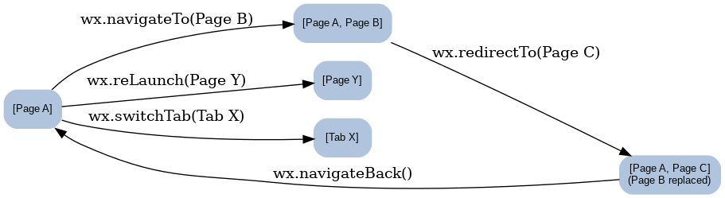

# 微信小程序面试知识点整理

## 基础概念

### 是什么

微信小程序是微信于 2017 年正式推出的一种无需下载安装即可使用的轻量应用形态。简单来说，小程序“用完即走”，用户扫一扫或搜一下即可打开应用，无需安装卸载，解决了传统 App 需要下载安装、占用存储等痛点。对于开发者，微信提供了小程序的开发框架和丰富的组件及API，能够帮助快速开发具有接近原生体验的应用服务。

### 背景

小程序并非凭空出现。**在出现小程序之前**，微信内的网页通过内置的 **WebView** 承载，并提供了 **JS-SDK** 让网页调用微信的能力，以弥补 H5 能力的不足。但仅靠 JS-SDK 并不能提升网页的性能和体验，例如界面流畅度仍不如原生。为此，微信设计了全新的小程序系统，以实现：

- 更快速的加载和渲染  
- 更强大的系统能力接口  
- 更接近原生的用户体验  
- 安全易用的数据开放能力  
- 高效简单的开发流程

这些都是传统 H5 页面难以同时做到的，因此微信小程序应运而生。

### 与 H5 的区别

微信小程序在技术实现上结合了 Web 和 App 的优点，同时又有自身特性：

- **运行环境**：小程序运行在微信内置的浏览器内核环境中，但采用了全新的解析和渲染机制，不是普通浏览器。它的逻辑层和视图层分离，由微信客户端管理。
- **系统权限**：小程序可以调用更多系统能力（摄像头、文件、本地存储、网络状态等），这些是在普通 H5 页面受限或不可及的。
- **渲染机制**：小程序采用**双线程架构**，逻辑层（JavaScript）和渲染层（界面）分开运行。逻辑层运行在 JSCore 引擎，渲染层使用 WebView 来渲染界面。页面的结构使用 WXML（类似 HTML），样式使用 WXSS（类似 CSS），本质上小程序页面还是网页，只是封装在微信内。

由于上述机制，小程序可以看作只能在微信中打开的特殊网页，它通过架构上的改进提升了性能和体验，在使用上接近原生 App。

### 优点

微信小程序的主要优点包括：

- **即用即走，触手可及**：无需安装，用完退出即可。这样小程序可以替代许多不常用的 App，实现应用功能的简化版。
- **流量巨大，易于传播**：依托微信平台，用户使用成本低，开发者可以更容易获得微信导流。
- **安全性较高**：小程序运行在微信受控的沙箱中，对用户和系统更加安全可靠。
- **开发门槛低**：使用前端技术栈即可开发，无需掌握原生开发，大量前端工程师可以快速上手。
- **兼容性好**：依赖微信客户端环境，避开了不同浏览器或机型的差异性问题，减少了兼容性适配工作。

### 缺点

同时，小程序也存在一些限制和不足：

- **用户留存率低**：由于用完即走的特性，很多小程序的次日留存率只有约 13%，两周留存甚至降到约 1%。用户容易使用一次就流失，持续活跃度不高。
- **包体积限制**：早期微信限制小程序代码包大小不得超过 2MB（现已提升至更高，但仍有体积限制），这限制了超大型应用在小程序上的实现，需要通过分包等手段拆分。
- **受微信平台管控**：小程序必须遵守微信的各种规范和审核。功能接口、内容品类等都有所限制。相比独立 App（尤其安卓上的自由度），小程序的能力和发布都受到平台制约。
- **无法脱离微信独立存在**：用户使用小程序必须打开微信，这对于没有微信的国外用户或不常用微信的场景来说是不便的。这一点使小程序更适合作为微信生态内的辅助手段。

## 小程序架构原理

微信小程序在架构上采用了**双线程模型**来平衡性能和体验。渲染层和逻辑层由不同的线程处理：界面渲染由 WebView 线程完成，业务逻辑由 JSCore (JavaScript 引擎) 线程执行。框架层面，微信会在两者之间构建通信桥梁，将数据和事件在逻辑层和视图层之间同步。下图展示了小程序的架构简况：


*图1: 微信小程序运行的双线程架构示意*

如上图所示，小程序运行在微信容器内。**逻辑层**包含所有页面和应用的 JS 代码，运行在独立的 JS 引擎线程中，整个小程序共有一个逻辑层线程来处理所有页面的逻辑。**渲染层**则使用多个 WebView 来渲染界面，每个页面对应一个 WebView 线程（微信限制同时存在的页面数最多 5~10 个）。当小程序需要更新界面时，会通过微信提供的机制（类似 **WeixinJSBridge**）在逻辑层和渲染层之间传递数据和事件，实现界面更新。例如，在逻辑层调用`setData()`会将变更的数据通过原生层发送到对应页面的 WebView，触发界面渲染更新。

这种架构使得小程序具备以下特性：

- **界面流畅**：界面绘制与业务逻辑分离，避免了 JS 计算阻塞界面渲染，提高了流畅度。
- **接近原生**：通过原生层桥接，提供了比普通 H5 更多的接口和更好的性能，例如文件系统、摄像头等能力以及更快的界面反馈。
- **方便开发**：开发者仍然使用前端语言编写，无需关心多线程同步细节，小程序框架自动完成逻辑层与渲染层的通信。

需要注意，小程序的页面本质上还是网页技术，只是由微信框架托管。WXML 模板最终会转为 HTML，WXSS 最终对应 CSS，结合逻辑层的数据一起渲染成页面。因此**小程序页面本质上就是特定封装的网页**。但得益于框架优化，小程序实现了更好的性能和用户体验，使之成为介于 Web 和原生 App 之间的应用形态。

## 生命周期

微信小程序的生命周期函数指的是在应用或页面运行到特定阶段时，框架自动调用的回调函数。小程序的生命周期分为**应用生命周期**、**页面生命周期**和**组件生命周期**三部分。掌握各个阶段的触发时机有助于合理初始化和清理资源。

### 应用生命周期

应用生命周期是全局的，在整个小程序维度触发，通常在`app.js`中通过`App({...})`进行注册。主要的应用生命周期函数包括：

- **`onLaunch`**：小程序初始化完成时触发，全局只执行一次。常用于小程序启动时的登录、获取设备信息等操作。
- **`onShow`**：小程序启动，或从后台进入前台显示时触发。每次小程序进入前台都会调用，可用于刷新数据、检测更新等。
- **`onHide`**：小程序从前台进入后台时触发。可用于暂停或保存当前状态。
- **`onError`**：小程序发生脚本错误或 API 调用报错时触发。开发者可以在这里进行错误上报。
- **`onPageNotFound`**：当跳转的页面不存在时触发（可以进行异常页面处理）。
- **`onUnhandledRejection`**：出现未处理的 Promise 拒绝时触发。
- **`onThemeChange`**：微信切换系统主题时触发。

### 页面生命周期

页面生命周期函数是在页面级别触发的，每个页面都有自己的一套生命周期，在页面通过`Page({...})`定义时自动注册。主要的页面生命周期包括：

- **`onLoad`**：页面加载时触发。每次打开页面（或通过路由进入）时调用一次。常用于获取路由参数、初始化页面数据等。
- **`onShow`**：页面显示时触发。每当页面出现在前台（包括首次加载、从其他页面返回等）都会调用。可用于刷新页面数据。
- **`onReady`**：页面初次渲染完成时触发。只触发一次，表示界面已经可以与用户交互。常用于获取界面节点信息、创建动画等。
- **`onHide`**：页面被隐藏时触发。当用户离开当前页面（例如navigateTo另一个页面）或小程序进入后台时调用。可用于暂停定时器等。
- **`onUnload`**：页面被卸载时触发。当页面销毁（比如redirectTo到新页面或navigateBack返回上一页）时调用。可用于释放页面相关资源。

需要注意，页面的`onShow`/`onHide`可能多次交替执行（页面多次进入前台或后台），而`onLoad`/`onUnload`是一对一对应的（加载一次对应卸载一次）。

### 组件生命周期

如果使用了自定义组件，那么组件也有自己的生命周期。组件生命周期通过在组件定义时使用`Component({...})`中的字段来注册，包括：

- **`created`**：组件实例刚刚被创建，好比页面的onLoad，但此时组件尚未进入页面渲染树中。
- **`attached`**：组件进入页面节点树时触发，已经可以访问组件的DOM节点。
- **`ready`**：组件布局完成时触发，组件界面已经渲染出来。此时可以操作组件内的DOM或获取节点信息。
- **`moved`**：组件在节点树中的位置发生移动时触发。
- **`detached`**：组件实例被从页面中移除时触发，类似页面的onUnload。

此外，组件还有一个特殊的`pageLifetimes`可以监听组件所在页面的生命周期，如：

```javascript
Component({
  pageLifetimes: {
    show() {
      // 当组件所在的页面显示时触发
    },
    hide() {
      // 当组件所在的页面隐藏时触发
    }
  }
})
```

上例中，组件可以感知所在页面的显示/隐藏事件，方便组件内部进行相应处理。

### 生命周期调用顺序示意

以下梳理小程序在不同场景下生命周期函数的调用顺序：

 

*图 2：小程序生命周期函数触发的时序示意*

- **小程序启动（首次打开小程序）**：依次触发 **(App)onLaunch** → **(App)onShow** → **(Page1)onLoad** → **(Page1)onShow** → **(Page1)onReady**。应用启动后会打开第一个页面，应用和页面的初始化回调按顺序执行。
- **页面跳转到另一个页面**：在当前 **Page1** 调用`wx.navigateTo`进入 **Page2** 时，顺序是 **(Page1)onHide** → **(Page2)onLoad** → **(Page2)onShow** → **(Page2)onReady**。可以看到，离开的页面先触发隐藏，新页面再加载显示。
- **返回到上一页面**：如果在 **Page2** 使用`wx.navigateBack`返回 **Page1**，则顺序为 **(Page2)onUnload** → **(Page1)onShow**。被关闭的页面触发卸载，被返回的页面重新显示。
- **小程序进入后台**：当用户按 Home 键等使小程序进入后台时，触发 **(App)onHide**（此时当前页面的onHide已经在跳转时触发过）。
- **小程序重新进入前台**：如果小程序尚未被销毁（如短时间从后台切回），会直接触发 **(App)onShow** → **(前台页面)onShow** 等流程；如果小程序已被微信销毁（如长时间未使用），则再次进入相当于重新启动，会走 **onLaunch** 等初始化流程。

通过以上顺序可以看出：应用生命周期包围整个小程序运行周期，而页面和组件的生命周期各自独立又彼此配合。合理利用这些回调时机，可以在**合适的时间初始化数据或释放资源**，提高应用性能和稳定性。

## 组件通信

在小程序中，父子组件之间可以通过属性和事件进行通信，这与 Vue、React 等前端框架的父子组件通讯思想相似。具体来说：

- **父组件传递数据给子组件**：通过在组件的定义中使用`properties`定义属性，父组件在引用子组件时以标签属性的形式绑定数据。组件实例化后，这些数据会传入组件内部。  
  例如，定义子组件时指定一个属性：  
  ```javascript
  Component({
    properties: {
      count: { type: Number, value: 0 }
    },
    // ...
  })
  ```  
  父页面在 WXML 中使用该组件：  
  ```html
  <my-counter count="{{itemCount}}" />
  ```  
  如上，父页面将自己的`itemCount`数据传给了子组件的`count`属性，子组件内部即可通过`this.properties.count`获取并使用。

- **子组件反馈事件给父组件**：当子组件内部需要将某些动作或结果通知父组件时，可以使用组件的方法`this.triggerEvent`触发自定义事件。父组件在引用组件时通过`bind:eventName`绑定事件处理函数来接收。  
  例如，在子组件的定义中：  
  ```javascript
  Component({
    methods: {
      // 子组件内部某个操作完成后调用
      updateCount(newCount) {
        // 触发名为 "update" 的自定义事件，并传递数据
        this.triggerEvent('update', { value: newCount });
      }
    }
  });
  ```  
  父页面 WXML 中监听该事件：  
  ```html
  <my-counter count="{{itemCount}}" bind:update="handleUpdate" />
  ```  
  父页面的对应 JS 中实现事件处理：  
  ```javascript
  Page({
    data: { itemCount: 0 },
    handleUpdate(e) {
      const newVal = e.detail.value;
      this.setData({ itemCount: newVal });
    }
  });
  ```  
  如此，子组件通过`triggerEvent('update', {value: ...})`向父组件发送消息，父组件的`handleUpdate`被调用并获得子组件传递的参数（通过`e.detail`）。

通过以上机制，实现了**父组件到子组件的属性传值**和**子组件到父组件的事件通知**。此外，对于没有直接父子关系的组件，常见的通信方式包括：

- **利用全局事件总线**：可以手动实现一个事件订阅/发布机制，允许非父子的组件相互通信。
- **使用全局状态**：将需要共享的数据放入`App()`的全局数据或使用状态管理库，让不同页面组件通过访问全局状态进行间接通信。
- **页面路由参数**：在页面跳转时，通过`url?param=value`或使用`eventChannel`传递数据，也是一种在页面之间传递信息的方法。

但总体来说，在小程序开发中**组件间通信更多是父子组件之间**，使用好属性和自定义事件即可满足大多数需求。

## 网络请求与登录

### 网络请求

微信小程序提供了类似 AJAX 的接口用于网络通讯，最主要的是`wx.request`用于发起 HTTP 请求。用法与浏览器中的`XMLHttpRequest`或`fetch`类似，例如： 

```javascript
wx.request({
  url: 'https://example.com/api/data', // 请求的服务器接口
  method: 'GET', // 或POST等
  data: { id: 123 },
  header: { 'Content-Type': 'application/json' },
  success(res) {
    console.log('返回数据：', res.data);
  },
  fail(err) {
    console.error('请求失败：', err);
  }
});
```

上面代码展示了 GET 请求获取数据的简单例子。需要注意几点：

- **域名白名单**：小程序出于安全策略，只有在小程序管理后台配置过的域名才能请求。开发前需将`https://example.com`添加到「业务域名」设置中，否则请求会被阻拦。
- **异步回调**：`wx.request`是异步的，通过`success`和`fail`回调获取结果。也可以使用基于它封装的 Promise 或 async/await（需要自行封装或使用第三方库）来更方便地处理异步。
- **其他网络API**：微信还提供了`wx.uploadFile`、`wx.downloadFile`、`wx.connectSocket`（WebSocket）等接口，覆盖文件上传下载和长连接等场景。这些也需要相应配置域名且使用`https`连接。

### 登录流程

微信小程序的登录与传统 Web 不同，并没有让用户输入帐号密码的流程，而是利用微信提供的**临时登录凭证**和**微信用户标识**来建立登录态。典型的小程序登录流程如下：

1. **获取登录凭证**：调用`wx.login()`获取临时登录凭证（`code`）。`code`有效期短（5分钟），需要尽快使用。示例：  
   ```javascript
   wx.login({
     success(res) {
       if (res.code) {
         // 拿到临时凭证 res.code，发送到服务器换取openid等
       }
     }
   });
   ```
   调用成功后会得到`res.code`字符串。

2. **后台换取 OpenID 和会话密钥**：将上一步的`code`发送到开发者服务器，服务器调用微信提供的**登录凭证校验接口**（`auth.code2Session`）。该接口会返回用户在当前小程序的唯一标识 **OpenID**，以及会话密钥 **session_key**。开发者服务器可使用 OpenID 作为用户标识，并结合 session_key 生成自己的**会话 token**或存储会话信息。

3. **建立应用内登录态**：服务器生成自定义的登录态（如 JWT 或 session），并返回给小程序。小程序拿到自定义登录态（例如一个 token）后，可以将其缓存到本地`wx.setStorage()`，并在后续请求时通过请求头或参数携带该登录态，用于换取业务数据。这样，服务器通过校验自定义登录态就能确认用户身份。

4. **维护登录态有效性**：微信提供`wx.checkSession()`接口，可以在每次启动时检查本地 session_key 是否过期。如果过期需要重新调用`wx.login()`走一遍流程。如果未过期则可直接使用之前缓存的登录态。此外，当用户明确退出登录或需要切换账号时，可以清除本地存储的登录态。

整个流程中，**微信封装了用户身份验证**，开发者不需要获取用户的微信密码等敏感信息，只需在后台通过 code 换取 OpenID 等即可识别用户。这种方式更加安全，也减少了用户操作。若需要进一步获得用户昵称头像等信息，可以使用`wx.getUserProfile`接口在用户允许的前提下获取。

需要注意的是，小程序获取到的 OpenID 对每个小程序都不同，如果需要跨应用识别用户，可以通过微信开放平台的 UnionID 机制（前提是该用户的不同应用账号绑定到了同一个微信开放平台账号）。

总之，小程序的登录流程可以概括为：“微信授权登录(code) -> 换取OpenID(session_key) -> 建立自身登录态(token)”，这种流程高效安全。开发者应妥善保管 session_key，并通过后台校验 token 来保证每次请求的用户身份有效。

## 页面跳转与路由

微信小程序提供了多种页面路由跳转方法，不同方法对页面栈的影响和使用场景不同。常见的跳转方式有：`wx.navigateTo`、`wx.redirectTo`、`wx.switchTab`、`wx.reLaunch` 和 `wx.navigateBack`。下面将对它们的特点和区别进行说明。


 
*图 3：不同页面跳转方式对页面栈（历史堆栈）的影响示意*

上图展示了各跳转方法对于页面栈的操作情况。例如，`navigateTo`会在栈中新增页面，而`redirectTo`会替换当前页面。具体来说：

- **`wx.navigateTo`**：保留当前页面，跳转到非 tabBar 的某个新页面，页面栈高度加一。可以使用`wx.navigateBack`返回到原页面。适用于需要返回上一个页面的情况。需注意页面栈最多保存10层，多于10层将无法继续`navigateTo`新页面。
- **`wx.redirectTo`**：关闭当前页面，跳转到非 tabBar 的某个页面。也就是说用新页面替换掉当前页，因此不能返回（被关闭的页面已销毁）。适用于不需要返回的流程（例如表单提交后直接进入结果页）。
- **`wx.switchTab`**：跳转到tabBar页面，并关闭所有其他非 tabBar 页面。只能跳转到定义过的 tab 页，而且会清空其他页面栈。常用于全局的导航，例如从任意页面回到首页或分类页。
- **`wx.reLaunch`**：关闭所有页面，重新打开到一个目标页面。无论目标是否 tabBar，都相当于重启了一个新的页面栈，只剩下打开的这个页面。适用于例如登录完成后重启到主页面，或发生严重错误需要回到起点的情况。
- **`wx.navigateBack`**：返回上一页面或多级页面。可以通过参数`delta`指定返回的层数，`delta:1`表示回到上一个页面，`delta:2`表示回退两层。常用于退出子页面返回上级。

**小结**：  
- 如果希望**保留返回路径**，使用`navigateTo`；如果不需要返回原页面，用`redirectTo`。  
- 页面涉及**tabBar切换**，必须使用`switchTab`（且无法传递参数，可借助全局状态或缓存传参）。  
- **重启式**的跳转用`reLaunch`，会清空历史。  
- 返回上页用`navigateBack`（或在页面内调用`wx.navigateBack()`或使用导航栏的返回按钮）。

理解这些区别有助于在开发中选择合适的跳转方式。例如：表单提交后用`redirectTo`跳转结果页避免用户返回重复提交；从登录页进入应用主页面用`reLaunch`防止登录页留在历史栈；普通页面间的导航用`navigateTo`方便返回等。

## 性能优化

提升微信小程序的性能和加载速度，可以从**包体积、网络、渲染**等多方面入手。以下总结常见的优化手段：

- **控制代码包大小**：尽量减小小程序代码包的体积，这是加快启动加载的直接方法。具体包括启用开发者工具的代码压缩选项、删除无用的代码和资源、精简图片等多媒体资源的大小和数量。代码包越小，微信下载和解压速度越快，用户启动等待时间越短。
- **分包加载**：将小程序按照功能模块拆分为多个子包。把用户经常访问的页面放在主包，较少访问的页面放入分包。小程序启动时只加载主包，减少初始下载量。等用户需要访问某个子包页面时，再按需加载子包。微信还支持**预下载分包**，在用户即将需要时提前加载，提高后续打开速度。
- **资源 CDN 与懒加载**：对于较大的图片等静态资源，使用 CDN 加速分发，用户可就近加载资源。对一些列表中的图片，使用懒加载（`<image>`组件的`lazy-load`属性）使其在即将进入视野时再加载，避免一次性加载过多资源，提升首页渲染速度。
- **减少网络请求**：网络请求往往是最耗时的不确定因素。通过**缓存**和**预请求**来减少等待：在页面`onLoad`阶段就发起数据请求（不用等到页面完全渲染后），并利用`wx.getStorageSync()`先读取本地缓存的数据立即显示，等网络请求返回新数据后再更新。同时，尽量合并请求，避免多次拉取可以一次获取的数据。
- **优化数据更新与渲染**：小程序的界面更新由`setData`驱动，频繁或大量的`setData`调用会降低性能。应**避免不当使用setData**，例如将不会变化的大数据重复地set；尽可能将多次更新合并成一次，减少界面渲染次数。也要避免每次滚动、输入都触发过多的界面更新。
- **使用自定义组件隔离作用域**：将页面划分为多个组件可以一定程度优化渲染性能。组件拥有自己独立的数据和渲染，不会因为父页面的数据变动而全部重新渲染。合理拆分组件，可以减少一次 setData 对整棵界面树的影响范围，提高局部更新效率。
- **利用客户端特性**：微信提供了背景缓存、下拉刷新、分包预加载等机制，这些可以根据场景利用。例如使用`wx.startPullDownRefresh()`结合`stopPullDownRefresh()`实现主动刷新，或在适当时机通过`loadSubPackage`提前加载资源。另一个方面，小程序线程模型决定了不要在主线程执行过于耗时的 JS 计算，可将复杂运算拆成多步或放入 Worker 中。

通过以上手段，大部分常见的小程序性能问题都可以得到缓解。总的来说，**减少加载量、降低绘制频率、充分利用缓存**是优化的核心。开发者应在开发过程中多利用微信开发者工具的性能面板来发现瓶颈（如绘制次数过多、数据传输过大等），从而有针对性地优化，提升小程序的流畅度和响应速度，带来更好的用户体验。

## 支付能力

微信小程序可以集成微信支付功能，实现在线支付。小程序本身不直接处理支付逻辑，而是通过调用微信提供的支付接口调起微信支付流程。**微信支付的基本流程**是：由后台统一下单生成预支付订单，小程序前端调用微信支付接口，微信支付后通知后台完成订单。

典型的小程序支付实现步骤如下：

1. **后台统一下单**：用户在小程序中发起购买操作后，开发者服务器使用微信支付的商户接口（如`unifiedOrder`统一下单API）生成预支付交易，会得到预支付会话标识`prepay_id`等信息。
2. **前端调用支付接口**：服务器将`prepay_id`和相关参数（包括时间戳`timeStamp`、随机串`nonceStr`、签名`paySign`等）返回给小程序。小程序拿到这些参数后，调用`wx.requestPayment`接口调起微信支付控件，例如：

```javascript
wx.requestPayment({
  timeStamp: '<%= timeStamp %>', // 由后台返回的时间戳字符串
  nonceStr: '<%= nonceStr %>',   // 由后台返回的随机字符串
  package: 'prepay_id=<%= prepay_id %>', // 订单包信息，prepay_id须拼成这样的格式
  signType: 'MD5',   // 签名算法，按微信支付文档要求，一般为 MD5 或 HMAC-SHA256
  paySign: '<%= paySign %>',   // 支付签名
  success(res) {
    // 支付成功的回调处理
  },
  fail(err) {
    // 支付失败或用户取消的处理
  }
});
```

上述代码中，关键参数都由服务端计算提供，例如 paySign 是对其它参数和商户密钥签名得到的。调用`wx.requestPayment`会拉起微信内置的支付窗口，用户可以选择支付方式并输入密码完成付款。

3. **支付结果处理**：如果`wx.requestPayment`的回调返回成功，表示用户支付已完成。但出于安全，最终是否扣款成功需要以**后台通知**为准。微信支付后台会向商户服务器发送支付结果通知，服务器据此更新订单状态（如标记已支付）并返回通知处理结果。小程序前端可以通过查询自己的后台获取最终确认的支付结果，然后给予用户反馈。

需要注意，小程序中使用微信支付需要具备开通微信支付商户、在小程序后台绑定商户号等前提条件。支付过程中涉及的签名、订单生成等都在后端完成，**小程序前端只负责拉起支付并得到结果**。这样可以确保安全，前端拿不到敏感的商户密钥。

综上，微信小程序的支付能力主要体现在封装好了微信支付的流程，开发者按照文档准备好后台接口，并简单调用`wx.requestPayment`即可完成支付集成。整个过程对用户来说也非常流畅：在小程序内就能唤起熟悉的微信支付界面，支付完成后小程序可以继续后续业务逻辑，提升了用户转化率和体验。

## 发布流程

微信小程序的开发完成后，需要经过**代码上传**、**审核**和**发布**几个阶段才能上线给用户使用。发布流程主要分为以下步骤：

1. **上传代码**：开发者在微信开发者工具中，将小程序代码上传到微信服务器。在工具中点击“上传”，填写版本号和更新说明后提交。上传成功后，代码包会出现在小程序管理后台的版本列表中（状态为“待审核”）。在多人协作开发时，可以给不同成员分配开发权限，确保只有有权限的人才能上传代码。

2. **提交审核**：登录微信公众平台的小程序管理后台，找到刚才上传的版本，填写必要的审核信息并提交微信审核。审核信息包括：版本描述、功能介绍、测试账号等。微信团队会对小程序的内容和功能进行审核，确保不违反规定（例如内容是否合法、是否有支付资质、涉及的接口权限是否申请等）。

3. **发布上线**：当审核通过后，开发者即可在后台点击“发布”，将该版本的小程序推送给所有用户。发布操作通常即时生效，用户在微信端可以搜索到小程序或通过原有的小程序入口进入时，看到的就是最新发布的版本。旧版本会被新版本替换。

需要注意一些发布流程的细节：

- **审核时间**：微信官方审核通常在几个工作日内完成，节假日可能顺延。开发者要预留出审核时间，避免发布计划延误。审核未通过时，后台会给出原因，需要根据反馈修改代码再提交。
- **体验版和灰度发布**：在最终发布前，可以将上传的版本设置为体验版供团队测试。同时，微信也支持灰度发布，开发者可以选择将新版本按一定百分比逐步发布给用户，以控制风险。
- **版本回滚**：一旦新版本出现严重问题，微信提供紧急回退到上一个版本的功能，减少故障影响。
- **多人员协作**：微信小程序后台支持成员管理，可分配开发、体验、运营、管理员等不同角色。多人协作时，可让测试人员使用体验版小程序测试，运营同学在审核通过后负责点击发布等。

总之，小程序的上线发布流程相对规范清晰：**开发者工具上传代码 -> 后台填写信息提审 -> 审核通过后发布**。按照这一流程走完，小程序即可正式提供给微信用户使用。在发布后，开发者还需通过数据分析、用户反馈等不断完善迭代小程序功能，这又进入了下一个开发发布循环。通过严谨的发布流程把关，可以最大程度保证上线质量和用户体验。 