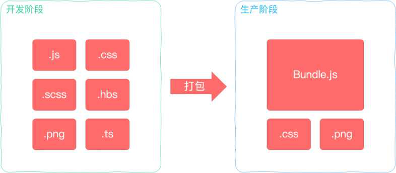
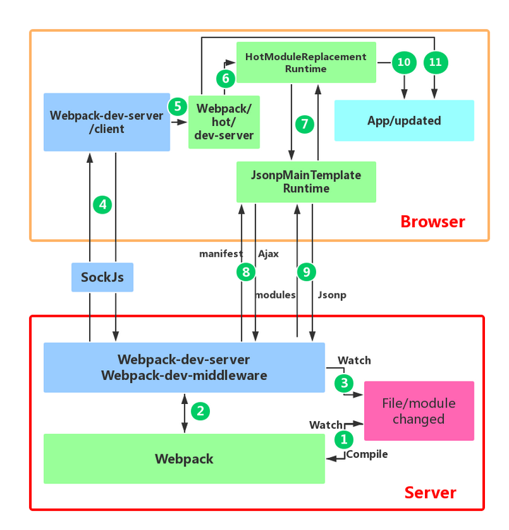

## 1. 说说你对 Webpack 的理解？解决了什么问题？

 
 
 *图示：Webpack 将开发阶段的各种资源（JS、CSS、图片等）进行打包，生成生产环境所需的静态资源。左侧为多个源文件，右侧为打包后的输出文件。* 

Webpack 是一个现代前端项目的**模块打包工具**。它的核心思想是把项目中的各种资源（JavaScript、CSS、图片等）作为模块进行处理，解析模块间的依赖关系，并按照一定规则打包输出为体积更小、浏览器可识别的静态文件。例如，在没有打包工具时，我们可能需要在 HTML 中手动引入多个 `<script>` 文件来拼接功能，不同文件通过全局变量交互，既不直观也容易产生命名冲突；Webpack 则可以将这些模块自动关联打包，解决模块依赖管理的问题，实现**模块化开发**。

Webpack 的出现主要解决了以下前端开发痛点：

- **依赖管理与模块化：** 自动解析处理模块依赖，使开发者可以使用 `import/require` 来组织代码，无需手动管理脚本的加载顺序和依赖关系，避免全局作用域冲突。
- **文件体积优化：** 通过 **Tree-Shaking**（删除未引用代码）和代码压缩等手段剔除无用代码，减少打包后文件体积，加快加载速度。例如，Webpack 在生产模式下会自动压缩代码，并可配合 TerserPlugin 等进一步优化。
- **高级语法转译：** 支持将 ES6+/TypeScript、SCSS、LESS 等高级语法或语言编译为兼容性好的代码（如编译 TypeScript 或 ES6+ 为 ES5），方便使用新特性同时确保浏览器兼容性。这通过配置相应的 Loader（如 `babel-loader`、`ts-loader` 等）实现。
- **统一构建流程：** 提供从源码到产出的**一站式构建**。整合了例如代码检查（ESLint）、样式前缀补全（PostCSS）、打包压缩、环境变量注入等各环节，形成标准化的构建输出，提升开发效率和项目一致性。
- **开发调试增强：** 集成开发服务器（`webpack-dev-server`）支持实时刷新和模块热替换（HMR），以及丰富的插件机制，可按需扩展功能（如自动刷新浏览器、生成 HTML 文件等），打造高效的本地开发环境。

简单来说，Webpack 将传统繁琐的前端构建工作自动化、模块化，使开发者专注于业务逻辑，显著提升了前端工程化水平。

> **示例：**假如我们有两个脚本模块 `module-a.js` 和 `module-b.js`，前者定义了一些方法，后者依赖前者。如果不使用打包工具，HTML 中需要手动按顺序引入：


```html
<script src="module-a.js"></script>
<script src="module-b.js"></script>
```
> `module-a.js` 可能通过全局变量暴露接口：

```js
// module-a.js
window.moduleA = {
   data: '...',
   method1: function() { ... }
 };
```

> `module-b.js` 则直接使用全局的 `moduleA`：

```js
// module-b.js
console.log(window.moduleA.data);
window.moduleA.method1();
```
> 这种方式维护困难，且全局变量容易冲突。Webpack 可以让我们使用模块化语法：

```js
// module-b.js
import { data, method1 } from './module-a.js';
console.log(data);
method1();
```
> 然后通过配置让 Webpack 打包输出一个 `bundle.js`，自动处理模块加载和依赖，不再需要手工管理脚本引入顺序。

以上示例表明了 Webpack 在模块依赖管理上的便利。总之，“Webpack 的理解”可以概括为：Webpack 将前端开发涉及的各种资源视为模块，通过加载器和插件体系对模块进行转换和优化，最终输出高效的前端静态资源文件，解决了传统前端开发中手动管理依赖、代码冗余、重复劳动等问题。

## 2. 说说 Webpack 的热更新（HMR）是如何做到的？原理是什么？

Webpack 的**热更新**（Hot Module Replacement, HMR）是一种在不刷新整个页面的前提下替换、更新模块的技术。相比传统的自动刷新（Live Reload），HMR **更加高效**：当源代码变更时，Webpack 只重新编译受影响的模块，并将其动态注入到运行中的应用中，从而保留应用的状态（例如保留表单输入、组件状态），极大提升开发体验。

 
 
 *图示：Webpack HMR 工作流程概览：浏览器端和服务端通过 WebSocket 保持通讯，当检测到文件修改时，Webpack 编译出新模块并通知浏览器获取更新模块进行替换。绿色部分表示 Webpack 核心，蓝色表示 webpack-dev-server，橙色表示浏览器 HMR 客户端。数字标注了主要的处理步骤。*

**HMR 原理流程：**Webpack 的热更新通常配合 `webpack-dev-server` 一起工作，其基本原理可以分为以下几个步骤：

1. **监听文件变更：**Webpack 以 watch 模式运行时，利用文件系统接口监听源代码文件的变化。当某个文件修改保存后，Webpack 检测到变化，开始重新编译构建**增量模块**。

2. **Webpack 编译打包：**根据变化的文件及其依赖，Webpack 以当前配置重新编译受影响的模块，生成更新的模块代码。与正常打包不同的是，dev-server 会将编译后的更新模块存储在**内存中**（而非输出到磁盘），以便后续快速获取。

3. **通知 DevServer：**Webpack 完成模块重新打包后，`webpack-dev-middleware` 会拦截并通知 `webpack-dev-server`：本次编译生成了一个新的模块版本，其中包含一个新的 Hash（标识此次编译）。dev-server 随即准备将此信息通知给浏览器。

4. **建立通信连接：**`webpack-dev-server` 与浏览器端的 HMR 客户端（运行在浏览器中的 Webpack HMR runtime）之间通过一个 **WebSocket长连接** 保持实时通信。Webpack-dev-server利用 **SockJS** 在后台创建这个 WebSocket 通道。

5. **发送更新信号：**文件变化后，DevServer 通过 WebSocket 向浏览器推送消息，主要内容是此次变更编译的 **hash** 值以及编译状态。浏览器的 HMR 客户端（通常由 webpack-dev-server/client 注入）接收到该消息后，判断需要进行模块热替换（还是整个页面刷新）。如果仅启用了 HMR（`devServer.hot` 为 true），则继续以下流程；如果未开启 HMR，则可能触发浏览器刷新。

6. **请求更新模块：**浏览器端的 HMR runtime（`webpack/hot/dev-server` 模块）拿到新的编译 Hash 后，会通过发送 AJAX 请求向 DevServer 请求获取更详细的更新信息（manifest）。DevServer 返回一个 JSON 清单，包含此次变更涉及的模块的哈希列表。随后，HMR runtime 再根据该清单通过 JSONP 请求实际获取增量的模块代码（这一步Webpack利用了动态加载模块的能力，后台其实是一个 JSONP 请求获取增量模块的 JS 文件）。

7. **替换更新模块：**浏览器端拿到新模块代码后，Webpack 的 HMR runtime 会调用 Hot Module Replacement 接口，尝试用新模块替换旧模块。具体来说，Webpack 会比较新旧模块的依赖关系和状态：如果新模块接受 HMR（模块内实现了 `module.hot.accept` 等逻辑），则执行模块的更新处理逻辑，用新模块导出的内容替换旧的内容，并更新依赖引用。如果某些模块无法热替换（例如状态无法保留或模块未设置接收更新），Webpack 会采取**回退机制**：要么刷新整个页面以应用更改（确保不会出现不一致状态），要么根据配置决定忽略该模块的更新。

8. **应用更新并反馈：**模块替换成功后，开发者在浏览器中会看到应用局部刷新了最新代码的效果，而无需整页刷新。DevServer 和浏览器会持续保持该 WebSocket 通道，以便下次文件改动时重复以上流程。整个过程对于开发者来说是透明且快速的。

**关键点：**HMR 能够实现的前提是模块具有**可热替换性**。例如 CSS 样式通过 `style-loader` 可以直接替换，React 组件可以借助 React Hot Loader 或 Fast Refresh 保留状态热替换。而像应用的初始化逻辑则可能不适合热更新，需要页面刷新。Webpack 提供的 `module.hot` API允许开发者在模块内定义如何处理自身的更新（如清理旧资源、应用新逻辑等）。下面是一个简化的使用 HMR 的代码示例：

```js
// Webpack 配置片段（启用 HMR）
module.exports = {
  devServer: {
    hot: true,        // 开启模块热替换
    // hotOnly: true   // 可选，即使HMR失败也不刷新页面
  },
  plugins: [
    new webpack.HotModuleReplacementPlugin()  // 插件激活
  ]
};
```

```js
// 应用模块内部（接收自身更新）
if (module.hot) {
  module.hot.accept('./utils.js', () => {
    // 当 utils.js 模块更新时的处理逻辑
    console.log('utils.js 模块更新了');
  });
}
```

在上面配置中，我们通过 `devServer.hot=true` 和 HMR 插件开启热更新功能。应用代码中，使用 `module.hot.accept` 声明当前模块接受指定依赖模块的更新。当 `utils.js` 修改时，新的代码将通过 HMR 流程加载进来并执行回调，从而实现局部刷新而无需整页重载。

**总结：**Webpack HMR 原理是基于**发布-订阅模式**，利用 WebSocket 实现浏览器与开发服务器的实时通讯，在源文件改变时，仅发送和应用变更的模块。它通过在运行时注入的 HMR Runtime 控制模块替换逻辑，实现应用局部的热替换更新，从而显著提升开发效率和体验。

## 3. 说说 Webpack 的构建流程？

Webpack 的**构建流程**指的是从启动构建到输出最终结果的一系列阶段。其整体流程可以概括为**“初始化 -> 编译 -> 输出”**三个大步骤，每个步骤中又包含细分的环节。如下是 Webpack 构建的基本流程：

1. **初始化参数：**读取合并配置。Webpack 在启动时会读取配置文件 (`webpack.config.js`) 中的配置，以及通过 CLI 传入的参数，综合得到最终的配置参数。然后根据配置初始化 Compiler 对象，加载配置中指定的插件（`plugins`）等。此阶段Webpack会广播 **environment**、**afterEnvironment**、**beforeRun**、**run** 等钩子，插件可以通过监听这些钩子执行初始化任务。

2. **开始编译：**Webpack 调用 Compiler 对象的 `compile` 方法正式开始编译构建过程。首先根据配置确定**入口点**(Entry)，对于每个入口，创建一个新的编译 Compilation 对象来管理本次编译。

3. **模块编译与依赖处理：**从各入口文件出发，Webpack 使用配置的 Loader **逐个编译模块**。具体来说，Compiler 会针对入口文件，调用配置中匹配的 Loader 对其内容进行转换，将源码转为标准的 JS 模块。例如，遇到 `.css` 文件会用 `css-loader`、`.ts` 文件用 `ts-loader` 等。每处理完一个模块，Webpack 会解析该模块所依赖的其他模块（如 `import` 或 `require` 引入的文件），然后递归地对这些依赖模块重复上述过程，形成整个应用的**模块依赖图**（Dependency Graph）。这个阶段，Webpack 广播 **compile**、**make** 等钩子，插件（如 DefinePlugin 等）可以参与模块的构建流程。

4. **完成模块编译：**当所有模块及其子依赖都经过 Loader 转换处理后，Webpack 得到了每个模块被转换后的最终内容以及它们之间的依赖关系。这时会触发 **afterCompile** 钩子表示模块转换完成。

5. **生成 Chunk：**Webpack 将编译后的模块根据入口和分包策略进行分组，组成不同的 **Chunk**（代码块）。通常每个入口文件及其依赖会形成一个 Chunk，动态加载的模块可能形成额外的 Chunk。Webpack 会计算每个 Chunk 中包含哪些模块、Chunk 的名称（如对应输出文件名）等信息。

6. **输出资产：**Webpack 将每个 Chunk 转换成最终的 **输出文件**（即 bundle 文件等）。这一步包括：为每个输出文件分配名称和路径、根据模板将 Chunk 中的模块封装成浏览器可执行的代码（例如插入 runtime 引导代码、按需加载代码等），以及附加上每个模块的模块ID等。然后Webpack会把这些输出内容写入到指定的输出目录。这个阶段会触发 **emit** 钩子，像 HtmlWebpackPlugin 等插件会在此阶段生成 HTML 文件或处理输出内容。

7. **完成：**输出完毕后，Webpack 广播 **done** 钩子表示一次构建过程结束。此时可以在钩子中获取构建产物信息或者执行后处理任务。

以上流程可以用简图表示为：**初始化**（读取配置和插件） => **编译**（从入口递归编译所有模块，构建依赖图） => **封装**（模块合并为 chunk） => **输出**（生成文件）。整个构建过程中 Webpack 会在不同阶段广播事件，插件机制使我们能够扩展这些阶段的行为。例如，在初始化阶段某插件可以修改配置，在编译阶段 Loader 可以转换代码，在输出阶段插件可以压缩文件等，使 Webpack 构建拥有很高的可定制扩展性。

> **提示：**Webpack 提供了许多钩子用于插件定制流程，如 Compiler 阶段的`compile, run, done`，Compilation 阶段的`seal, optimize, emit`等。理解这些钩子对于编写自定义插件、深入Webpack原理非常有帮助。

**简单示例：**下面是一段包含入口、输出和 Loader 配置的简化 Webpack 配置，结合流程说明：
```js
// webpack.config.js
const HtmlPlugin = require('html-webpack-plugin');
module.exports = {
  entry: './src/index.js',          // 初始化阶段：确定入口
  output: {
    filename: 'bundle.js',         // 输出阶段：确定文件名
    path: __dirname + '/dist'
  },
  module: {
    rules: [                       // 编译阶段：配置 Loader 转换模块
      { test: /\.js$/, use: 'babel-loader', exclude: /node_modules/ },
      { test: /\.css$/, use: ['style-loader','css-loader'] }
    ]
  },
  plugins: [ new HtmlPlugin() ]    // 初始化阶段：加载插件，HtmlPlugin会在emit阶段生成HTML文件
};
```

在构建时，Webpack 会根据上述配置执行对应流程：从 `src/index.js` 开始，使用 Babel-loader 转换 JS，使用 css-loader、style-loader 处理 CSS，然后将所有模块打包进 `bundle.js`，并由 HtmlPlugin 生成引用该 bundle 的 HTML 文件，最终输出到 `dist` 目录。

## 4. 说说 Webpack 的打包原理？

Webpack 的**打包原理**指的是它如何将各个模块的代码组合在一起，生成最终在浏览器中运行的代码。打包后通常是一个或多个 bundle 文件，其中包含了项目所有模块的代码和 webpack 用于加载模块的运行时(Runtime)逻辑。理解Webpack打包产物的结构有助于理解模块是如何执行的。

**模块封装机制：**Webpack 打包时，会为每个模块分配一个模块ID（通常是相对路径作为键），然后将模块代码包装在一个函数作用域中，所有模块被存储在一个类似数组或对象的结构中。Webpack 输出一个引导代码（bootstrap）用来管理这些模块的加载。当应用启动时，Webpack 的运行时代码会先执行，提供一个 `__webpack_require__` 函数用于按 ID 加载模块。

可以用一段简化的伪代码展示 Webpack 打包后的结构：

```js
// Webpack 打包生成的自执行函数 (简化示例)
(function(modules) {
  // 模块缓存
  var installedModules = {};

  // 模块加载函数
  function __webpack_require__(moduleId) {
    // 若模块已缓存，直接返回
    if(installedModules[moduleId]) {
      return installedModules[moduleId].exports;
    }
    // 否则创建新模块并缓存
    var module = installedModules[moduleId] = { exports: {} };
    // 执行模块函数
    modules[moduleId].call(module.exports, module, module.exports, __webpack_require__);
    return module.exports;
  }

  // 运行入口模块
  return __webpack_require__("./src/index.js");
})({
  // modules 对象：键是模块ID，值是模块函数
  "./src/index.js": function(module, exports, __webpack_require__) {
    const msg = __webpack_require__("./src/message.js");
    console.log(msg);
  },
  "./src/message.js": function(module, exports) {
    module.exports = "Hello Webpack";
  }
});
```

上面的伪代码说明了 Webpack 打包原理的关键点：

- 所有模块代码被放入一个`modules`对象中，键为模块标识（例如文件路径），值为包裹模块的函数。
- Webpack runtime 定义了一个 `__webpack_require__` 函数用于加载模块：通过模块ID找到对应模块函数并执行。第一次执行时会在 `installedModules` 缓存中保存导出结果，之后再次请求相同模块时直接返回缓存，提高性能。
- 入口模块（如 `./src/index.js`）作为应用启动点被 `__webpack_require__` 执行，从而带动整个应用运行。入口模块内部如果用 `require`/`import` 引入了其它模块，则通过调用 `__webpack_require__` 加载相应模块。
- 这种机制实现了浏览器端的模块化：因为浏览器本身不支持如 Node.js 的 `require`，Webpack 在打包后提供了一个自定义的 `__webpack_require__` 来替代 Node 的模块加载器，从而让多模块代码能够在浏览器环境下协同工作。

**模块变量隔离：**每个模块都被包装在函数作用域中（如上例中的 `modules[moduleId].call(...)`），这样可以保证模块内的变量不会污染全局命名空间，实现了作用域隔离。同时 Webpack 会根据模块类型不同注入不同的参数，例如对于 CommonJS 模块会提供 `module, exports, require` 参数，对于 ES Module 则会做相应处理（比如转换为 `__webpack_exports__`）。

**异步加载原理：**Webpack 输出的 runtime 还会包含处理按需加载（代码分割）的逻辑。如果在代码中使用了动态导入 (`import()`)，Webpack 会将被动态导入的模块分离成一个独立的 chunk，打包成一个额外的文件。当运行到这段代码时，runtime 会通过 JSONP 请求加载对应的文件，并在加载完成后执行其中的模块，从而实现按需加载。Webpack 使用 **manifest** 来管理各个 chunk 文件之间的关联和文件名。输出中可能包含一个 manifest 文件或 runtime chunk 来指导浏览器该如何加载后续的chunk。

**总结：**Webpack 打包原理核心在于：**以自定义的模块管理机制替代浏览器缺失的模块系统**。它把项目中的模块代码按照一定格式串联在一起，由一个运行时代码在浏览器端解释执行模块加载。Webpack 输出的 bundle 本质上就是一个自执行函数，其中内部维护了一个模块集合和加载逻辑。通过这种方式，实现了浏览器端的模块化和依赖管理。这也是为什么在打包后可以直接在浏览器使用 `require`/`import` 等模块语法——因为 Webpack 已经在打包产物中模拟并实现了这些模块加载行为。

## 5. Webpack 与 Gulp、Grunt 等传统构建工具有什么区别？

Webpack 与 Gulp/Grunt 都是前端构建工具，但**侧重点和工作方式**有明显区别：

- **Webpack：模块打包工具。**Webpack 把项目当作一个整体，自动地递归解析处理模块依赖，将所有模块打包为体积优化的静态文件。它关注**模块化和依赖**，提供诸如代码拆分、按需加载、模块热替换、Tree-Shaking等高级功能，适合构建**模块依赖复杂的单页应用**或前端工程项目。

- **Gulp/Grunt：任务执行工具。**Gulp 和 Grunt 更像是构建流程的**任务管理器**，通过代码或配置定义一系列任务（如压缩 CSS/JS、优化图片、复制文件等），按照定义的顺序执行。它们本身不具备模块打包能力，更擅长**对文件的操作**（增删改查），常用于前端项目中的构建流水线自动化。例如 Gulp 利用代码（基于 Node.js 流stream）定义任务，Grunt 则采用配置式的任务描述。但如果需要模块化打包，通常得借助 Browserify、webpack 等与之配合。

简单来说，Webpack = **模块打包 + 构建**，而 Gulp/Grunt = **构建任务流水线**。Webpack 更关注模块依赖关系，打包出优化的Bundle；Gulp/Grunt注重流程控制，将不同工具串联。随着前端工程复杂度提高，Webpack 成为主流选择，而 Gulp/Grunt 常用于简单构建或配合特殊任务。

**与其他工具对比：**除了 Gulp/Grunt，前端还有其它构建打包工具，Webpack各有取舍：

| 工具名称       | 类型           | 特点及适用场景 |
| ------------- | -------------- | -------------------------------- |
| **Webpack**   | 模块打包工具   | 功能全面，插件 Loader 生态丰富；适合大型 SPA 项目，支持代码拆分、HMR 等。缺点是配置相对复杂，初学成本高。 |
| **Gulp/Grunt**| 任务构建工具   | 配置简单，执行自定义任务灵活；适合简单项目或配合其他工具使用。缺点是不原生支持模块化，需要插件实现打包。 |
| **Rollup**    | ES模块打包工具 | 专注于打包 ES Module，产出代码精简；常用于构建 JS 类库。支持 Tree-Shaking 更彻底，输出 ES2015 格式。缺点是对非ES模块支持较弱（需插件），不擅长处理复杂应用依赖。 |
| **Parcel**    | 打包工具       | 开箱即用的零配置打包器，自动完成常见配置（支持JS/TS、CSS、文件等）；内置开发服务器和HMR，适合中小型项目快速起步。缺点是可定制性相比Webpack略低。 |
| **Snowpack**  | 构建工具       | 利用ESM的即时构建(dev server不打包，只做处理)，构建速度快；支持按需加载，适合开发阶段即时反馈。生产构建可交给Webpack或Rollup。 |
| **Vite**      | 开发服务器+构建 | 基于原生ESM的开发服务器，极快冷启动；开发时按需加载源模块，HMR性能好。生产模式下使用 Rollup 打包。适合现代前端框架开发（Vue3/React）。 |

以上对比可以看到，Webpack 的定位与这些工具有所不同：它是一个高度集成的方案，既能处理资源模块化又能完成各种优化构建任务，因而在现代前端构建流程中占据核心地位。而 Gulp/Grunt 更像辅助工具，现在多用于定制一些边缘任务。新的工具如 Vite 则在开发体验上进一步优化，但底层打包仍然会借助 Rollup 等实现。所以**Webpack 依然是当前最通用且强大的前端打包构建工具**，尤其在需要兼顾开发体验和产出优化的大型项目中。开发者应根据项目需求选择合适的工具或组合：例如小项目直接用 Parcel，库开发用 Rollup，现代框架开发用 Vite，复杂需求下Webpack依旧可靠。

## 6. 什么是 Entry、Output？

**Entry（入口）** 和 **Output（输出）** 是 Webpack 配置中两个最基本的概念，用于指定**打包的起点和终点**。

- **Entry（入口）：**Webpack 从入口开始构建内部的依赖图。**入口定义应用程序的主模块**，Webpack 会递归解析这个模块及其所有依赖，把所有依赖模块都打包进去。入口可以是一个或多个文件。例如最常见的单页应用入口：
  ```js
  // webpack.config.js
  module.exports = {
    entry: './src/index.js'
  }
  ```
  这意味着 Webpack 将以 `src/index.js` 作为起点，找到它依赖的其它模块，一起打包。对于多页应用，可以设置**多入口**：
  ```js
  module.exports = {
    entry: {
      page1: './src/page1/main.js',
      page2: './src/page2/main.js'
    }
  }
  ```
  这样 Webpack 会分别从 `page1` 和 `page2` 两个入口构建，两套依赖图输出两个 bundle。入口可以是字符串、数组（如多个脚本插入同一页面）或对象（多个入口起点）。

- **Output（输出）：**入口确定了打包的内容，**输出则决定了打包结果的文件位置和命名**。主要通过 `filename` 和 `path` 等配置项指定。Continuing the above example:
  ```js
  module.exports = {
    entry: { app: './src/index.js' },
    output: {
      path: path.resolve(__dirname, 'dist'),      // 输出目录
      filename: '[name].bundle.js'                // 输出文件名模板
    }
  }
  ```
  在单入口情况下，`[name]` 通常是 `"main"`（默认入口名称）或自定义的 `"app"`，最终生成文件名如 `app.bundle.js`，存放在 `dist` 文件夹下。对于多入口，`[name]` 会被替换为每个入口对象的键名，比如上例将生成 `page1.bundle.js` 和 `page2.bundle.js` 两个文件。

Output 常用的配置包括：
  - `filename`: 输出的文件名模板。可以使用占位符，如 `[name]`（入口名称）、`[hash]`（编译哈希）等，用于实现长效缓存。如 `filename: '[name].[contenthash:8].js'` 可以为每个 bundle 带上内容哈希避免缓存问题。
  - `path`: 输出目录的绝对路径。
  - `publicPath`: 发布到线上时的资源公共路径前缀（例如 CDN 地址），影响按需加载的 chunk 路径等。

> **注意：**若入口包含多个文件（如数组形式），Webpack 会将它们打包为一个 bundle（适合于需要按顺序加载的依赖，如 polyfill 放在主代码前）。而多入口对象会输出多个 bundle。配合 HtmlWebpackPlugin 可以自动将对应 bundle 引入到不同的 HTML 页面中。Entry 和 Output 灵活组合，可以满足单页、多页以及库打包等各种场景需求。

简而言之，Entry 是 Webpack 构建的起点（告诉 Webpack 从哪开始打包），Output 是终点（告诉 Webpack 打包结果放在哪、叫什么）。正确配置这两者，可以让 Webpack 清晰地知道**“打包什么”**和**“输出在哪里”**。

## 7. 什么是 Loader？什么是 Plugin？两者有何区别？

**Loader（加载器）**和**Plugin（插件）**是 Webpack 提供的两种扩展机制，用于增强 Webpack 对不同类型资源的处理能力和扩展构建过程的功能。

- **Loader：**加载器用于**转换特定类型的模块文件**。由于 Webpack 默认只能理解 JavaScript 模块，当遇到非 JS 文件（例如 CSS、图片、TypeScript 等）时，就需要对应的 Loader 将其转换为可打包的模块。本质上，Loader 是一个导出为函数的 Node 模块，接受源文件内容作为输入，返回处理后的内容。常见 Loader 有：
  - `babel-loader`：将 ES6+/JSX 转换为 ES5 JavaScript，以支持旧浏览器。
  - `css-loader`：解析 CSS 文件中的 `@import` 和 `url()` 等依赖。
  - `style-loader`：将 CSS 以 `<style>` 标签插入到页面 DOM 中。
  - `file-loader`：处理导入的文件（如图片、字体），把文件复制到输出目录，返回文件的 URL。
  - `url-loader`：类似 file-loader，但在文件小于设定阈值时返回 data URL 内联资源。
  - `sass-loader`/`less-loader`：将 SCSS/LESS 预处理样式转换成 CSS。
  - `ts-loader`：将 TypeScript 编译为 JavaScript。
  
  Loader 的用法一般在 Webpack 配置的 `module.rules` 中指定。例如：
  ```js
  module: {
    rules: [
      { test: /\.css$/, use: ['style-loader','css-loader'] },
      { test: /\.ts$/, use: 'ts-loader', exclude: /node_modules/ }
    ]
  }
  ```
  Loader 支持串联多个，从右到左顺序执行。如上，先用 css-loader 处理 CSS 获得样式字符串，再交给 style-loader 将其插入页面。通过配置 Loader，Webpack 得以支持多种类型的静态资源模块化，**解决了 Webpack 自身只识别 JS 的局限**。

- **Plugin：**插件用于**扩展 Webpack 构建过程的功能**。Plugin 可以介入 Webpack 构建生命周期的各个阶段，对输出结果进行定制化的改变。Loader 只能转换模块文件，而 Plugin 的能力更为**广泛且强大**，它可以在编译、打包、输出的不同阶段执行任意操作。Plugin 通常是一个包含 `apply(compiler)` 方法的类，在其方法内通过 `compiler`（或 `compilation`）对象挂载钩子函数，监听 Webpack 生命周期事件，以实现功能。常见插件有：
  - `HtmlWebpackPlugin`：在构建后自动生成 HTML 文件，并把打包后的资源插入其中，免去手工引入脚本的麻烦。
  - `CleanWebpackPlugin`：在构建前清空输出目录，保持输出的文件干净。
  - `DefinePlugin`：定义环境变量或编译时常量，将指定的变量插入到代码中。
  - `UglifyJsPlugin/TerserPlugin`：压缩优化 JS 代码，去除多余空白和注释（Webpack5默认内置Terser进行JS压缩）。
  - `MiniCssExtractPlugin`：将CSS从bundle中提取成独立的CSS文件，而不是嵌入在JS中，方便CSS并行加载和缓存。
  - `OptimizeCSSAssetsPlugin`：压缩CSS文件。
  - `HotModuleReplacementPlugin`：启用模块热替换(HMR)功能。
  
  使用插件需要在配置的 `plugins` 数组中实例化添加，例如：
  ```js
  plugins: [
    new HtmlWebpackPlugin({ template: './src/index.html' }),
    new DefinePlugin({ "process.env.NODE_ENV": JSON.stringify("production") })
  ]
  ```

**区别总结：**Loader 和 Plugin 的主要区别在于**作用范围和用途不同**：
- Loader 聚焦于**模块内容转换**。它是模块级别的，作用于每一个匹配的文件，按照规则将A格式转为B格式。例如把.scss文件转为.css文件、把TS转为JS、把图片转为数据URI等。可以理解为“文件处理管道”。Loader 在加载模块时按顺序执行，其本质是函数，对输入内容进行处理后输出结果。
- Plugin 聚焦于**整体构建流程**。它在 Webpack 的生命周期中执行，可以影响多个模块甚至整个输出。Plugin 可以做的事情很多，比如打包优化、资源管理、注入环境变量等。Plugin 常常利用 Webpack提供的钩子机制，在合适的时机介入，对结果进行**全面性的处理**。

简喻的话：Loader 像加工车间的机器，每台负责一种原料->产品的转换；Plugin 则像管控流水线的经理，可以决定何时启停机器、怎么组装包装。两者配合使得Webpack既能细致地处理各类资源，又能在高层次上灵活定制流程。

**使用场景举例：**
- 如果需要支持一种新的文件类型（比如 Markdown `.md` 文件）作为模块，应该编写或使用 Loader，将 `.md` 转为 HTML 或字符串，这样才能被 JS 应用引用。
- 如果需要在打包完成后自动将文件上传CDN、生成报表、乃至于构建失败时发系统通知，这些超出模块转换范畴的任务，就需要 Plugin 来完成。

## 8. 什么是 Bundle、Chunk、Module？它们之间有什么区别？

这些术语都是 Webpack 及模块打包领域常用的概念，分别描述打包过程中的不同层次：

- **Module（模块）：**指源码中**任意一个可以被Webpack处理的源文件**，例如一个 JavaScript 文件、一个 CSS 文件、一个图片等等。一切皆模块：Webpack 把项目中的各种资源文件都视为模块，通过 Loader 转换非JS模块内容。模块是构建的基本单元，Webpack 会从入口文件出发递归地将所有依赖的文件当作模块加载处理。因此，我们编写的每个 `.js`、`.css`、`.vue` 等源文件都是一个模块。

- **Chunk（代码块）：**指Webpack在构建过程中，根据需要拆分出的**代码组**。一个 Chunk 由多个模块组合而成，是打包输出的中间产物。最常见的 chunk 就是以每个入口为单位形成的块。例如单页应用只有一个入口，会生成一个主 chunk，包含了入口模块及其所有依赖模块。而在存在按需加载或多入口的情况下，会产生多个 chunk：
  - 多入口时，每个入口文件及其依赖形成一个 chunk（还有可能有一个 runtime chunk 存放公共的运行时代码）。
  - 当我们使用动态导入 (`import()`) 或 SplitChunks 抽取公共代码时，Webpack可能把某些模块拆分到另一个 chunk，如`vendors~main.js`等。
  
  Chunk 并不是最终的文件，但 chunk 和输出的文件往往是一一对应的（除非使用类似于 `webpack-dev-server` 内存模式下，不实际输出文件）。可以简单理解 chunk 为“将要生成的文件的逻辑分组”。

- **Bundle（捆或包）：**指**Webpack 打包输出的文件**。通常每个 chunk 会生成一个或多个 bundle 文件（比如 JS bundle、对应的 source map 文件算另一个）。Bundle就是发布到线上供浏览器加载的最终代码文件。举例来说，当我们说 Webpack 打包生成了 `app.bundle.js`，这个文件就是一个 bundle；里面可能包含了项目所有代码。这也是常说的“构建产物”。

三者关系可以这样理解：**模块（module）**是源代码层面的最小单位，Webpack 对模块进行分析转换后，按需把多个模块组合成**代码块（chunk）**，每个 chunk 会对应输出一个或多个**文件（bundle）**。

举个例子，加深理解：
- 我们的项目有 `index.js`, `util.js`, `a.css` 三个源码文件，那么这三各就是独立的 **模块**。`index.js` 依赖了 `util.js`，并且通过 CSS Loader 引入了 `a.css`。
- Webpack 以 `index.js` 为入口打包时，会把这三个模块都包括进来。假设没有额外拆分，所有模块形成一个 **chunk**（因为只有一个入口，没有拆分点）。
- Webpack 根据输出配置，将这个 chunk 转换成一个 `bundle.js` 文件，即最终的 **bundle**。
- 如果我们进一步配置了代码拆分，比如将 `util.js` 单独拆出去，或者 `a.css` 通过 MiniCssExtractPlugin 抽取成独立 CSS 文件，那么会出现多个 chunk：一个包含主要代码，一个包含 `util.js`，一个 CSS chunk 等。最终则输出多个 bundle 文件：如 `main.js`, `vendors.js`, `main.css` 等。

因此：**模块**是源码、**代码块**是构建过程中的打包单元、**包文件**是构建结果。Webpack 从模块开始，产出 chunk，最后写出 bundle。

> **扩展：**在Webpack配置中，我们经常遇到跟这些概念相关的配置：
> - `optimization.splitChunks` 用于拆分 chunk，例如将第三方库模块拆分成独立的 chunk（俗称 vendors chunk）。
> - `output.filename` 决定 bundle 文件的命名，可以使用 `[name]`, `[chunkhash]` 等占位符，其中 `[name]` 实际上对应 chunk 的名称。
> - SourceMap 文件也可看作一种特殊的 bundle（只是用于开发调试）。
> 
> 理解模块、chunk、bundle，有助于优化打包策略，例如通过分析 chunk 体积来抽离公共模块，合理命名 bundle 以利用浏览器缓存等。

## 9. 如何自动生成 Webpack 配置？

Webpack 的配置通常需要手动编写，但是在某些情况下，我们可以使用**脚手架或初始化向导**来自动生成基础的 Webpack 配置，这对入门或搭建新项目很有帮助。主要有以下几种方式自动生成配置：

- **Webpack CLI 的 `init` 功能：**Webpack 官方提供了脚手架命令，可以通过 `webpack init` 来根据提示生成配置文件。具体使用时，先全局安装 `webpack-cli`：
  ```bash
  npm install -D webpack webpack-cli
  npx webpack init
  ```
  执行 `webpack init` 时，Webpack会询问一系列问题，比如项目的入口文件路径、是否需要开发服务器、用不用CSS等。根据回答，它会生成一个基础的 `webpack.config.js`。这个功能背后使用了一些预定义的**初始化模板**（例如 `@webpack-cli/init` 包），可以生成不同风格的配置。需要注意有时需先安装 `webpack-cli` 的额外插件（webpack 5可能需要安装 `@webpack-cli/generators`）。总之，这是Webpack官方的配置生成器。

- **第三方脚手架工具：**很多框架或项目模板自带Webpack配置，可以通过它们的CLI工具自动生成。比如：
  - **Create React App (CRA)：**一键创建React应用，内部集成了Webpack配置，虽然默认不暴露出来，但可以通过 `npm run eject`导出配置。
  - **Vue CLI：**创建Vue项目时，通过交互选择选项，CLI会生成包含Webpack配置的项目脚手架。
  - **Angular CLI：**也内置了Webpack（不过通常不直接暴露配置）。
  - **Umi、dva 等工具：**在特定领域（如 React/Vue 框架）提供了开箱即用的Webpack配置。
  - **Yeoman Generator：**有一些Yeoman生成器可以生成通用的Webpack配置模板工程。

- **Webpack 配置示例模板：**在Webpack官方文档、GitHub、社区博客上，也有不少常用场景的配置范例，可以复制调整。这不算自动生成，但提供了现成蓝本，比如多页面配置模板、React应用配置模板等，拿来即用也能省去手写的工作。

**Webpack 默认配置：**值得一提的是，Webpack 本身有一些**零配置默认行为**，可以在不提供 `webpack.config.js` 的情况下运行。Webpack 默认把 `./src/index.js` 当作入口，打包输出到 `./dist/main.js`。因此在非常简单的场景下（例如只有 JS，没有CSS等），不写配置直接运行 `webpack` 也能工作。不过大多数实际项目会需要定制配置以处理各种资源和开发需求。

**小结：**自动生成 Webpack 配置可以通过官方的 webpack-cli init 向导或各类脚手架工具。它们能根据项目需要生成一个初始可用的配置，开发者再在此基础上调整参数。这大大降低了初学者和快速启动项目的门槛。当然，生成的配置可能不是最优的，需要理解后进一步优化。自动化工具解决的是**配置模板**问题，但Webpack本身的灵活性意味着深入理解配置仍很重要。

> **提示：**使用脚手架生成配置后，建议仔细阅读配置文件的内容。了解各选项含义能帮助你更好地维护和修改配置。即使是自动生成的配置，也往往需要根据具体项目需求手工调整，比如添加额外的 Loader/Plugin 等。

## 10. Webpack 如何配置单页面（SPA）和多页面（MPA）的应用程序？

Webpack 同时适用于单页应用和多页应用，但配置上有所不同，主要体现在**入口设置和 HTML 模板生成**上。

- **单页面应用 (SPA) 配置：**单页应用通常只有一个入口（入口JS负责初始化整个应用），Webpack 配置比较简单，用单入口即可。典型配置：
  ```js
  module.exports = {
    entry: './src/main.js',          // 单页应用只有一个入口文件
    output: {
      filename: 'bundle.js',
      path: path.resolve(__dirname, 'dist')
    },
    plugins: [
      new HtmlWebpackPlugin({
        template: './src/index.html',   // HTML模板
        inject: 'body'
      })
    ]
    // ...loaders等省略
  }
  ```
  在上述配置中，我们将入口指向应用的主文件 `main.js`。使用 HtmlWebpackPlugin 指定一个 HTML 模板，插件会自动把打包生成的 `bundle.js` 注入到 HTML 中。这就构成了单页面应用的构建：最终产出一个 `index.html` 引用一个 `bundle.js`（还有可能包含CSS等静态文件）。

  **要点：**单页应用只有一个 HTML 页面，所有路由在前端处理。因此 Webpack 开发服务器需要设置 `historyApiFallback: true` 来支持 SPA 的路由（用于在刷新时仍指向入口HTML）。但在打包配置上，只需关心一个入口和相应的输出即可。

- **多页面应用 (MPA) 配置：**多页应用有多个独立的页面，每个页面各自有对应的 JS 入口和 HTML。Webpack 可以通过**多入口+多个HtmlWebpackPlugin实例**来支持。关键在于：
  1. **配置多个入口(entry)：**为每个页面定义一个入口名称和路径。
  2. **输出文件名使用占位符：[name]：**确保每个入口打包后文件名称不同。
  3. **HtmlWebpackPlugin 多实例：**为每个页面生成一个对应的 HTML，并引入各自的 bundle。

  示例：
  ```js
  module.exports = {
    entry: {
      home: './src/home/index.js',
      about: './src/about/index.js'
    },
    output: {
      filename: '[name].[contenthash:8].js',    // 根据入口名称输出 home.js 和 about.js
      path: path.resolve(__dirname, 'dist')
    },
    plugins: [
      new HtmlWebpackPlugin({
        filename: 'home.html',
        template: './src/home/template.html',
        chunks: ['home']         // 只引入home入口相关的js/css
      }),
      new HtmlWebpackPlugin({
        filename: 'about.html',
        template: './src/about/template.html',
        chunks: ['about']
      })
    ]
  }
  ```
  上述配置会产生 `home.html` 和 `about.html` 两个页面，分别自动插入 `<script src="home.xxx.js">` 或 `<script src="about.yyy.js">`。通过 `chunks` 选项我们确保各HTML只包含自己需要的资源。如果有公共的模块代码（多个页面均用到），可以借助 SplitChunksPlugin 将其拆分为独立的 `common.js`，再通过 HtmlWebpackPlugin 的 `chunks` 或 `chunksSortMode` 确保每个页面也引入这个公共chunk，从而实现**公共依赖提取**，避免多个页面重复加载相同代码。

  **要点：**多页面应用的Webpack配置虽然看起来繁琐一些，但思路清晰：每新增一个页面，就在入口里加一个属性，在HtmlWebpackPlugin里加一个实例。最终Webpack会输出对应数量的bundle和HTML文件。一旦设置好模式，扩展页面只需复制粘贴配置块。

**开发服务器配置：**对于MPA，webpack-dev-server在打开时可以指定默认打开某个页面，例如：
```js
devServer: {
  open: ['home.html']  // 打开开发服务器时先打开首页
}
```
这样可以方便地预览多页面中的某一个。由于每个页面都是独立HTML，路由由服务端决定，开发时无需像SPA那样特殊处理historyApiFallback。

**总结：**SPA 与 MPA 的Webpack配置差异：
- SPA: 单入口、单HTML。构建产物通常是 `index.html + bundle.js + vendor.js（可选） + styles.css（可选）`等。
- MPA: 多入口、多HTML。构建产物有多个页面，各自对应一组资源文件。需要利用 `[name]` 占位符和多个HtmlWebpackPlugin实例来管理输出。
  
Webpack 很好地支持多页面架构，通过**多入口**机制结合插件可以灵活地构建出MPA需要的文件结构。同时还能利用CommonsChunk（老版本）或SplitChunks（新版本）来抽取公共代码，提高多页面应用的加载效率。

> **提示：**对于多页面应用，合理利用 `optimization.splitChunks` 将共用的库（如 jQuery、React 等）打包成 `vendors~.js`，并在每个页面 HTML 中都引入，能够避免每个页面重复打包这些库，提高整体加载性能。同时，可以考虑使用 `HtmlWebpackPlugin` 的模板功能，在模板中放置通用的结构（如导航栏HTML），减少重复内容的维护。